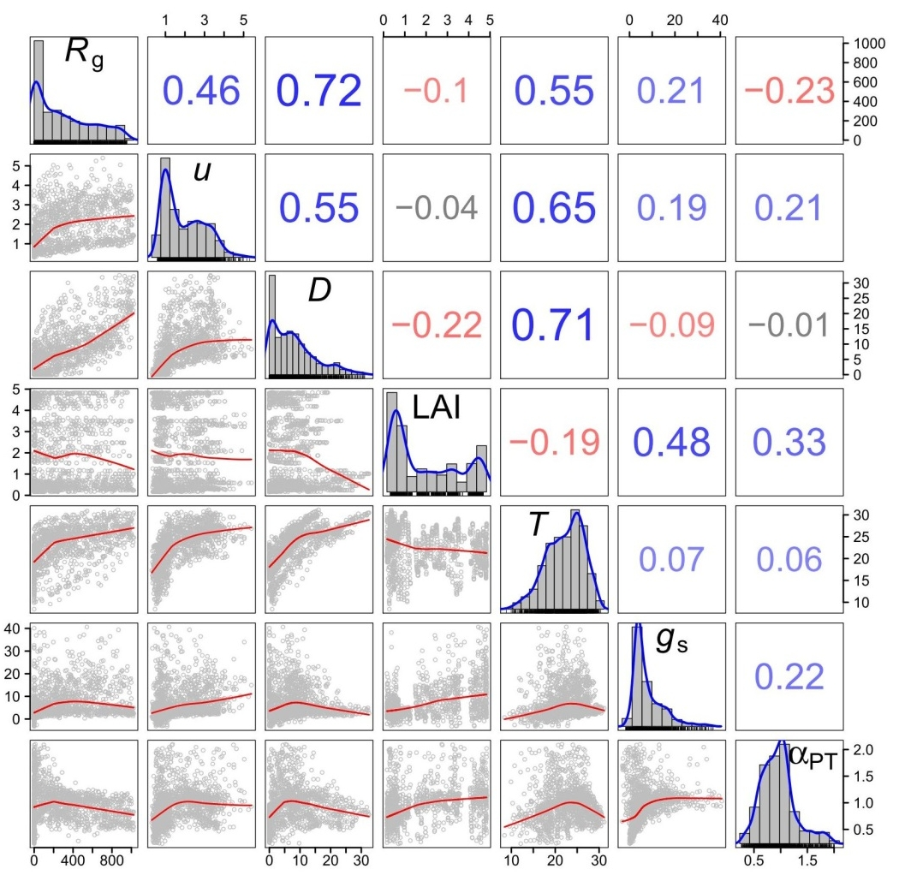
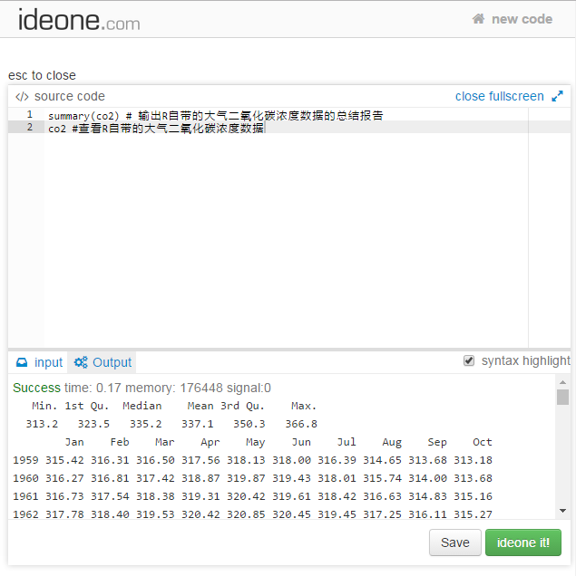
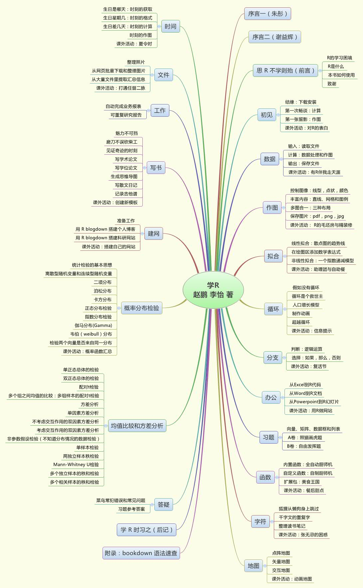

# 初见 {#secstart}

    　　有些人从没听说过 R，也照样过得无比快乐，而实际上我的工作之一就是把 R 交给他们。快乐不等于能力和效率。有些情况下，效率对一个人的好处，比短暂的快乐要强得多。

<!---
> Actually, I see it as part of my job to inflict R on people who are perfectly happy to have never heard of it. Happiness doesn't equal proficient and efficient. In some cases the proficiency of a person serves a greater good than their momentary happiness.
> 

--->
> --- Patrick Burns, April 2005

    　　世间所有的相遇，都是久别重逢。

> --- 电影《一代宗师》


## 结缘：下载安装 {#secstart-2}

R 是跨平台的开源免费自由软件，Windows、Linux、macOS 都有对应的安装文件可以下载。本书均以 Windows 系统为例作介绍。截至本书成稿时，R 的最新版是 3.4.1，安装程序文件只有 75 M。我们去 R 的服务器 CRAN^[CRAN：https://cran.r-project.org/]，点击 'Download R for Windows'，在打开的新网页最上方点击 'base'，就找到下载链接了。下载完毕后，一路"下一步"的傻瓜式安装即可。安装完毕之后，从开始菜单中找到 R，运行就可以了。

R 的默认界面是控制台窗口（图 \@ref(fig:img-r)），展示的是代码和运行结果。在这个窗口逐条输入下面的代码，每换一次行就会执行一条。

\index{杂项!summary}
```{r, eval=FALSE}
co2
summary(co2)
```

我们输入的 R 代码很简单。第一行展示了一个名叫 co2 的变量，内容是夏威夷 Mauna Loa 观测站的大气二氧化碳浓度数据，是 R 自带安装的。这个数据举世闻名，我们现在常说的全球变暖、节能减排，经常会拿这个数据来说事儿。第二行计算的是co2数据的统计量,依次是最小值、第一分位数、中值、平均值、第三分位数、最大值。敲几个字母就算出这么多结果，是不是很方便？这只是 R 牛刀小试而已。

需要注意的是，退出 R 之后，这个窗口的代码不会保存。想保存的话，可以点击菜单栏的 File -- New script，就会出现一个新的编辑窗口，这里可以输入代码。需要执行的话，光标移到代码所在行，按 ctrl+r （表示同时按住 ctrl 键和 r 键。下同）即可。编辑窗口的代码可以保存成文本文件，方便以后重复使用。


```{r img-r, fig.cap='裸奔的R默认界面', out.width='80%', fig.align='center', echo=FALSE}

```

不出意料的话，新手对 R 的第一印象一定是：怎么这么简陋！

是的，此刻的 R 在裸奔，虽然能用，但不好看，而且不方便。我们可以给 R 穿上一件衣服遮遮羞，这只需再安装一个软件就行。

___

```{lemma}
你还见过哪些软件，界面简陋却功能强大？哪些软件界面花哨却功能差强人意？
```


R 能穿的免费衣服很多，人们各有所爱。我们用过 Notepad++、\mbox{Tinn-R}、 RKward，也用过 Vim 配合 R 插件，最后选定了 RStudio，因为有诸多好处，最明显的就是把 R 常用的界面整合到了一起（图 \@ref(fig:img-rstudio)）。看吧，华丽丽堪比貂皮大衣。默认有四个面板：左上面板输入代码，左下面板查看代码的运行结果，右上面板展示工作环境，右下面板显示作图结果和帮助信息。我第一次用RStudio 的时候一时惊为天人，就像《天龙八部》里的段誉看见了神仙姐姐的雕像，《神雕侠侣》里的郭襄看见了摘去面具的杨过，从此不可自拔。RStudio 还有很多好处，我们以后慢慢讲。将来会发现，RStudio 岂止是件貂皮大衣，简直是一栋豪华别墅。


```{r img-rstudio, fig.cap='RStudio:R的豪宅', out.width='80%', fig.align='center', echo=FALSE}
knitr::include_graphics("images/img-rstudio.jpg")
```

RStudio的安装很简单。上 RStudio 官网^[RStudio：https://www.rstudio.com/]，下载安装文件 运行即可。安装完毕后运行，然后选择菜单 File -- New -– R script ，或按快捷键 ctrl+shift+n，会新建一个 .r文件。

以后我们只需运行 RStudio 就行了，它会自动调用 R。那个裸奔的 R 界面，就让它像泰坦尼克号一样永远埋葬在电脑的深处。忘了它吧。

现在，我们正式开始 R 的奇幻之旅。

## 第一次畅谈：计算 {#secstart-3}

R 最简单的功能，是用作计算器。先在左上面板窗口输入以下代码，然后按窗口上方的运行（Run）按钮，或按快捷键 ctrl+回车（这个快捷键会经常用），就会运行光标所在行的整行代码：

```{r}
3 * (2 + 2)
```

上面第一行是输入的代码示例。第二行用两个`#` 号开头，表示是运行结果，默认显示在 RStudio 的左下面板。如不另作说明，本书都用这种格式来区分代码和运行结果。我们暂时不管`#`号后面的`[1]` 是什么，先来试试R的数学基本运算符：加`+`， 减 `-`，乘 `*`，除 `/`，乘方 `^`，整除的商 `%/%`，整除的余数 `%%`。

___

```{example, label='ex1-1'}

  计算365除以7得到的整除商和余数。
```


下面，我们开个平方。输入并运行

```{r}
9 ^ 0.5 # 开平方
```

或者

```{r}
sqrt(9)  # 也是开平方
```

上面两条语句的作用等同，只是形式不同。这里，`sqrt()`是开平方的函数，被开方的数必须放在圆括号里，这是 R 语法的基本规则之一。`#` 号后面一直到这一行的末尾是注释，注释部分不会被运行，这样是为了方便将来理解这句代码的用途。当然，我们可以用注释随便写点什么，比如说 “`# 哇塞我的第1行代码太帅了`”或者“`# 今天心情不大好就写到这儿吧`”等等。如果你乐意，那么完全可以在注释里偷偷写一部小说，就像《倚天屠龙记》里有人在《楞伽经》夹缝处写下《九阳真经》一样。

有人读到这里，可能会退缩了：sqrt，开玩笑，我怎么记得住啊！注意 R 入门第一秘诀：**不要被 R 吓住！**现在，我们请出我们的第一位人气小助理：tab 键。试试只输入 s，然后按 tab 键，就会看到 RStudio 给出的贴心提示，所有以 s 打头的函数和变量都列在里边了，用鼠标或箭头键选取就行了。在 s 后面接着输入 q 之后再按 tab 键试试。这个“tab 小助理”我们以后天天时时分分秒秒都会用。

其实，常用的函数就那么几个，用几次就不需要贴心提示了。而且函数名称都很好记，sqrt 就是 square root 的缩写，顺便练了英文。实在记不住，那就用基本运算符来求乘方好了， `9 ^ 0.5` 即可。将来学了自定义函数之后，你甚至可以把 sqrt 改名叫做 kaipingfang。我们在后面的学习中，会经常针对同一个问题给出多个解决方案，条条道路通罗马，R 很灵活的，随便挑一个你喜欢的方案拿去用就行了。

___

\index{a@小贴士!a@入门三大秘诀}
```{theorem, label='thm-3tips'}
R 菜鸟入门三大秘诀

第一秘诀：不要害怕！学 R 非难事，谁都可以 R（Anyone can R）。

第二秘诀：能用就行！只要能完成工作，R 代码写得漂亮与否并不重要。如果你有两个解决办法，那就选用你熟悉的那个。将来时间有富余的话再试另一个。

第三秘诀：与人分享！如果你的 R 代码是一把刀，那么分享就是磨刀，越磨越快。
```


常用函数都可以顾名思义：四舍五入 `round()`， 截取整数 `trunc()`， 开平方 `sqrt()`，求绝对值 `abs()`，指数函数 `exp()`，自然对数函数 `log()`，以 10 为底的对数函数 `log10()`，三角函数 `sin()`，`cos()`，`tan()`，`asin()`，`acos()`，`atan()`等等。

有些常数在R中已经定义好了，例如圆周率 $\pi$，只要输入 `pi` 并运行

```{r}
pi
```

怎么只有这几位有效数字？有些读者上幼儿园时就背下来了，精确度不够高啊。要提高精确度，需要用选项函数`options()`：

\index{杂项!options}
```{r}
options(digits = 22)  # 最大支持 22 位
pi
```

`options()`函数运行一次后，以后的数字都会是指定的位数，直到重新运行一次，或者退出 R。下面我们把位数改为默认值，7 位：

```{r}
options(digits = 7) 
pi
```

位数就变回来了。

有的常数，虽然没有定义好，但很容易算出来，例如自然对数的底 e：

```{r}
exp(1)  # 计算 e
```

可以像 pi 一样，我们自己定义一个名叫 e 的变量，把`exp(1)`的值保存在 e 里，方便以后调用：

```{r}
e = exp(1) 
```

或者

```{r}
e <- exp(1)  
```

两种办法的赋值效果完全等同。`<-` 是个箭头，表示把右边的值赋给左边。如果你去看别人写的代码，会发现有人爱用箭头，有人爱用等号，这完全取决于个人喜好。箭头的灵活之处在于，可以把左边的值赋给右边：

```{r}
exp(1) -> e
```

本书的赋值符号统一用箭头。RStudio 中输入箭头有个快捷键：按alt+\_ 就行了。

___

```{lemma}
箭头和等号的作用完全等同吗？什么情况下只能用等号，不能用箭头？上网搜搜答案。
```


好了，以后可以用 e 来代表自然对数的底了。查看 e 的值，可以看 RStudio 的右上面板，也可以在左上面板代码窗口输入变量名 e，然后 ctrl+回车，

```{r}
e
```

就会在左下面板的结果窗口出现 e 的值。e 可以用来做后续计算，比如：

```{r}
x <- round(e)^2
x
```

注意， R 中大小写字母是有区别的，'E' 和 'e' 是不同的两个变量名。这叫做“大小写敏感”。

___

\index{a@小贴士!b@变量名的约定}
```{theorem, label='thm-vname'}
变量名的约定（三可三不可）

\smiley 可以是一个或多个字母，如 'e', 'x', 'mydata'；

\smiley 可以包括数字，如 'a1', 'a2';

\smiley 可以包括句点和下划线，如 'temperature_air', 'humidity.max'。

\frownie 不可以包含空格，如 'my data'；

\frownie 不可以用数字或小数开头，如 '2x'，'.3y'；

\frownie 不可以用中文。

```


	
此外，你的变量名不能跟 R 的内置变量重名。这个倒是不必担心，遇见的时候 R 会自动发警告。一般来说，我们只要注意变量名不要加空格，不要用中文，就不会犯大错。

     　　不要给你的矩阵变量取名为“矩阵”。你会给你的狗狗起名字叫“狗狗”吗？

<!---
>
> Don't call your matrix 'matrix'. Would you call your dog 'dog'? 
>
--->

>--- Barry Rowlingson, October 2004


一个变量名可以存储很多数据。比如说，本市的月降水量从一月到十二月依次是：61, 45, 55, 46, 56, 79, 86, 57, 56, 56, 57, 71 mm。可以把这十二个数据赋值给一个变量 $x$，这种变量叫做向量：

```{r}
x <- c(61, 45, 55, 46, 56, 79, 86, 57, 56, 56, 57, 71)
x
```

如果需要查看四月的降水量，就用方括号来指定“下标”。下面方括号中的 4 就是下标，表示调用 $x$ 中的第四个数值。

```{r}
x[4]
```

再比如前面提到的二氧化碳数据，变量名就是“co2”，这一个变量里存的是多年二氧化碳的浓度。我们可以将它转存到另一个变量里：

```{r}
y <- co2 # 转存
y[10] # 看看第十个数据
```
R 支持向量运算。试试输入：

```{r}
x + 100
```

$x$ 里的每一个数都加上了 100 。这就是向量运算的好处：简单的代码，避免逐个计算。

现在我们可以回答 RStudio 左下方窗口里显示的结果开头那个`[1]`了，它表示的是这一行开头显示的是 $x$ 的第一个值。如果显示的向量长，需要折行，那么下一行开头的方括号里显示的就是该行第一个元素在 $x$ 中的位置，省得我们从头数。

## 第一张留影：作图 {#secstart-4}

下面，让我们作出第一个图形来：Mauna Loa 观测站的二氧化碳浓度时间序列。这是张全球闻名的明星图。承接前面的数据，我们只需敲 7 个键就行了（图 \@ref(fig:fig-co2)）：

\index{作图!plot}
```{r fig-co2, fig.cap='Mauna Loa 二氧化碳浓度', out.width='60%', fig.align='center', echo=2}
par(mar = c(3, 3, 0.1, 0.1))
plot(y)  # 作图
```

是不是很简单？有没有很激动？简单的东西人见人爱。

本市的月降水量，也可以这样画出来：因为已经保存在变量 $x$ 里了，所以`plot(x)`就可以了。

再进一步，我们来做统计运算，看看本市月降水量的平均值是多少。

```{r}
(x[1] + x[2] + x[3] + x[4] + x[5] + x[6] + x[7] + x[8] + 
   x[9] + x[10] + x[11] + x[12]) / 12  # 计算平均值
```

这个式子很长，我们把这条指令强行写成了两行，R 读完第一行发现指令不完整，就会自动读下一行。由于受版式的约束，本书的代码都会采用这种换行方式。实际写代码时不必这样换行。

$x$ 的 12 个元素逐个敲起来太麻烦了，可以用求和函数 `sum()`以及求向量长度的函数 `length()`，来简化代码：

```{r}
sum(x) / length(x)
```

或者直接用平均值函数 `mean()`：

```{r}
mean(x)
```

更厉害的是 `summary()`函数：

\index{杂项!summary}
```{r}
summary(x)
```

得到的六个数是最小值、25% 分位数、中位数、均值、75% 分位数和最大值。记住 `summary()`这个明星函数吧，将来我们会反复享受使用这个函数的快乐。

上文我们用四种方法计算平均值，算出来的结果都一样，条条大路通罗马，想起哪个用哪个。

常用统计函数有：求和 `sum()`，平均值 `mean()`，最大值 `max()`，最小值 `min()`，范围 `range()`，中位 数`median()`，分位数 `quantile()`，标准差 `sd()`，方差 `var()`，总结报告 `summary()`。你可以把这些函数用在 $x$ 上，看看结果都是什么。

___


```{example, label='ex1-2'}
2003 年 8 月北京城区测得的 PM~2.5~ 的质量浓度日变化^[数据来源：Chan et al., 2005. Atmospheric Environment 39 (28) : 5113-5124], 从 0 时到 23 时 依次是97, 80, 64, 91, 87, 100, 128, 144, 150, 150, 150, 106, 78, 68, 62, 46, 55, 68, 84, 92, 95, 108, 128, 138 微克每立方米 。做出北京PM~2.5~的日变化图。计算PM~2.5~出现的最大值、最小值、平均值。最大值出现在几点钟？
```


最后，请在 RStudio 菜单栏点击 File -- Save，或按快捷键 ctrl+s，把刚才输入的代码保存到一个扩展名为 .r 的文件里，下一节接着用。这个 .r 文件 其实就是文本文件，用 Windows 记事本打开就能看，只不过里面放的是 r 代码罢了。如果装了 RStudio，双击 .r 文件就会用 RStudio 打开。

好啦，以上就是 R 的基本操作和运算、作图、统计分析，你全都掌握了！ R 就差不多学完了！喝一杯庆祝一下吧。


\index{a@小贴士!c@新手第一步}
```{theorem, label='thm-newbee'}
新手学 R 第一步
```

项目            内容
--------------- -------------
安装            CRAN, RStudio
数学基本运算符  `+`, `-`, `*`, `/`, `^`, `%%`, `%/%`
常用数学函数    `round(),  trunc(), sqrt(), abs(), exp(),` 
                `log(), log10(), sin(), asin()`
常用统计函数    `sum(), mean(), max(), min(), range(),`
                `median(), sd(), var(), summary()`
作图            `plot()`


<!---
```{r, tidy=FALSE, echo=FALSE, eval=FALSE}
tb_newbee <- read.csv('./tables/newbee.csv')
knitr::kable(
  tb_newbee, col.names = NA,
  booktabs = TRUE
)
```
--->

## 课外活动：表白{#secstartpost}

经过了初步的相处，你对R的印象如何？有没有相见恨晚或者一见倾心的感觉？

R 给我的印象，说得文雅一点，那就是：

        关关雎鸠，在河之洲。窈窕淑女，君子好逑。
        参差荇菜，左右流之。窈窕淑女，寤寐求之。
        求之不得，寤寐思服。悠哉悠哉，辗转反侧。

> --- 《诗经·国风·周南·关雎》

说得通俗一点：我想和R在一起。

跟很多理科生一样，我本科论文中使用的是 Excel，硕士论文使用的是 OriginLab，但博士期间换用了 R 之后，从此死心塌地跟 R 永结同心。

那么， R 窈窕在哪里？

仁者见仁，智者见智，一千个人心中有一千个哈姆雷。R 是一个取之不尽用之不竭的宝藏，我们各取所需便是。比如我，贪图便宜，看上 R 是看上了它的 免费 和 随心所欲 。当然，盗版的 Excel，OriginLab，Matlab 也免费，但盗版毕竟是见不得光的事儿，还是少干吧。

不光免费和灵活，还有 R 功能的强大，R 社区的友好等等。从我的角度来说，如果没有学习 R 和使用 R 带来的乐趣，那么我的博士研究生活必定会枯燥很多。几年过去了，我依然记得当年为论文做出一张图（图 \@ref(fig:img-thesis)）时的兴奋。有前人定义好的函数，花了不到一分钟，只用了一个语句，就画出了 7 个变量的直方图（对角线）、两两之间的散点图和 loess 拟合曲线（对角线左下半部分），并标出了两两之间的相关系数（对角线右上半部分，正负用数字的颜色区别，相关程度用字体的大小表示）。那种激动和快乐，至今历历在目。


```{r img-thesis, fig.cap='增强版两两散点图', out.width='80%', fig.align='center', echo=FALSE}

```

___


```{lemma}
如果使用你熟悉的作图软件，那么图 \@ref(fig:img-thesis)这种图该怎么做？
```


我们将在第\@ref(secfunction)章学习这种图的作法。

不光是论文作图，R 还能很容易做出 3D 动画来演示。不光是枯燥的科技作图和演示，R 还可以娱乐。比如可以画一颗立体中国心（图 \@ref(fig:img-heart)）。

```{r img-heart, fig.cap='R绘出的中国心', out.width='40%', fig.align='center', echo=FALSE}

```

当然可以很容易地把国旗换成别的。写本文时正值情人节，那就换成她或他的照片好啦。这种图的作法同样是在第\@ref(secfunction)章。

总地来说，我学 R 的理由，说得文雅一点，那就是：

        桃之夭夭，灼灼其华。之子于归，宜其室家。
        桃之夭夭，有蕡其实。之子于归，宜其家室。
        桃之夭夭，其叶蓁蓁。之子于归，宜其家人。

> --- 《诗经·国风·周南·桃夭》

说得通俗一点：和 R 在一起真好。

下面轮到你了。请勇敢表白一下：你是为什么要学 R 呢？

<!--chapter:end:040-secstart-start.Rmd-->

# 数据 {#secdata}


    　　数据！数据！数据！没有泥的话我没法做出砖。

> ---夏洛克·福尔摩斯


    　　要是你的数据烂，不管啥统计程序都没救。
<!---
>
> You can't expect statistical procedures to rescue you from poor data.
>
--->

> --- Berton Gunter, April 2005


在第\@ref(secstart)章里，我们学会了用 R 进行常规的数学运算和统计计算，并且做出了三张图：大气二氧化碳浓度时间序列，降水的季节变化图，北京的 PM~2.5~ 日变化图。好像已经把 R 语言学完了。只是，总不能每次都把数据一个一个敲到代码里吧，也不能只使用 R 自带的数据自娱自乐吧。要是处理你自己文件里的大量数据呢？本篇就解决这个问题。

本书里我们会使用示例数据，方便你跟我们同步操作。示例数据文件可以请 R 来自动生成。运行下面这两行命令：

\index{文件操作!dir.create}
\index{数据读写!write.csv}
```{r, eval=FALSE}
dir.create('c:/r4r')
write.csv(as.data.frame(t(matrix(
  co2, 12, dimnames = list(
    month.abb, unique(floor(time(co2))))))), 
  file = 'c:/r4r/co2.csv')
```

将来我们会解释这两条代码的含义，现在你大可略去，只管去 c 盘找到一个名叫“r4r”的文件夹，里面有个名叫“co2.csv”的文件。这就是我们做示范的示例数据文件，你就当作是从我们的光盘上拷贝过来的吧。请在参照本书运行示例代码的过程中保留“c:/r4r”这个文件夹，我们在后续章节所做的示范都要用到它。

请用 Excel 或记事本打开 co2.csv 这个文件。这是个数据表，内容是 1959 年 1 月到 1997 年 12 月夏威夷 Mauna Loa 观测站的大气二氧化碳浓度，以年份为行，以月份为列。不要做任何修改，我们现在假定这是你即将处理的数据文件，看看如何对其中的数据进行操作。

## 输入：读取文件 {#secdata-1}

读取文件，就是让 R 把数据读进 R 的脑子里。

如果你喜欢拷贝粘贴的方式，那么可以用 Excel 打开数据文件 co2.csv，用鼠标选中全部数据区（ctrl+a），拷贝，然后在 R 中用下面的代码读取剪贴板里的数据（边输入边试一下“tab小助理”。以后每个长命令都用一下，养成习惯）：

\index{数据读写!read.table}
```{r, eval=FALSE}
mydata1 <- read.table(file = "clipboard", header = TRUE)
```

这条指令的含义是：读取剪贴板里的数据，保存到 mydata1 这个数据框变量里。`header = TRUE` 翻译过来就是“文件头是**真**有啊“，意思是数据表的第一行是列名称。

这时，注意观察 RStudio 的右上窗，出现了 mydata1 的信息。鼠标单击可以查看内容，也可以用输入代码并运行：

```{r, eval=FALSE}
mydata1
```

```
##       X    Jan    Feb    Mar    Apr    May    Jun    Jul
## 1  1959 315.42 316.31 316.50 317.56 318.13 318.00 316.39
## 2  1960 316.27 316.81 317.42 318.87 319.87 319.43 318.01
## 3  1961 316.73 317.54 318.38 319.31 320.42 319.61 318.42
## 4  1962 317.78 318.40 319.53 320.42 320.85 320.45 319.45
## 5  1963 318.58 318.92 319.70 321.22 322.08 321.31 319.58
## 6  1964 319.41 320.07 320.74 321.40 322.06 321.73 320.27
## ......
## 38 1996 362.09 363.29 364.06 364.76 365.45 365.01 363.70
## 39 1997 363.23 364.06 364.61 366.40 366.84 365.68 364.52
```

好了，读取数据就是这么简单。如果这已经满足你的需求，那么就可以跳至第 \@ref(secdata-2) 节，进行后续操作了。不过，我们建议你耐心把本节读完。因为，用拷贝粘贴的方式读取数据，优点是简单灵活易上手，适合临时用一下；缺点是重复性差，下回你可能忘了上次拷贝的是哪个区域的数据，这不是 R 的做事风格。更多情况下，我们要告诉 R，数据文件保存在哪里，只需把上面命令的剪贴板 `clipboard` 换成数据文件的路径即可。下面我们详细介绍这种方法。

不习惯命令行的用户，可以通过下面的指令获取这个文件的路径（请在敲入时练习一下前面说过的“箭头快捷键”和“tab 小助理”）：

\index{数据读写!file.choose}
```{r, eval=FALSE}
myfile1 <- file.choose()
```

在弹出的窗口中选择文件 c 盘下 r4r 文件夹里的 co2.csv。

好了，现在我们看看 myfile1 的值是什么。在 RStudio 运行：

```{r, echo=FALSE}
myfile1 <- "c:/r4r/co2.csv"
```

```{r}
myfile1
```

是刚才选取文件的路径。这是获取路径的方法之一，比较符合很多人喜欢鼠标选择文件的习惯，但比较麻烦，每次使用这个代码时都得点一次。一般来说，我们存放数据的路径是固定不变的，所以更常用的方法，是在代码里直接敲入文件路径：

```{r}
myfile2 <- "c:/r4r/co2.csv"
myfile2
```

跟鼠标选取文件的结果完全相同。

注意：

- 路径的名称前后要用引号（单双都行，但要成对儿），表示这是一个字符串。
-	文件路径中上下级文件夹之间的斜线必须是斜线（`/` ）而不是反斜线（`\`）， Windows 用户一定要注意！其中的道理我们暂不深究。

<!---
现在，输入并运行：

\index{文件操作!file.show}
```{r, eval=FALSE}
file.show(myfile2) # 查看文件
```

文件就会用默认程序打开，跟在浏览器中双击打开的效果是一样的。
-->

myfile2 里存储的文件路径，并不是文件内容。R 现在知道文件在哪里，却不知道里面是什么内容。现在，我们让 R 读取文件的内容。

\index{数据读写!read.table}
```{r, results='hide'}
mydata2 <- read.table(file = myfile2, 
                      header = TRUE, sep = ",")
mydata2
```

`sep` 参数表示数据列的分隔符，这里设置为逗号，表示读取逗号分隔的数据。

你也许会说，`read.table()` 括号里那么多东西，用起来也太复杂了吧？怎么记得住？对，谁都记不住，现在我们有请助理团的第二位成员隆重登场！只需要把光标放到代码 `read.table` 的任何一个字符处，按键盘 F1 键，RStudio 此时会在右下面板显示帮助信息，有详细的解释和实例。好好读读帮助吧，以后你会发现，F1 小助理是仅次于 tab 的常用操作。除了 tab 小助理和 F1 小助理外，以后我们会介绍更多的小助理跟你见面。

___


\index{a@小贴士!d@入门三大法宝}
```{theorem, label='thm-tools3'}
R菜鸟入门三大法宝

- 第一法宝：助理！以F1和tab键为首的豪华助理团，简直就是身边的诸葛亮，可以随时方便地寻求帮助。

- 第二法宝：猎狗！就是搜索引擎。遇见问题不懂就上网搜，你会发现，早就有人提出类似的问题并解决了。

- 第三法宝：顾问！就是论坛。内事不决问统都^[统计之都 R 语言论坛：https://d.cosx.org/t/r]（中文论坛）， 外事不决问爆栈^[爆栈网R语言论坛：http://stackoverflow.com/questions/tagged/r]（英文论坛）。 

```


为了省事儿，我们可以用`read.table()`的瘦身简化版`read.csv()`函数，用来专门读取逗号分隔的 .csv 文件：

\index{数据读写!read.csv}
```{r, eval=FALSE}
mydata2 <- read.csv(file = myfile2)
```

跟上一条指令的效果完全相同。到此为止，数据文件中的数据就被R读进了他的脑子里。mydata1和mydata2这种二维表格数据，叫做“数据框”。

你可能会觉得麻烦，怎么在Excel里双击一下就搞定的事，在R里边却这么麻烦？是的，R对数据的读入并非“傻瓜”操作，也许在读数据上R比Excel麻烦10倍，但只要读进去了，后面会省事百倍千倍。而且，如果需要读入千百个数据文件，那么配合第\@ref(secloop)章的循环语句可以轻松搞定，而不必双击千百次。相信我们，磨刀不误砍柴工。

其实，上面的过程是一套分解动作，让我们容易理解读取数据的过程。实际应用时，只需一行代码：

\index{数据读写!read.csv}
```{r}
mydata2 <- read.csv(file = "c:/r4r/co2.csv")

```

___


```{lemma}
细心的你也许会留意，本章开头有个`write.csv()`函数，跟`read.csv()`有什么关系？既然`read.csv()`是`read.table()`的瘦身版，那么会不会有个`write.table()`函数呢？要弄清楚这些问题，请试试你的三大法宝。
```


在RStudio中，像ctrl+shift+n、tab和F1这样的快捷键操作还有很多。从RStudio菜单栏选择Tools -- Keyboard Shortcuts Help，或者直接按alt+shift+k键，就会弹出一本快捷键魔法书。

## 计算：数据处理和作图 {#secdata-2}

R把数据读入脑子后，就可以开始干活儿了。

我们先让R对数据画个图，看起来更直观（图 \@ref(fig:fig-pair)）：

\index{作图!plot}
```{r, eval = FALSE}
plot(mydata2)
```

```{r fig-pair, fig.cap='多张小图一次完成（局部展示）', out.width='100%', echo = FALSE}
plot(mydata2[, 1:6])
```

Bingo！多张小图一次完成！这就是事半功倍的效果。


    　　你想多懒就多懒，并不耽误高效率。
<!---
>
> You can be maximally lazy, but still be efficient.
>
--->

> --- Kevin Murphy, September 2003


这是任意两列的散点图。画的小图表示的是什么呢？比如从上数第2行第4列的小图，跟它排在同一行的文字是左边的Jan，这是小图的纵坐标标签；跟小图排在同一列的文字是下方的Mar，这是小图的横坐标标签。所以这个小图展示的是以3月的二氧化碳浓度为 $x$，1月份的二氧化碳浓度为 $y$ 的散点图。其他小图可以类推。那么，第1列小图，展示的就是各月二氧化碳浓度的逐年变化。

这么复杂的图，简单一条指令就轻松做出来了。追求高效人士的利器！

___


```{lemma}
使用Excel或其他常用的作图软件，如何做出图 \@ref(fig:fig-pair)？
```


我们一般在读入数据文件后的第一件事就是`plot()`一下，对数据有个整体的感觉。第二件事，一般是用`summary()`看看这个文件的总结报告，这个函数我们在第\@ref(secstart)章已经打过照面了：

\index{杂项!summary}
```{r}
summary(mydata2)
```

得到的是每一列数据（也就是各年各月二氧化碳浓度）的最大值、最小值、中位数、平均值函数，顺便还附送了四分位数（1st Qu.， 3rd Qu.）。什么是四分位数？试试猎狗。

    　　放狗去搜。

> --- 谢益辉


如果我们想看看数据框里某个指定值，比如1995年9月二氧化碳的浓度，该怎么选取单元格呢？你还记得上一节我们是如何选取 4 月的降水量吗？`x[4]`。类似地，1995年是第37行，9月是第10列，所以：

```{r}
mydata2[37, 10]
```

要选取多个行呢？若你还记得用`c()`生成一个向量，那就好办了，比如选取第10列的全部偶数行：

```{r}
mydata2[c(2, 4, 6, 8, 10, 12, 14, 16, 18, 20,
          22, 24, 26, 28, 30, 32, 34, 36, 38), 10]
```

行数太多，逐个敲起来太麻烦了吧，高效人士的办法是用`seq()`函数生成个数列：

\index{杂项!seq}
```{r, eval=FALSE}
mydata2[seq(from = 2, to = 39, by = 2), 10]
```

`seq(from = 2, to = 39, by = 2)` 表示以 2 为起点，39 为终点，间隔（即步长）为 2 生成一个数列。比如步长是1的话，就用`seq(from = 2, to = 39, by = 1)`，等同于`2:39`：

```{r}
mydata2[2:39, 10]
```

如果是选取整行或整列的话, 为了省事儿，可以空出来相应位置：

```{r}
mydata2[, 10]  # 第10列全部。
mydata2[37, ]  # 第37行全部。
```

如果列数太多，总不能老去数第几列吧？别急，也可以用行或列名称来替代列数：

```{r, eval=FALSE}
mydata2[, 'Sep']
```

或者用美元符号后面跟着列的名称：

```{r, eval=FALSE}
mydata2$Sep
```

列名称都有哪些呢？其实在输入`$`符号后，RStudio就立刻贴心地把所有列名称列出来了，供我们选择。如果没有出现，请咨询tab小助理。除此之外，用`names()`函数或`colnames()`函数可以查看列名称：
 
\index{数据框!names} 
```{r}
names(mydata2) # 或 colnames(mydata2)
```
第一列在原始文件中没有名字，所以R自动起了个名字叫做“X”。我们可以把它的列名称改为“year”：

\index{数据框!names} 
```{r}
names(mydata2)[1] <- 'year'
names(mydata2)
```
类似的，用`rownames()`函数可以查看行名称。由于我们并没有给各行起名字，R默认按数字顺序命名。我们可以将年份列作为行名称：

\index{数据框!rownames} 
```{r}
rownames(mydata2)
rownames(mydata2) <- mydata2$year
rownames(mydata2)
```
这样，如果要查看1995年9月的数据，就不用再数第几行第几列了，用行名称和列名称更方便：

```{r}
mydata2['1995', 'Sep']
```
这对于处理大型的表格尤其方便，省得瞪着眼睛去数数寻找单元格了，很大程度上减少了对视力的伤害。

任何一行或一列，都可以作为向量来计算。我们仿照上一章介绍的向量计算方法，来算一下1995年全年二氧化碳的平均浓度，只要对该行的第2到13列求平均：

\index{杂项!sum}
```{r}
sum(mydata2['1995', 2:13]) / 12
```

___


```{lemma, label='lem-mean'}
直接使用平均值函数mean()行不行？为什么？
```


如果求1996年比1995年二氧化碳浓度增加了多少，可以料想，只需把两行的平均值相减：

\index{杂项!sum}
```{r}
sum(mydata2['1996', 2:13]) / 12 - 
  sum(mydata2['1995', 2:13]) / 12
```

那么，1996年每个月比1995年同比增加了多少二氧化碳？

```{r}
mydata2['1996', ] - mydata2['1995', ]
```

这里我们可以体会向量计算的特点，是逐个对应相减的。

现在，你可以试着对任意一行或一列来做向量计算了。


___


```{example, label='ex2-1'}

请计算1995年二氧化碳浓度的最大值和最小值。
```


整行或整列的计算，在R中有更方便的方法，可以这样：

\index{数据框!colMeans}
```{r}
colMeans(mydata2[, 2:13]) # 排除掉第一列后，对整列求平均
```

类似的函数还有整行求和`rowSum()`和整列求和`colSum()`。函数名很好记，就是在原来函数前面加个`row`或`col`，并且注意大小写。

下面，我们对整行求平均值，并且把结果作为一列添加到mydata2中，列名称叫做mean：

\index{数据框!rowMeans}
```{r}
mydata2$mean <- rowMeans(mydata2[, 2:13])
```

如果不是求和或求平均值，而是求其他函数值，比如中位数、最大值、最小值呢？难道也是在原函数名前边添个`row`或者`col`就行了吗？呃，理论上当然是可以做到的（见第\@ref(secfunction)章），但实际上没那个必要，因为那样就需要太多的新函数。我们可以用功能更强大的`apply()`函数：

\index{数据框!apply}
```{r}
mydata2$median <- apply(X = mydata2[, 2:13], 
                        FUN = median, MARGIN = 1)
```

这条代码，表示计算对象是`mydata2[, 2:13]`这个数据框，按行操作（`MARGIN = 1`），操作的函数是求中位数`median`。如果把`median`换成`sum`或`mean`，那么就跟`rowSums()`和`rowMeans()`的效果完全一样了。想了解`apply()`函数更多详细情况，请咨询F1小助理。


现在，我们可以用上一章认识的各种数学函数，对这个表格进行随便折腾了。

任意相邻年份某个月的二氧化碳浓度增量，也就是相邻两行的差，可以用`diff()`函数：


\index{杂项!diff}
```{r, eval=FALSE}
diff(mydata2$Sep)
```

___


```{example, label='ex2-2'}
请解释下面代码的含义，猜猜计算出来的结果是什么，再运行，看看跟你猜的是否一致。
```


\index{数据框!apply}
```{r, eval=FALSE}
apply(X = mydata2, FUN = diff, MARGIN = 2)
```


上面我们演示了如何让R读取一个数据文件，并简单分析和作图。从此以后，你就可以依葫芦画瓢来处理真正属于你自己的数据了！

回过头来看，我们上面处理的是表格数据。如果要处理其他格式的数据文件，尽管用我们前面介绍的鼠标选定拷贝到剪贴板的方法也可以达到目的，但是我们仍然建议你用Excel或别的软件将它保存或导出为 .csv 格式，方便R读取和进一步处理，这是首选方案。并且，我们建议你以后把所有数据都尽量从一开始就保存为 .csv 格式，因为它就像全世界语言里的英语，到哪里都通用，几乎任何软件都能打开。如果这仍然满足不了你的需求，那么

- 请F1小助理搬出`read.table()`和`scan()`函数的帮助文件；

- 请阅读《R数据的导入和导出》这本书，来自开源社区，网上免费获取^[R数据的导入和导出：http://pem.freeshell.org/math/R_data_import_export_zh.pdf]；

- 如果经常处理Excel的xls或xlsx文件，请使用R相关的扩展包。这个方法我们会在第\@ref(secfunction)章介绍。

```
　　R说明文档的水平已经远高于开源软件的平均水平了，甚至高过商业软件（特别是SPSS，老是摆出一张臭脸，说“如果你不懂输出的东西是什么含义，那么点击帮助按钮，我们会弹出5行你仍然不会弄懂的火星语。”）
```

> --- Peter Dalgaard, April 2002

<!---
>
> The documentation level of R is already much higher than average for open source software and even than some commercial packages (esp. SPSS is notorious for its attitude of "You want to do one of these things. If you don't understand what the output means, click help and we'll pop up five lines of mumbo-jumbo that you're not going to understand either."
>
--->


## 输出：保存文件 {#secdata-3}

数据文件的保存比读取要简单多了，用`write.csv()`函数即可。下面的语句把mydata2这个数据保存到c:/r4r文件夹下面，文件命名为\mbox{“mydata2.csv”}。

\index{数据读写!write.csv}
```{r, eval=FALSE}
write.csv(mydata2, file = 'c:/r4r/mydata2.csv')
```

___


```{lemma}
用Excel或记事本打开这个新生成的文件，同时也打开原有的co2.csv文件，比较两者有什么不同。
```


现在我们可以解释本章开头两条代码的含义了：先用`dir.create()`函数在电脑里创建了个文件夹，然后用`write.csv()`函数将一个名为co2的数据经过一系列格式转换后存成了co2.csv文件。

那么co2这个数据最初是怎么跑到我们的电脑里的？是R安装时捆绑自带的。我们可以运行

```{r, eval=FALSE}
data()
```

就可以看到R自带的很多数据文件。这些文件可以在学习R的过程里用来做各种测试。

在后面的章节中，如无例外，我们都使用R自带的数据做示例，省却读入数据的步骤。当然，如果想练习数据的读入，那么可以用本章开头的方法，把R自带数据存成数据文件，然后装作自己的文件从头操作。

今天的活儿干完了。我们关闭RStudio，收工。RStudio会弹出一个窗口，问你两件事（图 \@ref(fig:img-save)）：

```{r img-save, fig.cap='RStudio退出前保存', out.width='80%', fig.align='center', echo=FALSE}

```

1. 你要不要把工作区存到一个 .RData 文件里？翻译过来就是：“主人，你要不要我把今天算出来这些数据记在我脑子里，就是右上面板工作区Environment标签下列出的里那些东西，下回打开我的时候直接就能用这些数据？” 保不保存随你心意。我们一般选择不保存，让RStudio把数据忘得一干二净，下回打开时右上方的窗口是空的，只需重新读入数据和计算就行了，反正原始数据在，而数据的处理方法都在代码里。

2. 你要不要保存 .r 代码？也就是左上方窗口这些东东？当然保存了。

现在，才算是真正收工了。


\index{a@小贴士!e@常用数据操作}
```{theorem, label='thm-data'}
常用数据操作
```

操作           提示
-------------- --------
设定文件路径   路径里不要空格，不要中文，用斜线分隔，
               `file.choose()`
读取数据       `read.table()`, `read.csv()`
保存文件       `write.csv()`
选取单元格     `x[2, 3]`, `x[2, ]`, `x[, 3]`, `x$Sep`, `x['1995', 'Sep']`
快速掌握数据   `plot()`, `summary()`
行列名称       `rownames()`, `colnames()`, `names()`
行列计算       `rowMeans()`, `colMeans()`,
               `rowSum()`, `colSum()`, `apply()`

## 课外活动：有R伴我走天涯  {#secdatapost}

R不仅可以安装在本地，还可以从网络访问。在你的手机或电脑里打开浏览器，访问下面介绍的网站，就可以使用R语言了。

我们先来试试Ideone^[Ideone：http://ideone.com]。打开这个网站后，输入图 \@ref(fig:img-ideone) 上方窗口里的代码，点击 `Run!` 按钮运行，窗口下面就立刻显示运算结果。

```{r img-ideone, fig.cap='R在线调试网站Ideone', out.width='80%', fig.align='center', echo=FALSE}

```

Ideone可以让我们用浏览器来进行R编程和调试，非常方便。喜欢的话，可以注册个免费账号，这样就可以将一些代码保存在自己名下，方便以后调用。它还支持把代码嵌入到网页里，以便分享。

由于输入输出接口的限制，Ideone里的R语言不能读入外部数据，也不能实现作图。没关系，还有很多类似网站，能够满足不同的需求，例如 r-fiddle^[r-fiddle: http://www.r-fiddle.org]等。

如果你有自己的服务器，那么还可以用RStudio的服务器版来搭建自己专属的R网站，你的地盘你做主。

有了这些在线的R网站，随时随处都可以免费使用R，没有电脑就用手机。有R伴我走天涯，走到哪里都不怕。

\newpage \thispagestyle{empty}


# 作图 {#secplot}

    　　从优雅的角度来讲，R是精准的、有品位的、美丽的。等我长大了，我要娶R。
<!---
> As for elegance, R is refined, tasteful, and beautiful. When I grow up, I want to marry R.
>
--->

> --- Andy Bunn, May 2005

    　　一图胜千言。

> --- 俗语

<!---
        一旦你在作图上迈出不寻常的一步，就会更加让人目瞪口呆。
>
> All this becomes even more glaring if you take the unusal step of plotting the data.
>

> --- Bill Venables, July 2007
--->

在上两章中，我们都用到了`plot()`函数来作图。如果说Excel的作图方法是《秘密花园》那种书，让你在已经画好的图案里涂涂改改，很受约束的话，那么R作图的流程更加自由：就像铺开一张白纸，自己打好格，画数据点，画坐标轴，加图例，最后把纸收起来。作图的每一步，都清清楚楚掌控在你手里。

这里，我们用第\@ref(secdata)章读取的二氧化碳数据 mydata2，画一些更漂亮的图。为了兼顾本章的独立性和跟上一章节的连续性，我们预先把数据读入到mydata2中(当然，也可以用 `read.csv()`函数把co2数据读取进来)：

```{r}
mydata2 <- as.data.frame(t(matrix(
  co2, 12, 
  dimnames = list(month.abb, unique(floor(time(co2)))))))  
mydata2$year <- as.numeric(rownames(mydata2))
```

## 控制图像：线型，点状，颜色 {#secplot-1}

我们先做一张最简单的图，只画各年9月份二氧化碳的浓度（图 \@ref(fig:fig-co2sep1)）。

(ref:co2sep1) `plot()`函数第一种用法示例：一维数据散点图
\index{作图!plot}
```{r fig-co2sep1, fig.cap='(ref:co2sep1)', fig.height=4, fig.width=6, out.width='75%', fig.align='center'}
plot(mydata2$Sep)
```

这是`plot()`函数的第一种用法，也是最简单用法：绘制一维数据散点图。如果`plot()`的作图对象只是一个数值型的向量，那么画出的图纵向是这个向量，横向是数据的序号。

`plot()`函数还有别的什么用法呢？可以请F1小助理打开帮助文件。不过，今天我们请出我们的新助理：`example()`函数:

\index{b@帮助!example}
\index{作图!plot}
```{r, eval=FALSE}
example(plot)
```

运行这条代码，并在RStudio的左下面板里按照提示按回车键，就会看到很多示例。以后，想不起来某个函数的作用的时候，除了F1之外，小助理`example()`函数也是个很好的选择。

下面我们指定以年份为横坐标$x$，9月份的二氧化碳浓度为纵坐标$y$，做$xy$散点图（图 \@ref(fig:fig-co2sep2)）：

(ref:co2sep2) `plot()`函数第二种用法示例：二维数据散点图
\index{作图!plot}
```{r fig-co2sep2, fig.cap='(ref:co2sep2)', fig.height=4, fig.width=6, out.width='75%', fig.align='center'}
plot(x = mydata2$year, y = mydata2$Sep)
```

这是`plot()`函数的第二种用法：绘制二维数据散点图。比较一下，跟第一种用法有什么区别？

`plot()`函数的第三种用法，其实在前面已经出现过了，我们重复一次：

\index{作图!plot}
```{r, eval=FALSE}
plot(mydata2)
```

在这种用法里，`plot()`的作图对象是个多行多列的数据框（mydata2），画出的是任意两列分别作为$x$和$y$的散点图。这时，`plot()`函数等同于`pairs()`函数：

\index{作图!pairs}
```{r, eval=FALSE}
pairs(mydata2)
```

喜欢刨根问底的初学者可能对`plot()`函数的多种用法感到困惑。我们打个比方就容易理解了，这就好比佛教里的观音菩萨有32种化身，应众生的需要而以不同面孔示人。需要救人参果树的时候，菩萨就持杨柳枝；需要收鲤鱼精的时候，菩萨就编个鱼篮；适当的时候，菩萨还会伸出千手，或者送上个娃。`plot()`函数也是如此，根据你的需要来发挥不同的作用。除了这三种化身外，还有第四第五以及更多化身，我们在以后的章节里遇到再说。

当然，菩萨不止观音一位，R的作图函数除了`plot()`外还有很多，见小贴士 \@ref(thm:thm-plot)。他们的用法大同小异，可以咨询`example()`小助理。不过，我们这次有请`example()`助理的小姐妹——示范函数`demo()`来帮忙：

\index{b@帮助!demo}
```{r, eval=FALSE}
demo(graphics)
```

就像`example()`小助理一样，按照提示按回车键，就会看到各种作图函数的示范了。

___


\index{a@小贴士!f@常用作图函数}
```{theorem, label='thm-plot'}
常用作图函数（请使用example()函数来查看，如example(plot)，或运行demo(graphics)）
```

函数            用途
--------------- -----
`plot()`        主要用作散点图
`pairs()`       散点图矩阵
`symbols()`     气泡图
`hist()`        直方图
`curve()`       函数曲线图
`barplot()`     柱状图
`boxplot()`     箱式图
`coplot()`      条件散点图
`dotchart()`    点图（克利夫兰点图）
`stripchart()`  一维散点图
`image()`       矩阵方格图
`contour()`     等高线图
--------------- ------


在前面这些绘图操作里，我们没有对R额外要求什么，于是R就按默认值自行标注了坐标轴的名称、取值范围、数据点的类型。下面我们重新画一张图，来指定横坐标名称为“Year”，纵坐标名称为“CO2 in Sep”，图形类型为线形，纵坐标的展示范围为300到400 ppm（图 \@ref(fig:fig-co2sep3)）。

(ref:co2sep3) `plot()` 函数`type`参数的用法示例
\index{作图!plot}
```{r fig-co2sep3, fig.cap='(ref:co2sep3)', fig.height=4, fig.width=6, out.width='75%', fig.align='center'}
plot(x = mydata2$year, y = mydata2$Sep, 
     xlab = "Year", ylab = "CO2 in Sep", 
     ylim = c(300, 400), type = "l")
```


我们看到，`plot()`函数里除了用`x =`和`y =`两个参数来指定数据点横纵坐标外，还用`xlab`（x label的缩写）、`ylab`等参数来指定作图的细节。

R所有的函数都是这样使用的。比如，我们前面见过的读取数据函数`read.table()`，就是用`header`参数来指定要不要把第一行当作列名称，用`sep`（separation的缩写）参数来指定列与列之间用什么符号分隔：

\index{数据读写!read.table}
```{r, eval=FALSE}
mydata2 <- read.table(file = myfile2, 
                      header = TRUE, sep = ",")  
```

那么，一个函数里允许指定哪些参数呢？我们怎么才能记住这么多不同函数的不同参数呢？

没人记得住，也没必要记住。我们都是用tab小助理来调出参数列表后选择一个，或者F1小助理来查看帮助文件。下面，我们介绍`plot()`几个常用的参数。

`type`参数用来指定把数据点画成点还是画成线。最常用的是`l`表示线（line），`p`表示点（point）。此外还可以是`b, c, o, h, s, S, n`。见小贴士 \@ref(thm:thm-type)。

___


\index{a@小贴士!g@plot()函数的type参数}
```{theorem, label='thm-type'}
`plot()`函数的type参数
```
```{r fig09, fig.cap='', out.width='70%', fig.align='center', echo=FALSE}
par(mfrow = c(3,3), cex = 1.2, mar = c(0, 0, 0, 0))
for(i in c("p", 'l', "b", "c", "o", "h", "s", "S", "n")) {
  plot(x = mydata2$year[1:6], y = mydata2$Sep[1:6], type = i, axes = FALSE, cex = 1.5)
  box()
  legend('bottomright', legend = paste('type = "', i, '"', sep = ''), bty = "n", text.col = 'blue')
}
```


我们可以试着把上一句作图命令改为：

(ref:pch1) `plot()`函数：`pch` 默认值
\index{作图!plot}
```{r, fig-pch1, fig.cap='(ref:pch1)', , fig.height=4, fig.width=6, out.width='75%', fig.align='center'}
plot(x = mydata2$year, y = mydata2$Sep, type = "p")
```

当数据点类型设置为`p`时，默认画出来的数据点是个小圆圈（图 \@ref(fig:fig-pch1)）。不喜欢的话，可以用参数`pch`（point character的缩写）来指定数据点的形状（图 \@ref(fig:fig-pch2)）。

(ref:pch2) `plot()`函数示例：`pch = 20`
\index{作图!plot}
```{r, fig-pch2, fig.cap='(ref:pch2)', fig.height=4, fig.width=6, out.width='75%', fig.align='center'}
plot(x = mydata2$year, y = mydata2$Sep, type = "p", pch = 20)
```

`pch = 20`表示采用20号字符。20号字符是什么？见小贴士 \@ref(thm:thm-colors)。

当然，`pch`也可以随意是用你喜欢的任何字符，比如我们用字母“z”（图 \@ref(fig:fig-pch3)）：

(ref:pch3) `plot()`函数示例：`pch = "z"`
\index{作图!plot}
```{r, fig-pch3, fig.cap='(ref:pch3)', fig.height=4, fig.width=6, out.width='75%', fig.align='center'}
plot(x = mydata2$year, y = mydata2$Sep, 
     type = "p", pch = 'z')
```

类似的，当数据点类型是`l`（line，线）时，默认是实线。不喜欢的话，可以用`lty`参数（line type的缩写）指定是虚线还是实线，比如（图 \@ref(fig:fig-lty)）：

(ref:lty) `plot()`函数示例：`lty`参数
\index{作图!plot}
```{r, fig-lty, fig.cap='(ref:lty)', fig.height=4, fig.width=6, out.width='75%', fig.align='center'}
plot(x = mydata2$year, y = mydata2$Sep, type = "l", lty = 2)
```

\newpage

\index{a@小贴士!h@颜色代码和常用绘图参数}
```{theorem, label='thm-colors'}
R的颜色代码和常用绘图参数。上面板是按编号n排序，中面板是按照色调和饱和度排序，每个色块上标出了n值。调用时 col = colors[n]即可。下面板左边是几个常用的色彩函数，右边是绘图参数的线性（lty）和点状（pch）的取值。
```

```{r, fig.cap='', out.width='100%', fig.align='center', echo=FALSE}

```

\newpage

颜色参数`col`（color的缩写）可以设为颜色的名称，比如蓝色（图 \@ref(fig:fig-colors1)）。

(ref:colors1) `plot()`函数示例：蓝色数据点
\index{作图!plot}
```{r fig-colors1, fig.cap='(ref:colors1)', fig.height=4, fig.width=6, out.width='75%', fig.align='center'}
plot(x = mydata2$year, y = mydata2$Sep, type = "l", lty = 2, 
     col = 'blue')
```

R认识哪些颜色呢？输入并运行：

\index{作图!colors}
```{r, eval=FALSE}
colors()
```

```
##   [1] "white"                "aliceblue"           
##   [3] "antiquewhite"         "antiquewhite1"       
##   [5] "antiquewhite2"        "antiquewhite3"       
##   [7] "antiquewhite4"        "aquamarine"          
##   [9] "aquamarine1"          "aquamarine2"         
##  [11] "aquamarine3"          "aquamarine4" 
## ......
## [653] "yellow1"              "yellow2"             
## [655] "yellow3"              "yellow4"             
## [657] "yellowgreen"
```

有657种颜色名称可以使用。趁此机会学一下外语吧，有些颜色名称听都没听说过。

我们看看这657种颜色中第26个颜色叫什么名字：


\index{作图!colors}
```{r}
colors()[26]
```


正是蓝色。`col = colors()[26]` 这个参数设置跟`col = 'blue'` 是完全等同的。我们可以用颜色编号的方法，给上图的数据点染上不同的颜色。我们有`r length(mydata2$Sep)`个数据点，那么我们依次染上第27到`r 27 + length(mydata2$Sep) - 1`个颜色（图 \@ref(fig:fig-colors2)）：

(ref:colors2) `plot()`函数示例：多色数据点
\index{作图!plot}
```{r fig-colors2, fig.cap='(ref:colors2)', echo=FALSE, fig.height=4, fig.width=6, out.width='75%', fig.align='center'}
plot(x = mydata2$year, y = mydata2$Sep, type = "p", pch = 20,
     col = colors()[27:(27 + 39 - 1)], cex = 3)
```

从这一刻起，R 开始显得惊艳了。

这里我们用`cex`参数（character expansion的缩写）来设定数据点的绘制尺寸，值越大，点画得就越大。

从名字挑颜色不够直观，经常是想起了颜色却叫不出名字，看见了英文名字却不知道是什么颜色。没关系，我们再次请`demo()`小助理来帮忙：

\index{b@帮助!demo}
```{r, eval=FALSE}
demo(colors)
```

按照提示按回车键，就会看到颜色连同名称的展示。

`demo()`函数够酷。然而，并非所有函数都可以请`demo()`来帮忙的。运行：

\index{b@帮助!demo}
```{r, eval=FALSE}
demo()
```

会看到一个表格，列出了可供展示的函数。例如，我们看到其中有 \mbox{persp，} 那么可以运行：

\index{b@帮助!demo}
\index{作图!persp}
```{r, eval=FALSE}
demo(persp)
```

将来我们学到函数和扩展包时，`demo()`小助理还会发挥更大的作用，到时候再说吧。

刚才我们给数据点染上颜色后，发现选的这些颜色对比不是很明显。R提供了多种配色方案函数可以选用，比如彩虹函数`rainbow()`。

\index{作图!rainbow}
```{r}
rainbow(n = 39)
```

每个字符串代表一个颜色。彩虹函数要求给参数`n`设定一个整数值，只有这样R才知道该把彩虹的色带平均分割成几种颜色。我们现在有39个点，那么就让`n = 39`，看看能画出怎样的彩虹（图 \@ref(fig:fig-colors3)）。

(ref:colors3) `plot()`函数示例：`col`参数彩虹数据点
\index{作图!plot}
\index{作图!rainbow}
```{r fig-colors3, fig.cap='(ref:colors3)', fig.height=4, fig.width=6, out.width='75%', fig.align='center'}
plot(x = mydata2$year, y = mydata2$Sep, type = "p", pch = 20,
     col = rainbow(n = 39), cex = 3)
```

请用`example()`小助理来调出`rainbow()`函数的示例。可以看到，除了`rainbow()`外，还有几个类似的色彩函数，用法也类似。小贴士 \@ref(thm:thm-colors) 展示了他们的色带范围。

有了颜色参数，我们的作图本领更加强大，可以重新考虑一下 mydata2 这个数据框了。

实际上，mydata2的每个数据点都包含了三个内容：“年份”，“月份”，“CO~2~浓度”。这是个三维数据。我们前面由于刚刚入门，受作图能力所限，只能把数据“降维打击”^[降维打击：见刘慈欣《三体3：死神永生》。]成了二维，只保留了“年份”和“浓度”两个维度（当然也可以只保留“月份”和“浓度”，或“年份”和“月份”，但后者实在无趣）来作图。既然每个点都可以指定一个特有的颜色，那么就可以用颜色来表示这些数据点的第三个维度。

下面，我们将作一个散点图，图上每个点的横坐标是“月份”，纵坐标是“年份”，每个点的颜色表示“浓度”，在色带上，越偏向紫色就表示浓度越大（紫移），越偏向红色就表示浓度越小（红移）。

我们先用 `unlist()`函数（见第 \@ref(secmid-1) 节）把“浓度”这个数据框转换成一个向量，作为第一个维度：

\index{杂项!unlist}
```{r}
myco2 <- unlist(mydata2[, 1:12])
myco2 <- round(myco2)
```

为了简化后面的操作，我们用 `round()` 函数对浓度数据进行了四舍五入。

然后，用一个向量`myyear`来存储第二个维度“年份”：

\index{杂项!rep}
```{r}
myyear <- rep(mydata2$year, 12)
```

`rep()`是重复函数（repeat的缩写）。由于每年12个月，所以，每个年份重复12次。

最后，用向量 `mymonth` 来存储第三个维度“月份”，每个月份重复的次数是数据里出现的年数，也就是行数：

\index{杂项!rep}
```{r}
mymonth <- rep(1:12, each = nrow(mydata2))
```

三个维度的数据准备完毕，下面准备一下每个数据点的颜色。我们用`rainbow()`函数根据浓度数值的大小给数据点确定一个颜色：

\index{杂项!diff}
\index{作图!rainbow}
```{r}
n <- diff(range(myco2)) # 彩虹分割的颜色数量
mycolor <- rainbow(n)[myco2 - min(myco2) + 1]
```

一切准备就绪，可以作图了：

(ref:colors4) `plot()` 函数示例：三维图
\index{作图!plot}
```{r fig-colors4, fig.cap='(ref:colors4)', fig.height=4, fig.width=6, out.width='75%', fig.align='center'}
plot(x = mymonth, y = myyear, 
     col = mycolor, cex = 10, pch = 15)
```

得到的图 \@ref(fig:fig-colors4) 里，沿着横向看就是CO~2~浓度的逐月变化，沿纵向看就是年际变化。我们的图升维了。

事实上，R 里有另外一个函数`image()`，可以一步做出类似的颜色图（图 \@ref(fig:fig-colors5)）。

(ref:colors5) `image()`函数示例
\index{作图!image}
\index{作图!rainbow}
```{r fig-colors5, fig.cap='(ref:colors5)', fig.height=4, fig.width=6, out.width='75%', fig.align='center'}
image(t(as.matrix(mydata2[1:12])), col = rainbow(n))
```

`image()`函数将在第 \@ref(secloop-4) 节再度露面，届时我们再做进一步介绍。


`plot()`函数的参数很多，那么就允许数据有更多维度。例如，把地理位置作为第四个维度，那么我们可以用数据点的不同大小来表示（`cex`参数），亚洲的数据用大号数据点，欧洲用中号等等。我们可以随意对图进行维度改造了！

要想对作图进行更精细的控制，可以使用`plot()`函数的其他参数、`par()`函数、`axis()`函数等。我们将在下文详细介绍，如果你迫不及待的话，请你自己找F1小助理问问吧。

___


```{example, label='ex3-1'}

请绘制1959年到1997年二氧化碳全年平均浓度的逐年变化散点图，线形为“p”，数据点形状为实心三角形，数据点颜色为黄色。
```


## 丰富内容：直线，网格，图例 {#secplot-2}

为了让图更容易被读懂，我们经常需要给图像添加直线、网格、图例等，这超出了`plot()`函数的职能范围，需要别的函数来实现。

在现有的图上添加直线，可以用`abline()`函数（图 \@ref(fig:fig-abline)）：

\index{作图!plot}
\index{作图!abline}
```{r, eval=FALSE}
plot(x = mydata2$year, y = mydata2$Sep)
abline(h = 350)
abline(h = 360, v = 1980, col = 'red')
abline(h = seq(from = 320, to = 340, by = 5), 
       v = seq(from = 1970, to = 1990, by = 5), 
       col = 'grey')
```
`h`参数（horizontal）表示水平线，`v`参数（vertical）表示垂直线。`seq()`函数（sequence的缩写）用来生成指定的数列。网格线其实就是一组间隔相等的直线，用`seq()`函数生成一组`h`或`v`值即可。


`abline`的全称是 “截距$a$和斜率$b$的直线”。顾名思义，除了用`h`和`v`来画水平和垂直线外，还可以用参数`a`和`b`来画斜线。

```{r, eval=FALSE}
abline(a = -2240, b = 1.3)
```

往图中添加图例，一般使用`legend()`函数：

\index{作图!legend}
```{r, eval=FALSE}
legend(x = 1970, y = 350, legend = 'Sep', pch = 1)
```

图例放置的位置有多种设置方法。上面的例子是用坐标位置($x$, $y$)确定的。还可以用内置模板来指定，例如用`topleft`设置在左上角，`center`设置在中央等等：

```{r, eval=FALSE}
legend("topleft", legend = 'Sep', pch = 1)
```

还可以用鼠标确定位置，指哪儿打哪儿：

\index{作图!locator}
```{r, eval=FALSE}
legend(locator(1), legend = 'Sep', pch = 1)
```

上面这个命令运行后，R会等待你用鼠标左键在图上点击一下，再按Esc键，R就知道点击位置的坐标了。

`legend()`函数的参数很丰富灵活，可以用来控制图例的点形、线状、颜色、边框等。请咨询F1小助理吧。


```{r fig-abline, fig.cap='给图上增添直线、网格和图例', out.width='80%', fig.align='center', echo=FALSE}
par(mar = c(4, 4, 4, .1))
plot(x = mydata2$year, y = mydata2$Sep)
abline(h = 350)
abline(h = 360, v = 1980, col = 'red')
abline(h = seq(from = 320, to = 340, by = 5), 
       v = seq(from = 1970, to = 1990, by = 5), col = 'grey')
abline(a = -2240, b = 1.3)

legend(x = 1970, y = 350, legend = 'Sep', pch = 1)
legend("topleft", legend = 'Sep', pch = 1)
#text(x = 1988, y = 340, labels = '1988, 340', col = 'red')
#mtext(text = 'out!!', side = 3, line = 1, col = 'red')
```

除了增添直线、网格和图例，我们将在第\@ref(secfit)章里介绍如何用`text()`函数增添文字、用`expression()`函数添加公式。我们还可以用`box()`函数添加边框，`rect()`函数添加矩形，`arrow()`函数添加箭头或误差线等。小助理那里什么资料都有，本书就不做详细介绍了。


___

```{example, label='ex3-2'}
在图中画满网格线，竖线间隔为1年，横线间隔为 10 ppm。
```


## 多图合一：三种布局 {#secplot-3}

我们经常需要把多张图画在一起，有时候是为了做对比，有时候为了节省空间。多图合一常见的页面布局大体分三种情况。

第一种情况，是在同一个坐标系里绘制多组($x$, $y$)数据点。比如图 \@ref(fig:fig-layout1)，以月份为$x$，1959年和1997年各月二氧化碳浓度为$y$。

```{r fig-layout1, fig.cap='多图合一布局1',  fig.align='center', echo=FALSE, fig.height=4, fig.width=6, out.width='75%', fig.align='center'}
par(mar = c(4, 4, .1, .1))
plot(x = 1:12, y = mydata2['1959', 1:12], 
     xlab = 'Month', ylab = expression(CO[2]),
     ylim = c(310, 370), 
     type = "l", lty = 2, col = 'blue')
lines(x = 1:12, y = mydata2['1997', 1:12], col = 'red')
points(x = 1:12, y = mydata2['1997', 1:12], col = 'red', type = 'l')
```
该布局的特点是两条曲线共享同一个$x$-$y$坐标系。这种图的作法很简单，先按我们前面学过的`plot()`函数画出一组 $y_1$ 图线，

\index{作图!expression}
\index{作图!plot}
```{r, eval=FALSE}
plot(x = 1:12, y = mydata2['1959', 1:12], 
     xlab = 'Month', ylab = expression(CO[2]),
     ylim = c(310, 370), 
     type = "l", lty = 2, col = 'blue')
```

再用`points()`或者`lines()`函数添加$y_2$的图线。

\index{作图!lines}
\index{作图!points}
```{r, eval=FALSE}
lines(x = 1:12, y = mydata2['1997', 1:12], col = 'red')
#或者
points(x = 1:12, y = mydata2['1997', 1:12], col = 'red', 
       type = 'l')
```

___


```{lemma, label=''}
上面两条代码的作用完全相同。那么这两个函数难道完全一样吗？请搜一下帮助信息，自己比较一下。
```


刚才画这张图里，两年的二氧化碳浓度的取值范围相差比较大，季节变化显示得不够明显，不如使用另一个新的纵坐标。这就是多图合一的第二种情况，即同样是多组$xy$，横坐标相同，但纵坐标不同，我们以副坐标轴的形式来展示。方法是各自独立绘图，并且在画两个图之间加一个`par(new = TRUE)`命令，让R知道后一张图是重叠在前一张图上：

\index{作图!par}
\index{作图!plot}
```{r fig-layout2a, fig.cap='多图合一布局2：错误的重叠',  fig.align='center', fig.height=4, fig.width=6, out.width='75%', fig.align='center'}
plot(x = 1:12, y = mydata2['1959', 1:12], 
     xlab = 'Month', ylab = '1959',
     type = "l", lty = 2, col = 'blue')
par(new = TRUE)
plot(x = 1:12, y = mydata2['1997', 1:12], ylab = '1997', 
     type = "l", lty = 1, col = 'red')
```

这回我们没有指定y轴的作图范围，让R自动选。图画是画出来了，但怎么坐标轴的刻度和标签都重叠在一起了（图 \@ref(fig:fig-layout2a)）？

对呀，是我们让R重叠的，R完全是按照我们的指令做的。做得不合意，是因为我们没有把我们的心意对R说清楚（请记住这句话，以后会用得着）。

现在我们重新对R交代清楚我们想要的东西：把第二张图的y刻度和标签放在右侧，作为副坐标轴。作图分6步完成（图 \@ref(fig:fig-layout2b)）：

\index{作图!par}
\index{作图!plot}
\index{作图!axis}
\index{作图!mtext}
```{r fig-layout2b, fig.cap='多图合一布局2: 正确的重叠', fig.align='center', fig.height=4, fig.width=6, out.width='75%', fig.align='center'}
# 1. 告诉R在右侧为副坐标轴留出空间。
par(mar = c(5,4,4,4))
# 2. 画第一张图。
plot(x = 1:12, y = mydata2['1959', 1:12], 
     xlab = 'Month', ylab = '1959',
     type = "l", lty = 2, col = 'blue')
# 3. 告诉R，下一张图跟第一张图叠加。
par(new = TRUE)
# 4. 画第二张图，但暂时不画坐标轴，也不标标签。
plot(x = 1:12, y = mydata2['1997', 1:12], 
     type = "l", lty = 1, col = 'red', axes = FALSE, 
     ylab = '', xlab = '')
# 5. 在右侧画出副坐标轴。
axis(side = 4, col = 'red')
# 6. 为副坐标轴添加名称。
mtext(side = 4, text = '1997', line = 3, col = 'red')
```

R是个听话的仆人，吩咐他做什么就做什么；没吩咐的，他按事先的约定（默认值）来做。

上面的第一条和第三条的`par()`函数，用参数`mar`（margin的缩写）来指定图表下方、左方、上方、右方的空白有多大，用参数`new`来指定下一条作图命令跟上一条的作图区域相同。第四条`plot()`指令的`axes`参数设置为“假”，来禁止显示默认的坐标轴。第五条和第六条指令，先用坐标轴函数`axis()`在右侧画一条红色的坐标轴，然后用`mtext()`函数在右侧添加文字，作为新坐标轴的标签。“右侧”是`side`参数来确定的，它的取值可以是1、2、3、4，分别表示在图表区的下、左、上、右方向。`line`参数表示文字与图表区的距离。有了`axis()`函数和`mtext()`函数，我们就可以对坐标轴为所欲为了。限于篇幅，我们不再做详细介绍，请咨询F1小助理。

多图合一的第三种情况，是绘制多个各自独立的小图，把他们拼贴在一张大图上。这仍然可以用`par()`函数的参数来实现。比如，我们把上图拆成左右两个小图，只需在作图前用`par()`的`mfrow`参数（matrix of figures entered row-wise 的缩写）告诉R，“请把这两张图放在一个表格里，这个表格是1行2列”（图 \@ref(fig:fig-layout3)）：

\index{作图!par}
\index{作图!plot}
```{r fig-layout3, fig.cap='多图合一布局3', out.width='100%', fig.align='center', fig.asp=0.5}
par(mfrow = c(1, 2))
plot(x = 1:12, y = mydata2['1959', 1:12],
     xlab = 'Month', ylab = '1959',
     type = "l", lty = 2, col = 'blue')
plot(x = 1:12, y = mydata2['1997', 1:12],
     xlab = 'Month', ylab = '1997', 
     type = "l", lty = 1, col = 'red')
```


`par()`函数的`mfrow`参数是将绘图区平均分割成几块来按顺序绘图。如果需要在大图里嵌小图，则需要用`par()`函数的`fig`参数和`new`参数；更复杂的拼贴，可以用`layout()`函数来实现，简直可以随心所欲。限于篇幅，这里按下不表，感兴趣的话，请找F1小助理看看函数的帮助和示例吧。

\newpage


## 保存图片：pdf，png，jpg {#secplot-4}

我们绘制的图片展示在 RStudio 右下窗绘图区，并没有以独立文件的形式保存，一旦关掉 RStudio，图就随之消失了，除非保存为指定的文件。

把图片保存到电脑里的最简单方法，是在RStudio的绘图区点击 \mbox{Export}，选择保存的格式和路径就可以了。不过，我们更常用的方法，是用代码，可以保证下一次运行同一段代码而输出同样的图片。

代码保存图片的流程是这样的：

\index{作图!pdf}
\index{作图!plot}
\index{作图!dev.off}
```{r, eval=FALSE}
 #打开一张宽度为8，高度为4的白纸:
pdf('c:/r4r/fig2_13.pdf', width = 8, height = 4)
 # 在白纸上画图:
plot(x = mydata2$year, y = mydata2$Jan)
# 画完了，把纸张收起来:
dev.off() 
```

`pdf()`函数将图片保存成pdf格式。常用的保存图片的指令，除`pdf()`外，还有`png()`、`jpg()`等。

___


\index{a@小贴士!i@常用作图指令}
```{theorem, label=''}
常用作图指令
```

项目       内容
---------- ----
作图函数   `plot()`, `boxplot()`
点形状     `pch = 1`, `pch = 'z'`
线形状     `lty = 2`
颜色       `col = 'blue'`, `rainbow()`, `colors()`
添加要素   `lines()`, `points()`, `abline()`, `axis()`, `box()`,
           `legend()`, `text()`, `mtext()`, `expression()`
多图布局   `par()`, `layout()`
保存图片   `pdf()`, `jpg()`, `png()`


```{example, label='ex3-3'}
做出本章小贴士 \@ref(thm:thm-type) 里的那张9张小图拼成的图，并保存为pdf文件。
```

## 课外活动： R的毛坯房与精装修 {#secplotpost}

你也许已经发现，我们使用的这些作图函数虽然强大灵活，但看起来有些简陋。其实这是很正常的事，因为简陋，才能灵活。好比一套毛坯房，你可以随心所欲地装修成你想要的样子。至于装修之后好看难看有用没用，就看你的水平了。

如果你不喜欢毛坯房，R也给你提供了多套精装修的房子，那就是我们将在第 \@ref(secfunction-3) 节讲到的扩展包（package）。这里，先给大家简单介绍一下三个作图的扩展包，展示一下R的精装房。这里涉及的函数先不必深究，只管运行即可。

首先，我们先安装这三套样板房。

\index{扩展包!install.packages}
```{r, eval=FALSE}
install.packages(c('ggplot2', 'lattice', 'plotrix'))
```

我们先来到ggplot2 [@R-ggplot2]的展厅，请`example()`小助理带我们看看这个展厅的`qplot()`函数展台：

\index{扩展包!library}
\index{b@帮助!example}
```{r, eval=FALSE}
library(ggplot2)
example(qplot)
```

下面再去lattice [@R-lattice]展厅，请`demo()`小助理带我们参观：

\index{扩展包!library}
\index{b@帮助!demo}
```{r, eval=FALSE}
library(lattice)
demo(lattice)
```

最后是plotrix [@R-plotrix]展厅：

\index{扩展包!library}
\index{b@帮助!demo}
```{r, eval=FALSE}
library(plotrix)
demo(plotrix)

```

感觉怎么样？只要学会了R，这些图将来我们都能轻松作出来。

你不信？现在我们就把之前做过的图用这几个扩展包重做一次。

为了方便作图，我们先准备一下数据。

\index{数据框!colnames}
\index{杂项!rep}
```{r}
mydatasub <- t(mydata2[as.character(
  seq(1960, by = 5, length.out = 8)), 1:12])
x <- rep(1:12, 8)
y <- as.vector(mydatasub)
group <- rep(colnames(mydatasub), each = 12)
```

好了，我们先用一下lattice扩展包的`xyplot()`函数（图 \@ref(fig:fig-lattice)）：

\index{扩展包!library}
\index{作图!expression}
```{r fig-lattice, fig.cap='lattice扩展包作图示例'}
library(lattice)
xyplot(y ~ x|group, type = c('p', 'l'), 
       xlab = 'Month', ylab = expression(CO[2]))
```

把选中年份的数据一下就画出来了。

再试试ggplot2（图 \@ref(fig:fig-ggplot2)）：

\index{扩展包!library}
```{r fig-ggplot2, fig.cap='ggplot2扩展包作图示例'}
library(ggplot2)
qplot(x, y, col = group, geom = c("point", "line"), 
      xlab = 'Month', ylab = expression(CO[2]))
```

第三个包plotrix，我们就不演示了，你自己试试吧。

前边我们那些多图合一的方法，在用了扩展包之后，只需简单的指令，就可以做出漂亮的图来了。

那么，R这些扩展包是怎么做出这么复杂的图的？我们有请助理团最后一位助理，神秘的`vignette()`函数隆重登场：

\index{b@帮助!vignette}
```{r, eval=FALSE}
vignette('ggplot2-specs')
```

vignette 这个词在中文里实在难以找到恰当的翻译^[vignette: 词典上的释义是“小插图，简介短文”，R 社区将它译作“小品文”。Vignette在奥地利的意思是“高速公路通行证”。]。`vignette()`小助理掌管的档案跟其他助理都不同。他提供的有时是一些技术文档，有时是论文，有时是示例。我们可以用下面的指令，看看他掌管了哪些资料：

\index{b@帮助!vignette}
```{r, eval=FALSE}
vignette(all = TRUE)
```

对于这些资料，现在不明白不要紧，等我们学到第\@ref(secfunction)章就清楚了。

___

　　
\index{a@小贴士!j@人气助理团}
```{theorem, label=''}
R的人气助理团
```

名称        作用
----------- ------
F1          展示函数的帮助信息
F2          演示函数源代码
tab         提示和自动补全
`example()`   函数示例，圆括号里填函数名
`demo()`      演示，圆括号为空时查看所有可用演示
`vignette()`  技术文档，`vignette(all = TRUE)` 展示所有可用文档
----------- --------


\newpage \thispagestyle{empty}


# 拟合 {#secfit}

    　　你大可以边用边学啊！需要用到的先学，其它的就放一边，只要能善用一些常用到的功能，又何必要那么深入呢？而且您在使用当中经常会发现一些新功能，这又会马上让您给赚到了。

> ---《大家来学VIM》


我们在Excel里经常需要对散点图做线性或非线性拟合，添加个趋势线，在图上显示个拟合公式。这个操作用R可以很轻松地完成，而且能输出更多有用有趣的结果。

## 线性拟合：散点图的趋势线 {#secfit-1}

我们进行线性拟合示例所用的数据，是R自带的世界电话数据WorldPhones。我们先准备一下数据，把WorldPhones保存为一个数据框，并增加一列年代数据。

\index{数据框!rownames}
```{r}
wp <- as.data.frame(WorldPhones)
wp$year <- as.numeric(rownames(wp))
```

下面，我们看看亚洲跟欧洲的电话数量有没有线性关系。R内置的线性拟合函数是`lm()`，用起来很简单：

\index{杂项!lm}
```{r}
m <- lm(wp$Asia ~ wp$Europe) 
```

`lm()`函数里参数的格式是`因变量~自变量`，也就是`y ~ x`。有时候，我们需要强制直线通过原点，只需在拟合时指定自变量加上0即可：

\index{杂项!lm}
```{r}
m0 <- lm(wp$Asia ~ wp$Europe + 0) 
```

___


```{lemma}
何时需要强制拟合直线过原点？
```


线性拟合的主要结果，也就是拟合直线的斜率和截距，都保存在了`m`这个变量里。

```{r}
m  # 查看模型，显示斜率和截距。
```

信息量太少了，至少得给个$R^2$和$p$值吧。好办，还记得前面见过的`summary()`函数吗？可以直接用到模型结果上：

\index{杂项!summary}
```{r}
msum <- summary(m)
msum  # 模型的详细总结报告。
```
这个信息就丰富多了，给出了残差的分布情况，斜率和截距的拟合值，标准差，$t$检验的$t$值、$Pr$值和显著性，残差的标准差，$R^2$，$F$检验的$F$统计量和$p$值等。关于$t$检验和$F$检验，详见第十七到第十九章。

___


\index{a@小贴士!k@拟合结果中各种统计量}
```{theorem, label=''}

获取拟合结果中各种统计量的函数
```

函数                    返回值 
--------------------------- --------
`summary()`                 主要统计量
`anova()`                   方差分析表
`coef()`, `coefficients()`  回归系数
`confint()`                 回归系数的置信区间
`deviance()`                残差平方和
`effects()`                 正交效应向量（Vector of orthogonal effects ）
`fitted()`                  拟合的Y值向量Vector of fitted y values
`residuals()`, `resid()`    模型残差Model residuals
`vcov()`                    主参数的协方差矩阵


要想从模型报告中提取需要的统计量，例如拟合系数和$R^2$，那么运行：

```{r}
msum$r.squared
msum$coefficients
```

记得在$后用tab小助理看看都能提取出哪些统计量。

前文我们讲过作图函数`plot()`的三种化身。现在，我们介绍第四种化身。先请`example()`小助理调出`lm()`函数的示例来看看：

\index{b@帮助!example}
\index{杂项!lm}
```{r, eval=FALSE}
example(lm)
```

`example()`函数实际运行的是F1帮助信息里是示例代码，这些代码在RStudio的左下面板逐个显示。仔细观察这些代码，可以发现，拟合结果图是用`plot()`函数直接画出来的。是的，这就是`plot()`的第四种化身：当作图对象是个拟合模型时，`plot()` 函数作出了四张模型诊断图。

下面我们把我们自己的拟合结果画出来。由于共有4张图，我们用上一章学到的作图布局方法，把四张图拼在一起：

(ref:four) `plot()`函数展示线性拟合模型的结果
\index{作图!plot}
\index{作图!par}
```{r, fig.cap='(ref:four)'}
par(mfrow = c(2, 2), mar = c(4, 4.2, 2, 1)) 
plot(m)
```

`plot()`再次展示了强大的威力。这四张图里，第一张是以拟合值为横坐标、残差为纵坐标的对比图，用来展示残差是否均匀分布在直线$y=0$两侧；第二张是残差Q-Q图，用来展示残差是否符合正态分布：第三张是以拟合值为横坐标、标准残差平方根为纵坐标的对比图，仍然是用来展示残差分布状况的；第四张是以杠杆值为横坐标、标准残差为纵坐标的对比图，展示影响回归结果的异常点。

做统计，R确实比Excel不知高到哪儿去了。只是，信息量有点大，术语有点多。不懂或者忘了的话，不要忘了你的三大法宝。

___


```{example, label='ex4-1'}
请在本节示例的散点图中添加强制过原点的拟合直线。
```


## 在绘图区添加数学表达式 {#secfit-2}

在展示线性拟合结果时，我们往往只需做个$xy$散点图，添加趋势线和回归方程就够了。对于散点图和趋势线，我们可以按照前文所学的绘图指令来完成。

\index{作图!plot}
\index{作图!abline}
\index{作图!legend}
```{r, eval=FALSE}
plot(x = wp$Europe, y = wp$Asia, pch = 19)  
abline(m, col = "blue")
legend("bottomright", pch = c(19, NA), lty = c(NA, 1), 
       legend = c("Data", "Linear fit"), 
       col = c("black", "blue"), bty = 'n')
```

```{r, fig.cap='给散点图添加趋势线和拟合方程', fig.height=6, fig.width=6, out.width='75%', fig.align='center', echo=FALSE}
par(mar = c(4, 4, .1, .1))
plot(x = wp$Europe, y = wp$Asia, pch = 19)  
abline(m, col = "blue")
legend("bottomright", pch = c(19, NA), lty = c(NA, 1), 
       legend = c("Data", "Linear fit"), 
       col = c("black", "blue"), bty = 'n')
text(x = 23000, y = 8500, labels = '(a)', col = 'red')
eqlm1 <- 'y = 0.2915x + 3783'
text(x = 23000, y = 7000, labels = eqlm1, adj = 0)
eqlm2 <- expression(y == 0.2915 * x + 3783)
text(x = 23000, y = 6000, labels = eqlm2, adj = 0)
eqlm3 <- expression(italic(y) == 0.2915 * italic(x) + 3783)
text(x = 23000, y = 5000, labels = eqlm3, adj = 0)
eqr2 <- expression(italic(R) ^ 2 == 0.9752)
text(x = 23000, y = 4000, labels = eqr2, adj = 0)
txt1 <- expression(sqrt(x))
legend('topright', legend = txt1)
legend('right', legend = txt1, lty = 1, col = 'blue', 
       bty = 'n')
txt2 <- expression(integral(f(x) * dx, a, b))
legend('topleft', legend = txt2, col = 'blue', bty = 'n')
```

___


```{lemma}
在这里，我们并未给`abline()`函数设定参数a和b，那么拟合直线是怎么作出来的？
```


对于添加回归方程，我们先了解一下如何在绘图区内添加文字。

绘图区添加文字，一般用`text()`函数。它跟`legend()`函数的用法很像。比如，我们在图的左上角(23000, 8500)这个坐标位置添加文本“(a)”，颜色为红色。

\index{作图!text}
```{r, eval=FALSE}
text(x = 23000, y = 8500, labels = '(a)', col = 'red')
```

除了使用指定的坐标位置外，跟`legend()`一样，放置文字的位置也可以`locate()`函数以鼠标点击的方式来确定。请自己试一下吧。


___

```{lemma}
看起来`legend()`跟`text()`有很多相似之处，那么，什么情况下他们两个的用处完全相同？
```


下一步，我们将回归方程以添加文本的方式添加到图上。从拟合结果里，可以找到拟合直线的斜率是0.2915，截距是3783。那么，方程可以写成一个字符串，然后用`text()`函数把这个字符串添进去：

\index{作图!text}
```{r, eval=FALSE}
eqlm1 <- 'y = 0.2915x + 3783'
text(x = 23000, y = 7000, labels = eqlm1, adj = 0)
```

要求不高的话，这就算是把公式添进图里了。

当然，严格来讲，这个表达式里的`x`和`y`应该用斜体来表示。这个需求是字符串满足不了的，我们需要用表达式函数`expression()`生成一个表达式：

\index{作图!text}
\index{作图!expression}
```{r, eval=FALSE}
eqlm2 <- expression(y == 0.2915 * x + 3783)
text(x = 23000, y = 6000, labels = eqlm2, adj = 0)
```

注意，在表达式里，乘号不能省略，而等号要用双等号表示。

eqlm2跟eqlm1在图上貌似没差别呀？别急，还没完。在\mbox{\texttt{expression()}}函数里，可以增添需要的格式，例如斜体，用\texttt{italic()}函数：


\index{作图!text}
\index{作图!expression}
```{r, eval=FALSE}
eqlm3 <- expression(italic(y) == 0.2915 * italic(x) + 3783)
text(x = 23000, y = 5000, labels = eqlm3, adj = 0)
```

这回有区别了吧？

如果你觉得区别不明显，下面我们来添加$R^2$值到图里：


\index{作图!text}
\index{作图!expression}
```{r, eval=FALSE}
eqr2 <- expression(italic(R) ^ 2 == 0.9752)
text(x = 23000, y = 4000, labels = eqr2, adj = 0)
```

`^`符号是个格式标记，`expression()`函数看到这个标记之后，就知道后面紧跟的是上标了。如果没有expression()函数，仅凭字符串是很难得到上标符号的。

___


```{lemma}
如果我偏要用字符串，坚持不用expression()函数，那该怎么输入上标？
```


`expression()`函数生成的表达式变量，不仅可以用在`text()`里作为文字插入绘图区，还可以用在`legend()`函数里插进图例，用在`mtext()`函数放在坐标轴外，用在`plot()`的`xlab`或`ylab`参数上作为坐标轴标签（见第 \@ref(secplotpost) 节）。

`expression()`函数提供了一个强大的数学环境，允许插入任何复杂的数学符号。例如，我们添加一个开平方表达式：

```{r, eval=FALSE}
txt1 <- expression(sqrt(x))
```

然后， 我们用`legend()`函数，将`txt1`添加到图例里（当然，图中并没有这条开平方曲线，这里仅仅作为练习）。

\index{作图!legend}
```{r, eval=FALSE}
legend('topright', legend = txt1)
```

可见，`expression()`函数把`sqrt`符号自动转换成了开方符号。我们为上面这个图例增加线型，去除边框：
\index{作图!legend}
```{r, eval=FALSE}
legend('right', legend = txt1, lty = 1, col = 'blue', 
       bty = 'n')
```


下面, 我们再插入一个积分符号，用`integral()`函数：

\index{作图!legend}
\index{作图!expression}
```{r, eval=FALSE}
txt2 <- expression(integral(f(x) * dx, a, b))
legend('topleft', legend = txt2, col = 'blue', bty = 'n')
```

常见的数学符号，见小贴士 \@ref(thm:thm-plotmaths)。

___


\index{a@小贴士!l@常用公式符号}
```{theorem, label='thm-plotmaths'}
常用公式符号
```


```{r, fig.cap='', fig.align='center', echo=FALSE, out.width='100%'}
knitr::include_graphics("images/img04.pdf")
```


```{example, label='ex4-2'}
图 \@ref(fig:fig-co2sep3) 的纵坐标标签“CO2”，这样写不规范，请将其中的“2”改成下标。
```


<!---
```{r, echo=FALSE, out.width='100%'}
require(datasets); require(grDevices); require(graphics)
get.r <- function(i, nr) i %% nr + 1
get.c <- function(i, nr) i %/% nr + 1
make.table <- function(nr, nc) {
  savepar <- par(mar=rep(0, 4), pty="m")
  plot(c(0, nc*2 + 1), c(0, -(nr + 1)),
       type="n", xlab="", ylab="", axes=FALSE)
  savepar
}
draw.plotmath.cell <- function(expr, i, nr, string = NULL) {
  r <- get.r(i, nr)
  c <- get.c(i, nr)
  if(is.null(string)) {
    string <- deparse(expr)
    string <- substr(string, 12, nchar(string) - 1)
  }
  text((2*(c - 1) + 1), -r, string)
  text((2*c), -r, expr, adj=c(.5,.5), col="blue")
  rect((2*(c - 1) + .5), -(r - .5), (2*c + .5), -(r + .5), border="grey")
}
nr <- 16
par(mar = c(0,0,0,0))
make.table(nr, 48 / nr)
i <- 0
draw.plotmath.cell(expression(x %+-% y), i, nr); i <- i + 1
draw.plotmath.cell(expression(x %/% y), i, nr); i <- i + 1
draw.plotmath.cell(expression(x %*% y), i, nr); i <- i + 1
draw.plotmath.cell(expression(x %.% y), i, nr); i <- i + 1
draw.plotmath.cell(expression(x[i]), i, nr); i <- i + 1
draw.plotmath.cell(expression(x^2), i, nr); i <- i + 1
draw.plotmath.cell(expression(x * y), i, nr); i <- i + 1
draw.plotmath.cell(expression(paste(x, y, z)), i, nr); i <- i + 1
draw.plotmath.cell(expression(sqrt(x)), i, nr); i <- i + 1
draw.plotmath.cell(expression(sqrt(x, y)), i, nr); i <- i + 1
draw.plotmath.cell(expression(x != y), i, nr); i <- i + 1
draw.plotmath.cell(expression(x < y), i, nr); i <- i + 1
draw.plotmath.cell(expression(x <= y), i, nr); i <- i + 1
draw.plotmath.cell(expression(x >= y), i, nr); i <- i + 1
draw.plotmath.cell(expression(x %~~% y), i, nr); i <- i + 1
draw.plotmath.cell(expression(x %=~% y), i, nr); i <- i + 1
draw.plotmath.cell(expression(x %==% y), i, nr); i <- i + 1
draw.plotmath.cell(expression(x %prop% y), i, nr); i <- i + 1
draw.plotmath.cell(expression(x %~% y), i, nr); i <- i + 1
draw.plotmath.cell(expression(plain(x)), i, nr); i <- i + 1
draw.plotmath.cell(expression(italic(x)), i, nr); i <- i + 1
draw.plotmath.cell(expression(bold(x)), i, nr); i <- i + 1
draw.plotmath.cell(expression(bolditalic(x)), i, nr); i <- i + 1
draw.plotmath.cell(expression(underline(x)), i, nr); i <- i + 1
draw.plotmath.cell(expression(hat(x)), i, nr); i <- i + 1
draw.plotmath.cell(expression(tilde(x)), i, nr); i <- i + 1
draw.plotmath.cell(expression(ring(x)), i, nr); i <- i + 1
draw.plotmath.cell(expression(bar(xy)), i, nr); i <- i + 1
draw.plotmath.cell(expression(widehat(xy)), i, nr); i <- i + 1
draw.plotmath.cell(expression(widetilde(xy)), i, nr); i <- i + 1
draw.plotmath.cell(expression(x %<->% y), i, nr); i <- i + 1
draw.plotmath.cell(expression(x %->% y), i, nr); i <- i + 1
draw.plotmath.cell(expression(x %<-% y), i, nr); i <- i + 1
draw.plotmath.cell(expression(x %up% y), i, nr); i <- i + 1
draw.plotmath.cell(expression(x %down% y), i, nr); i <- i + 1
draw.plotmath.cell(expression(Alpha - Omega), i, nr); i <- i + 1
draw.plotmath.cell(expression(alpha - omega), i, nr); i <- i + 1
draw.plotmath.cell(expression(phi1 + sigma1), i, nr); i <- i + 1
draw.plotmath.cell(expression(Upsilon1), i, nr); i <- i + 1
draw.plotmath.cell(expression(infinity), i, nr); i <- i + 1
draw.plotmath.cell(expression(32 * degree), i, nr); i <- i + 1
draw.plotmath.cell(expression(60 * minute), i, nr); i <- i + 1
draw.plotmath.cell(expression(30 * second), i, nr); i <- i + 1
draw.plotmath.cell(expression(sum(x[i], i=1, n)), i, nr); i <- i + 1
draw.plotmath.cell(expression(prod(plain(P)(X == x), x)), i, nr); i <- i + 1
draw.plotmath.cell(expression(integral(f(x) * dx, a, b)), i, nr); i <- i + 1
draw.plotmath.cell(expression(lim(f(x), x %->% 0)), i, nr); i <- i + 1
```
-->

## 非线性拟合：一个指数递减模型 {#secfit-3}

实验观测到一组 $x$ 值和 $y$ 值，假定 $y$ 对 $x$ 的响应关系用一个非线性方程来表达，那么一般可以使用 `nls()` 函数来得到方程的系数。 nls 就是 Non-Linear Simulation（非线性模拟）的缩写。

下面举个例子。为了描述方便，我们随机生成一组数据^[此处 $y$ 是随机生成的，所以重复运行这段代码得到的 $y$ 会不同，拟合的结果自然也不尽相同。若要重现本书的结果，请先运行`set.seed(123)`。]：

\index{杂项!seq}
```{r, echo=2:3}
set.seed(123)
x <- seq(0, 50, 1)
y <- runif(1, 5, 15) * exp(-runif(1, 0.01, 0.05) * x) + 
  rnorm(51, 0, 0.5)
```

假定上面这组数据是我们实验观测得到的，并且假定我们已知二者之间的关系可以用下面这个方程来描述：

$$ y = a e^ {–b x}$$

我们作图看看他们的关系：

\index{作图!plot}
```{r, fig.cap='用作非线性拟合的散点图示例', fig.height=4, fig.width=6, out.width='75%', fig.align='center'}
plot(x,y)
```

从两者响应的方程和图来估计，$a$是当$x=0$时的$y$值，约为8；当$x$ 约为50时，$y$约为1，那么根据对$a$的估计，我们可以来估计$b \approx - \log(1/a) / 50$，并以此估计值作为$a$和$b$的初始值，来拟合得到精确值。

\index{杂项!nls}
```{r}
a_start <- 8
b_start <- - log(1/a_start) / 50
m <- nls(y ~ a * exp(-b * x), 
         start = list(a = a_start, b = b_start))
m
```

可见，$a$的拟合值为8.04，$b$的拟合值为0.0425。拟合曲线的预测值跟实测值的相关系数为

```{r}
cor(y,predict(m))
```

要想查看总的拟合报告，我们再度使用人见人爱的`summary()`函数:

\index{杂项!summary}
```{r}
summary(m)
```

显示结果的格式跟前面的线性拟合是类似的。


___


```{example, label='ex4-3'}
请上面的指数递减模型的散点图上添加拟合曲线，并在绘图区添加图例和拟合方程。
```


## 课外活动：助理团与自助餐 {#secfitpost}

求人之前先求己，人助之前先自助。我们在第\@ref(secplot)章介绍了R的人气助理团，并且频繁提醒你使用他们。相信你现在对F1、`example()`和`demo()`已经从陌生到熟悉了吧？只要再进一步，深入了解一下他们的工作方式，我们就能学到更多有价值的东西。

例如，我们先敲个函数名`lm()`，再将光标移到`lm`函数名的任意位置按F1，RStudio右下面板就弹出了`lm()`的完整帮助信息。注意看其中的最后一部分Examples。

同时，我们请`example()`小助理调出线性拟合函数`lm()`的示例:

\index{b@帮助!example}
```{r, eval=FALSE}
example(lm)
```

RStudio左下面板会提示你按回车键，每按一次就多显示一些示例。左右面板对比一下，你就会惊喜地发现，左下面板的黑色代码和右下面板帮助信息的Examples部分完全相同！左下面板只是多显示了运行结果而已。只要把帮助信息里的代码拷贝粘贴到代码窗口运行，跟`example()`函数运行的结果是一样的。

`example()`小助理顿时哭了：主人，这秘密都被你发现了……以后你是不是只要F1不要我了……

其实`example()`比按F1再拷贝粘贴还是方便很多了。当然，这个因人而异，你喜欢哪个就用哪个好了。

下面一个要哭的是`demo()`：

\index{b@帮助!demo}
\index{作图!plotmath}
```{r, eval=FALSE}
demo(plotmath)
```

这里，`demo()`将表达式函数里的数学符号在RSudio右下面板的作图区展示出来。那么这些图是怎么作出来的？只要详细研究一下`demo()`运行后在左下面板出现的代码就知道了。

事实上，小贴士 \@ref(thm:thm-plotmaths) 就是从中摘录绘制而成的。


___


```{lemma}
借用`demo(plotmath)`演示的代码，从中挑出你常用的数学符号，可以自制自己专属的小贴士备忘录。想想该如何制作。
```


好了，现在你可以用`example()`和`demo()`试试别的函数，从中偷学一些绝技了。

关于F1、`example()`、`demo()`和`vignette()`这些助理更多的背景和秘密，我们将在第 \@ref(secfunction-4) 节进一步深挖。

学习R语言，不愁没资料，不愁身边没人帮忙。F1，F2，example，demo，vignette，stackoverflow，google，这是一桌丰盛的自助餐。根本不用讨饭吃，好吃的都摆在你眼前，就看你愿不愿动筷子夹到自己碗里。

\newpage \thispagestyle{empty}

# 循环 {#secloop}


    　　男人至少要擅长一项运动,一种乐器,一种编程，和拿手的几个小炒。
        
> --- 《小鸟学AHK》

    　　男女都一样。
        
> --- 大鹏赶紧补充


在我们的生活被阿尔法狗完全接管之前，机器比较适合做重复性的工作。比如你有1000组数据要做线性拟合，比如你有1000张照片文件要加上个拍摄日期，这种操作费时费力并且毫无乐趣，就应该交给机器来解决，这是高效人士的必备技能。本篇就来说说来进行重复工作的基本结构：循环。

## 假如没有循环  {#secloop-1}

循环就是兜圈子。先从一个简单例子开始。在练习 \@ref(exm:ex3-3) 中，我们做出了一张3行3列的组合图。那时我们还没有学到循环函数，那时的世界过的是这样的苦日子：

<!---
```{r, fig.show='hide'}
mydata2 <- as.data.frame(matrix(co2, 12, dimnames = list(month.abb, unique(floor(time(co2))))))  
mydata2$month <- 1:12
plot(mydata2[, 1], 
     xlab = 'Month', ylab = 'CO2',
     ylim = c(310, 330), 
     type = "l", col = rainbow(39)[1])
lines(mydata2[,2], col = rainbow(39)[2])
lines(mydata2[,3], col = rainbow(39)[3])
lines(mydata2[,4], col = rainbow(39)[4])
lines(mydata2[,5], col = rainbow(39)[5])
lines(mydata2[,6], col = rainbow(39)[6])
lines(mydata2[,7], col = rainbow(39)[7]) # 如此写下去，一直写到第39列。

```
-->

\index{作图!plot}
\index{作图!par}
\index{作图!legend}
```{r, eval=FALSE}
mydata2 <- as.data.frame(t(matrix(co2, 12, 
    dimnames = list(month.abb, unique(floor(time(co2)))))))  
mydata2$year <- as.numeric(rownames(mydata2))
x <- mydata2$year
y <- mydata2$Sep
par(mfrow = c(3,3), cex = 1.2, mar = c(3, 2, 0.5, 1))
plot(x = x, y = y, type = 'p')
legend('topleft', legend = 'p', cex = 0.8, 
       bty = "n", text.col = 'blue')
plot(x = x, y = y, type = 'l')
legend('topleft', legend = 'l', cex = 0.8, 
       bty = "n", text.col = 'blue')
plot(x = x, y = y, type = 'b')
legend('topleft', legend = 'b', cex = 0.8, 
       bty = "n", text.col = 'blue')
plot(x = x, y = y, type = 'c')
legend('topleft', legend = 'c', cex = 0.8, 
       bty = "n", text.col = 'blue')
plot(x = x, y = y, type = 'o')
legend('topleft', legend = 'o', cex = 0.8,
       bty = "n", text.col = 'blue')
plot(x = x, y = y, type = 'h')
legend('topleft', legend = 'h', cex = 0.8, 
       bty = "n", text.col = 'blue')
plot(x = x, y = y, type = 's')
legend('topleft', legend = 's', cex = 0.8, 
       bty = "n", text.col = 'blue')
plot(x = x, y = y, type = 'S')
legend('topleft', legend = 'S', cex = 0.8, 
       bty = "n", text.col = 'blue')
plot(x = x, y = y, type = 'n')
legend('topleft', legend = 'n', cex = 0.8, 
       bty = "n", text.col = 'blue')
```

虽然是以拷贝粘贴的方式，但也够烦的，不仅无趣，而且容易出错，还浪费纸张，占了本书整整一页纸。都什么时代了，还在用驴拉磨。

经过仔细观察，我们发现，其实每张小图都差不多，除了数据点的类型和图例发生变化外，基本是在重复。这种情况，就可以考虑用循环了。

## 循环是个救世主 {#secloop-2}

当循环降临到这个世界上，我们的好日子就来了，上面那段臃肿的代码可以瘦身写成这样：

\index{杂项!for}
\index{作图!plot}
\index{作图!par}
\index{作图!legend}
```{r, eval=FALSE}
par(mfrow = c(3, 3), cex = 1.2, mar = c(3, 2, 0.5, 1))
for(i in c('p', 'l', 'b', 'c', 'o', 'h', 's', 'S', 'n')) {
  plot(x = mydata2$year, y = mydata2$Sep, type = i)
  legend('topleft', legend = i, cex = 0.8, 
         bty = 'n', text.col = 'blue')
}
```
这三句跟上面的十几行语句效果完全等同。`i`在`c('p', 'l', 'b', 'c', 'o', 'h', 's', 'S', 'n')`这些字符中按顺序取值走一遭；每走一个值，就执行一次后面方括号里的所有操作。这里出现的`for()`就是循环语句。

循环就是周而复始，每次的操作都类似，除了`for()`函数里的`i`值会发生变化，就像诗里写的：

    　　究竟
    　　这一头有几个人能够等你
    　　下一个轮回翩然来归
    　　至少我已经不能够
    　　我的白发，纵有叁千丈怎跟你比长
    　　下次你路过，人间已无我

> --- 余光中《欢呼哈雷》


哈雷彗星的运行就是循环，76年一个循环周期。他兜一个圈子回来，我（`i`）的值已经变了……

虽然写循环语句的时候要多费点脑子，但代码看上去简洁很多，最重要的是修改起来容易，比如我们写完代码后悔了，想把所有的线都改成点，那么循环语句里改一次就行了，不用逐条修改，而且不容易遗漏出错。循环次数越多，写循环语句就越划算。高效人士的又一大福音啊！

`i`走的那个圈，可以是字符，也可以是别的，比如数字：

\index{杂项!for}
\index{杂项!print}
```{r, eval=FALSE}
for(i in 1:20) print(i)
```

由于每走一圈只需执行一条语句，所以花括号就省略了。

到目前为止，R 中所有的括号都闪亮登场了一遍，小贴士 \@ref(thm:thm-bracket) 总结了三种括号在R里扮演的角色。

___


\index{a@小贴士!m@三种括号的用法}
```{theorem, label='thm-bracket'}
R语言里三种括号的用法

- 圆括号 ()。用作函数和数学表达式，如 mean(x), (1 + 2) * 3。

- 方括号 []。用作下标，也就是：(1) 调用向量中的某个元素，如x[3], pm[2,6]，以及(2)公式expression()里的下标。

- 花括号 {}。用作组合，把一组指令组合在一起，如for() {}。

```

___


```{example, label='ex5-1'}
用`print()` 指令打印 1 到 100 之间的奇数。
```


R 中常用的循环语句，除了`for()`之外，还有`while()`和 `repeat()`，从逻辑上来说相互之间可以换用，我们这里就不做介绍了。

## 人口增长模型  {#secloop-3}

下面我们用循环语句来做一个指数增长模型，再体会一下循环的意义。

指数增长模型，也叫马尔萨斯增长模型，一个函数的增长率与其函数值成比例。举个例子吧^[本例来自Björn Reineking 教授 Introduction to R 课程讲义。]，我们用 `N1` 表示 2008 年世界总人口 66.8 亿，`r` 表示人口自然增长率。为简化起见，假定 `r` 是个常数 `r (r = 0.011)`，那么在下一年的总人口就是 `N2 = N1 + r * N1`。我们想看看今后一百年的人口总数。

第一种方法可以是逐年计算，把各年的人口分别存储到不同的变量中：

```{r, eval=FALSE}
r <- 0.011
N1 <- 66.8
N2 <- N1 + r * N1
N3 <- N2 + r * N2  
# ...... 如此写99行，就可以写到 N100。
N100 <- N99 + r * N99
```

第二种方法，逐年计算，用一个向量来存储各年人口总数。

```{r, eval=FALSE}
r <- 0.011
N <- numeric(100)
N[1] <- 66.8
N[2] <- N[1] + r * N[1]
N[3] <- N[2] + r * N[2]  
# ...... 如此写99行，一直写到 N[100]。
N[100] <- N[99] + r * N[99]  
```

第三种方法， 用循环语句计算，用一个向量来存储各年人口数。

\index{杂项!for}
```{r}
r <- 0.011
N <- numeric(100)
N[1] <- 66.8
for(t in 1:99) N[t + 1] <- N[t] + r * N[t] 
```

对比这三种方法，循环的好处一目了然。

由于数据储存在一个向量里，我们很容易把人口增长曲线画出来。 

\index{作图!plot}
\index{杂项!seq}
```{r, eval=FALSE}
Y <- seq(2008, length.out = 100)
plot(Y, N)

```

根据这个模型的预测，哪一年世界人口超过100亿？当然，可以用肉眼在数据里看。这里，我们画一条y = 100的横线，然后运行鼠标定位函数`locator()`，接着在横线与指数曲线的交点点一下鼠标，按一下Esc键就可以了:

\index{作图!abline}
\index{作图!locator}
```{r, eval=FALSE}
abline(h = 100)
locator(1)
```

```{r, fig.cap='人口增长模型', echo=FALSE, fig.height=4, fig.width=6, out.width='75%', fig.align='center'}
Y <- seq(2008, length.out = 100)
plot(Y, N)
abline(h = 100)

```

___


```{example, label='ex5-2'}
生成一个矩阵 $m$ （请F1小助理调出`matrix()`的帮助信息），令 `m[i, j] = x[i] * y[j]`，其中 `x <- c(2, 3, 5)`， `y <- c(1, 2, 3, 4)`。
```

## 制作动画 {#secloop-4}

动画的原理，其实就是把多幅静态的图片连续播放。根据这个原理，我们在循环中使用`plot()`画图，相邻两图之间有少许变化，连起来就是一幅动画,例如：

\index{作图!plot}
\index{作图!text}
\index{作图!rainbow}
\index{杂项!for}
```{r, eval=FALSE}
for(i in 1:360) {
    plot(1, ann = F, type = "n", axes = F)
    text(1, 1, "Ninja, go!", srt = i, col =
        rainbow(360)[i], cex = 7 * i/360)
}
```

下面，我们用类似的方法，来玩一个科学游戏：康威生命游戏。

游戏的设定是这样的：每个玩家有一个国际象棋棋盘，除了边缘外，每个方格被8个方格包围。每个方格里可以居住一个细胞，假定每个细胞周边养活细胞的资源是有限的。

游戏开始时，由玩家选任意多个方格，每个方格放进去一个活细胞。在下一个时刻，细胞的生死由相邻8个方格中的活细胞数量决定：

- 当相邻的活细胞多于3时，那么由于僧多粥少，中央的这个细胞就会饿死；

- 当相邻的活细胞少于2时，中央这个细胞会因太孤单而死；

- 只有在相邻活细胞数量刚好是2或3时，中央的细胞才会活下去；这种情况下，即使中央原本没有细胞，也会诞生一个新细胞。

所以，这个游戏有趣之处在于，游戏开始时该如何放置细胞，放多少个，才能让尽可能多的细胞存活尽可能长的时间？

我们用R代码来实现这个游戏^[本例来自Björn Reineking 教授 Introduction to R 课程讲义。]。用到的绘图函数是`image()`，在第 \@ref(secplot-2) 节已经牛刀小试了一把，现在我们请F1和`example()`两位助理来帮个忙深入了解：

\index{作图!image}
\index{b@帮助!example}
```{r, eval=FALSE}
example(image)
```

可见，`image()`绘制的是颜色网格图。

跟上面的例子类似，我们这回用`image()` 函数做出静态图片，用循环指令来连续播放。

\index{扩展包!install.packages}
\index{扩展包!require}
\index{作图!image}
\index{杂项!for}
```{r, eval=FALSE}
install.packages('simecol')
require(simecol)
# 40 * 40的棋盘:
m <- matrix(0, 40, 40)
# 玩家放置细胞的初始条件。0 表示该位置没有细胞，1 表示有细胞：
m[5:35, 19:21] <- 1
# 白色表示没有细胞，绿色有细胞：
image(m, col = c("white", "darkgreen"), axes = FALSE)
for(i in 1:200) {
  nn <- eightneighbours(m)
  m.old <- m
  # 当周围有三个细胞时该位置产生细胞：
  m[m.old == 0 & nn == 3] <- 1
  # 当周围细胞少于 2 个（太孤单）或大于 3 个（太拥挤）时，
  # 该位置细胞死亡。
  m[m.old == 1 & (nn < 2 | nn > 3)] <- 0
  image(m, col = c("white", "darkgreen"), axes = FALSE)
  Sys.sleep(0.1)
}

```

这里，我们使用了simecol扩展包[@R-simecol]，是为了使用其中的 `eightneighbours()`函数。关于扩展包详见第\@ref(secfunction)章。这个函数有什么作用呢？就像旧版Windows里的扫雷游戏，每个方格的数字表示周围8个方格里地雷的数量之和，而这个函数就用来计算矩阵的每个元素相邻周围8个元素之和。

游戏很好玩，如何把动画录制下来保存呢？只要在作图前后增加打开和关闭图片的函数就可以了，比如存成png格式的图片：

\index{作图!image}
\index{作图!png}
\index{作图!dev.off}
```{r, eval=FALSE}
png(paste("c:/R/data/conway_", 
          formatC(i, width = 2, flag = "0"), ".png", 
          sep = ""), 
    width = 300, height = 300)
image(m, col=c("white", "darkgreen"), axes = FALSE)
dev.off()

```

进一步用其他软件（如ffmpeg^[ffmpeg：https://ffmpeg.org/]）把这些图片连接之后保存在一个文件里，就可以得到一个动画文件。

___


```{lemma}
所谓失之毫厘，谬以千里。如何用康威生命游戏来模拟蝴蝶效应？当初始条件只改变了一点点，结果会有多大的不同？
```


R还可以制作3D立体动画。比如，我们可以使用rgl扩展包[@R-rgl]，绘制一个能旋转的带数据点的三维坐标系。

\index{扩展包!install.packages}
\index{扩展包!require}
\index{b@帮助!example}
```{r, eval=FALSE}
install.packages('rgl')
require(rgl)
example(movie3d)
```

## 超越循环 {#secloop-5}

<!---
> 我喜欢的数数方法来自太平洋的一个部落，这个数数方法的因子有四个水平：一，二，三，很多。因此，我就说“R用户有很多”吧。
>
> My preference goes with the numbering scheme attributed to a tribe on some island in the Pacific which consists of a 'factor' with four levels: 'one', 'two', 'three', and 'lots'. Hence, I'd go with 'lots of R users'.
>
> --- Dirk Eddelbuettel, April 2004

-->

循环曾经是我们的救世主，但是当我们觉醒之后，却将会试图超越他，因为我们拥有了两种更强大的力量：向量计算和因子计算。

R语言的精华思想之一，是用向量计算来替代循环，简化代码，提高效率。向量计算的例子早在第\@ref(secstart)章就出现过了。如果你还记得，我们曾经给向量$x$里每个元素加了100： 

```{r, eval=FALSE}
x <- c(61, 45, 55, 46, 56, 79, 86, 57, 56, 56, 57, 71)
x + 100
```

其中隐藏的逻辑等同于对x的所有元素循环逐个操作一遍:

\index{杂项!for}
\index{杂项!print}
```{r, eval=FALSE}
for(i in 1:12) print(x[i] + 100)
```

又如第\@ref(secdata)章遇到过的`rowMeans()`，`rowSums()`，`diff()`等函数，都可以在形式上转换成循环计算。

___


```{example, label='ex5-3'}
第\@ref(secdata)章里，我们计算mydata2的各列平均值用的是向量计算函数：
`colMeans(mydata2[, 2:13])`。请改写成循环语句，每次求一列的平均值，循环12次。体会循环与向量计算的联系和区别。
```


再如，第\@ref(secplot)章作出的图 \@ref(fig:fig-lattice) 和图 \@ref(fig:fig-ggplot2)，每幅图里边都有多条曲线，如果不使用扩展包ggplot2和lattice，那么就得像本章开头的例子那样逐个画出来，或者用循环语句。而使用了这两个扩展包后，一条语句就画出来了。这得益于作图之前对数据分了组，每组分别作图。而用来分组分类的变量，就是因子（factor）。因子的存在，使得很多计算变得简单轻松了。

这里，我们继续用R自带的数据WorldPhone，来简单介绍一下因子。

这个数据原来的格式中不含有因子，我们调整一下格式，生成mydata3，内容跟原来没有差别，只是变成了列数为3的数据框，三列依次是电话数量、年份、洲名：

```{r}
wp <- as.data.frame(WorldPhones) # 转化为数据框类型
wp$year <- as.numeric(rownames(wp)) # 将行名称转化为数值类型
mydata3 <- data.frame( # 生成一个新数据框
  nphone = unlist(wp[, 1:7]), year = rep(wp$year, 7),
  conti = rep(names(wp)[1:7], each = nrow(wp)))
```

`mydata3$nphone`有 49个数值，可以按年份分成 7 组，也可以按洲名分成7组，这个分组信息就是因子：

\index{杂项!summary}
\index{数据框!str}
```{r}
summary(mydata3)
str(mydata3)
```

`str()`函数用来查看数据的结构，返回的结果告诉我们，mydata3前两列是数值型，第三列是因子型。由于我们打算把年份这一列也作为对nphone这一列的分组信息，那么就需要用`as.factor()`函数把year这一列转换成因子型：

\index{数据框!str}
\index{因子!as.factor}
```{r}
mydata3$year <- as.factor(mydata3$year)
str(mydata3)

```

好了，现在，`mydata3$year` 也是个因子了。因子的取值叫做“水平” (level)。看看因子有几个水平，水平分别是什么：

\index{因子!nlevels}
\index{因子!levels}
```{r}
nlevels(mydata3$year)
levels(mydata3$year)
nlevels(mydata3$conti)
levels(mydata3$conti)
```

___


```{example, label='ex5-4'}
以年份为因子，将电话数量做出箱型图`boxplot()`。如果以洲为因子呢？
```


因子有什么用呢？既然因子就是分类变量，那么用处当然就是对数据分类了。请看下面的例子：

如果我们要计算mydata3每年这几大洲的电话总和，可以利用循环函数，对每个年份因子依次计算。

\index{因子!levels}
\index{杂项!for}
\index{杂项!print}
```{r}
for(i in levels(mydata3$year)) {
  print(sum(mydata3$nphone[mydata3$year == i]))
}

```

虽然能算出结果，但逐个计算的效率很低。幸好，我们有`tapply()`函数（table apply 的缩写）：

\index{因子!tapply}
```{r}
tapply(mydata3$nphone, mydata3$year, sum)
```

这样，就很方便地得到了整齐的表格。

`tapply()`是`apply()`家族的函数之一。这个家族成员长得很像，脾气秉性却各有不同。我们再挑两个来举例。

前面用过的二氧化碳数据，如果想得到每一列的几个常见统计量，以前我们是这样操作的：

\index{数据读写!read.csv}
\index{杂项!summary}
```{r, results='hide'}
mydata2 <- read.csv(file = "c:/r4r/co2.csv")
smr1 <- summary(mydata2)
smr1
```

虽然可以把统计量保存在表格里，看起来也算美观，但想取出来里边的数据却比较麻烦，因为全是字符，不是数字。比如我们想计算这几十年的所有1月份数据里最大值（`smr1[6, 2]`）与最小值（`smr1[1, 2]`）的差，也就是极差，那么下面的计算是不行的：

```{r, eval=FALSE}
smr1[6, 2] - smr1[1, 2]
```

```
## Error in smr1[6, 2] - smr1[1, 2]: 
##  non-numeric argument to binary operator
```


我们将来在第\@ref(secchar)章会学到，字符型变量是不能做数学运算的。那么，如果想调用`summary()`得到的数据做后续计算该怎么办？用`lapply()`或`sapply()`函数：

\index{因子!lapply}
\index{杂项!summary}
```{r, eval=FALSE}
smr2 <- lapply(mydata2, summary)
smr2[[2]][6] - smr2[[2]][1]

smr3 <- sapply(mydata2, summary)
smr3[6, 2] - smr3[1, 2]
```

`lapply()`返回的值是个列表（list），我们将来会择吉日在第 \@ref(secmid-1) 节介绍；而`sapply()`返回的是个我们熟悉的数据框。这样，就可以进行后续计算了。

除了`apply()`, `tapply()`, `lapply()`, `sapply()`, 这个家族还包括其他成员，如`rapply()`, `vapply()`，`mapply()`等。他们让很多原本需要循环才能完成的计算都变成了轻松爽快的向量计算。这里我们略过不表，感兴趣的话就找F1和`example()`两位助理吧。

很多函数对因子青睐有加，遇见因子就会做特殊考虑。比如第 \@ref(secplotpost) 节提到的ggplot2和lattice扩展包。再如，`plot()`函数如果遇到了因子，就会呈现第五种化身（图 \@ref(fig:fig-plot5)）：

(ref:plot5) 当`plot()`遇见因子
\index{作图!plot}
```{r fig-plot5, fig.cap='(ref:plot5)', fig.height=4, fig.width=6, out.width='75%', fig.align='center'}
plot(x = mydata3$year, y = mydata3$nphone)
```

由于$x$是用来分组的因子，`plot()`认为我们是要查看每组数据的分布情况，就自动化身为箱型图。等同于

\index{作图!boxplot}
```{r, eval=FALSE}
boxplot(mydata3$nphone ~ mydata3$year)

```

利用向量计算和因子计算来代替循环，虽然效率高，但对新手来说，脑子需要多绕两个弯。如果不习惯，那么，继续使用循环也没有什么不妥。还记得我们的入门第二秘诀吗？

        能用就行！


___


```{example, label='ex5-5'}
用`tapply()`和示例数据，分别计算各年几大洲的电话数量的最大值、最小值、中值。
```


## 课外活动：信息提示 {#seclooppost}

有些循环比较耗时。比如，在对大量数据作成百上千张复杂的图形时，可能每张图都要耗时几秒钟，那么完成所有工作就需要几十分钟。在等待的过程中，让R适当地给个进度提示，会比较有助于估算剩余的时间。

如果想提示进度，最简单的是在代码里加入`print()`函数，正如我们在人口曲线中所用的代码一样。我们也可以让操作系统弹出对话框来提示。下面这个例子，我们用`winDialog()`函数，在每计算完一个年份的人口数量时，就将循环暂停，弹出个对话框，直到你关闭之后才计算下一个年份。

```{r, eval=FALSE}
N <- numeric(100)
N[1] <- 66.8
r <- 0.011
for(t in 1:3)
{
  N[t+1] <- N[t] + r * N[t]
  winDialog(type = c("ok"), 
            message = paste('population in', t + 2007, 
                            'will be', N[t + 1])) #信息提示框
}

```

当然，我们也可以把`winDialog()`放在一段代码的结尾，运行之后就可以放手去做别的事情，直到听到信息提示音，就知道R把工作做完了（我们将在第 \@ref(secfile-2) 节演示这样一个例子）。

`winDialog()`连同我们前边见过的`file.choose()`函数一样，都属于R与用户交互对话的函数。这样的函数常见的还有`winDialogString()`，用来让用户在弹出的窗口输入文字并返回R：

```{r, eval=FALSE}

n <- winDialogString(
  message = "which year's population would you like to see", 
  default = '2050')
winDialog(type = c("ok"), message = paste(
  'population in', n, 'will be', N[as.numeric(n) - 2007]))

```

上面这个例子里，第一行用来让用户输入个年份，第二行把该年的预测人口数以对话框的形式弹出来。当然，这两行可以合成一句：

```{r, eval=FALSE}
winDialog(type = c("ok"), message = paste(
  'population in', winDialogString(
    message = "which year's population would you like to see",
    default = '2050'), 'will be', N[as.numeric(n) - 2007]))
```

采用这样的方法，就实现了用户和R的交互对话。

<!--chapter:end:080-secloop-loop.Rmd-->

# 分支 {#secif}

    　　日出日落，月圆月缺，年尾年头，这是“循环”；
    　　上学还是就业，单身还是结婚，丁克还是生娃，这是“分支”；
    　　不管是循环还是分支，都嵌入在生老病死的时间轴上，这是“顺序”。
    　　所谓尽人事听天命，想来就是心平气和地接受顺序结构，小心翼翼地制订循环结构，在关键时刻控制好分支结构，就这样度过一生罢。

> ---大鹏志^[大鹏志：http://dapengde.com]


顺序、循环和分支是编程的三大结构。顺序最简单，就是运行完第一行接着运行第二行；上一章我们学习了循环；这一章说说分支。

什么是分支？分支就是你到了一个路口，向左向右向前看，要选择到底往哪个方向走。每时每刻我们都要做出选择：渴了，是喝咖啡还是茶？见了人，是上去打招呼还是悄悄躲开？这本书读到这里，是扔掉还是继续读下去？这都是分支。

简单来说，分支就是先判断再选择。而所谓判断，就是逻辑运算。

## 判断：逻辑运算 {#secif-1}

关于逻辑运算，让我们先来做一套健脑操热热身：

```{r}
3 > 2  # 3比2大？是真（true）的。
1 > 2  # 1比2大？是假（false）的。
!(1 > 2)  # 1不比2大？呃......
3 > 2 & 1 > 2  # 3比2大，并且1比2大？假的。
3 > 2 | 1 > 2  # 3比2大，或者1比2大吗？真的。
3 > 2 & !(1 > 2)  # 3比2大，并且1不比2大？好像是真的吧...

```

好了，热身完毕。包括上面出现的，常用的逻辑运算符有：大于`>`， 小于`<`，等于`==`，不等于`!=`，小于或等于 `<=`，大于或等于`>=`， 与`&`，非`!`， 或`|`。

逻辑运算符用在向量上，得到的结果也是向量：

```{r}
x <- 1:3
x == 2
x == 2 | x == 3
y <- c(4, 1, 2)
x > y
x > y & y > 1
```

逻辑运算的结果，也就是`TRUE`和`FALSE`，相当于数字的1和0，可以做数学运算：

```{r}
TRUE * FALSE
TRUE + TRUE

```
这意味着，既然上面最后一个例子`x > y`的返回值是逻辑值`r x > y`，那么我们可以对这个逻辑值用`sum()`函数求总和，得到的就是“x里总共有多少个元素大于y”：

```{r}
sum(x > y)
```

___


```{lemma}
除了加减法，逻辑值TRUE和FALSE还能参与哪些运算？逻辑值能否参与“比大小”和“与非或”的逻辑运算？
```


```{example, label='ex6-1'}
设 `m <- 6:1`，`n <- c(3, 5, 6)`，判断 m 中的每个元素是否在n中出现。
```

```{example, label='ex6-2'}

从 1:100 中挑出既能被 2 整除，又能被 3 整除的数。

```

```{example, label='ex6-3'}
从1到10000中，挑出所有的素数。
```


上面这些练习，可以用循环来完成。不过，由于R很照顾追求高效的人士，对于像练习 \@ref(exm:ex6-1) 这样的任务，R提供了更方便的方法：

```{r}
x %in% y
```

得到的结果依次是`x`向量里的三个元素是否在`y`中出现。

如果逻辑值出现在下标里边，那么R就会把`TRUE`对应的下标挑出来。结合逻辑判断和下标系统，就可以挑出 `x` 中哪些元素出现在 `y` 中，以及出现的位置：

\index{杂项!which}
```{r}
x[x %in% y]
which(x %in% y)
```

第\@ref(secloop)章提到了马尔萨斯增长模型，我们用鼠标取点的方式，找出了哪一年世界人口超过100亿。现在有了逻辑判断，完成这个任务就更容易更准确了：

```{r, eval=FALSE}
Y[N > 100][1]
```

___


```{example, label='ex6-4'}
在练习 \@ref(exm:ex1-2) 中，我们曾经提出个问题：PM~2.5~ 一天中的最大值出现在几点钟？请用逻辑判断运算来回答。
```


上面讲的是分支两部曲的第一步：判断。下面说说第二步：选择。

## 选择：如果，那么，否则  {#secif-2}

分支语句的最简单结构，用人类语言表达就是：

```{r, eval=FALSE}
如果饿了，那么就吃。
```

将人类语言翻译成R语言就是：

\index{杂项!if}
```{r, eval=FALSE}
if(饿了) {吃}
```

跟循环语句类似，如果只有“吃”这一个动作，那么花括号`{}`可以不写。当发生一系列动作时，就需要全部放进花括号里，并且为了看上去清楚，一般会添加一些换行符。下面是几个实例。

\index{杂项!if}
\index{杂项!print}
```{r}
x <- 60
# 如果x小于75，那么在显示区打印出来一句话：
if(x < 75) print("x is less than 75")  
if(x < 75) {
	print("x is less than 75")
	y <- x + 10
	print(y)
	}
```

复杂一点的判断，就是后面加上了“否则”：

```{r, eval=FALSE}
如果饿了，那么就吃；否则，就干活儿。
```
翻译成R语言，就是：
\index{杂项!if}
```{r, eval=FALSE}
if(饿了) {吃} else {干活儿}
```

具体用起来是这样的：

\index{杂项!if}
\index{杂项!print}
```{r}
x <- 60
if(x < 75) {
    print("x is less than 75")
} else {
    print("x is larger than 75")
}  # 如果()，那么{}，否则{}。

```

无论是循环语句还是条件语句，都可以像俄罗斯套娃那样，一层套一层，大壳套小壳，比如说：

```{r, eval=FALSE}
如果饿了，那么就吃和喝；否则，如果困了，那么就睡；否则，就干活儿。
```

翻译成R语言就是：

\index{杂项!if}
```{r, eval=FALSE}
if(饿了) {吃} elseif(困了) {睡} else {干活儿}
```

继续上面的例子：

\index{杂项!if}
\index{杂项!print}
```{r}
x <- 60
if(x < 75) {
    print("small")
} else if(x > 90){
    print("large")
} else {
	print("good")
}
```

这样写起来显得啰嗦，于是有了瘦身版`ifelse()`函数。

\index{杂项!ifelse}
```{r, eval=FALSE}
ifelse(x < 75, "small", "large")  
```

效果等同于上一个例子。不同的是，这里 x 的向量长度可以大于1。比如，试试 `x <- 60:100`。

`ifelse()`函数也可以嵌套，像这样：

\index{杂项!ifelse}
```{r}
ifelse(x < 75, "small", ifelse(x > 90, "large", "good"))
```

如果嵌套太多，`ifelse()`函数也会显得啰嗦，那么可以适当考虑进一步的瘦身版——`switch()`函数，详见F1小助理。

___


```{lemma}
`if() {} else {}`、`ifelse()`、`switch()`，这三个函数之间，何时能相互替换，何时不能？

```


有了分支语句，就可以在很多地方派上用场了。比如，继续以马尔萨斯人口增长模型的数据作图，把超过100亿的数据点用红色区分出来：

\index{作图!plot}
\index{杂项!for}
\index{杂项!seq}
\index{杂项!ifelse}

```{r, fig.cap='用分支函数给数据点涂上不同颜色', fig.height=4, fig.width=6, out.width='75%', fig.align='center'}
N <- numeric(100)
N[1] <- 66.8
for(t in 1:99) N[t + 1] <- N[t] + r * N[t]
Y <- seq(2008, length.out = 100)
plot(x = Y + 2007, y = N, xlab = "Year", ylab = "Population", 
     cex = ifelse(N >= 100, 2, 1), pch = 16, type = "b", 
     col = ifelse(N >= 100, "red", "darkgreen"))
```

## 课外活动：复活节{#secifpost}

我们都知道，“计算机”一词在英文称为 computer，而compute 和 \mbox{computation} 分别是动词和名词的“计算”，他们均来自拉丁语的 \mbox{Computus}，而这个词的本意是“计算复活节的方法”。作为欧美国家最重要的节日之一，复活节，竟然难以计算是日历上的哪一天；复活节的计算，自古就是在考验人类的计算水平。今天，就让我们用R来试试计算每年的复活节是在日历的哪一天。

复活节用来纪念耶稣基督被钉死后复活。根据定义，复活节是每年春分月圆之后第一个星期日。为什么这样规定呢？据说，春分后北半球开始日长夜短，所以春分意味着光明的到来；月圆时夜晚也洒满光辉，同样意味着光明的到来。耶稣在光明到来的这一天复活，那么耶稣便是光明的使者。而星期日，是因为上帝星期天休息，我们也不上班，在家过节。

由于基督教有三大主要派别，其中天主教和基督新教（华语圈常简称基督教）属于西方罗马教会，使用公历；东正教属于东方教会，使用儒略历。每种历法中，又存在不同的计算方法^[算法来自维基百科。]。

第一种是数学王子高斯提出的高氏算法：

用Y表示年份，mod表示整除的余数（例如13 mod 5 = 3）。那么：

- a = Y mod 19
- b = Y mod 4
- c = Y mod 7
- d = (19a + M) mod 30
- e = (2b + 4c + 6d + N) mod 7

其中，M和N的取值，在东正教会的儒略历 M = 15，N = 6，而西方教会所用的公历的取法参见下表：

 年份       M     N
---------- ----- -------
 1583-1699  22   2
 1700-1799  23   3
 1800-1899  23   4
 1900-2099  24   5
 2100-2199  24   6
 2200-2299  25   0

- 若d + e < 10，则复活节在3月(d + e + 22)日，反则在4月(d + e - 9)日，除了两个特殊情况：

  1. 若公式算出的日期是4月26日，复活节在4月19日；
  
  2. 若公式算出的日期是4月25日，同时d = 28、e = 6 和 a > 10，复活节应在4月18日。

第二种是米氏（Meeus）算法。在公历中，

- a = Y mod 19
- b = Y / 100
- c = Y mod 100
- d = b / 4
- e = b mod 4
- f = (b + 8) / 25
- g = (b - f + 1) / 3
- h = (19a + b - d - g + 15) mod 30
- i = c / 4
- k = c mod 4
- l = (32 + 2 * e + 2 * i - h - k) mod 7
- m = (a + 11 * h + 22 * l) / 451
- month = (h + l - 7 * m + 114) / 31
- day = ((h + l - 7 * m + 114) mod 31) + 1

在儒略历中，

- a = Y mod 4
- b = Y mod 7
- c = Y mod 19
- d = (19c + 15) mod 30
- e = (2a + 4b - d + 34) mod 7
- 月 = (d+e+114) / 31
- 日 = ((d+e+114) mod 31) + 1

请把上面的算法用R代码写出来，并计算最近十年的复活节在几月几日。高氏算法和米氏算法的结果有差别吗？

<!--chapter:end:090-secif-if.Rmd-->

# 办公 {#secoffice}

    　　我们不要欺骗自己了：使用最广的统计软件其实是Excel。
<!---
>
> Let's not kid ourselves: the most widely used piece of software for statistics is Excel.
>
--->

> --- Brian D. Ripley, September 2002

本章，我们停下学习R函数的匆匆脚步，稍事休整，来让 R 做一件狗拿耗子的事情：把 R 当办公软件来用。

一说办公软件，我们首先想到的是微软Office办公三剑客Word，Excel，Powerpoint。这套软件售价不菲，安装还颇受限制，但并不影响对我们多年的吸引力。可惜，我们大部分人平时只用到Office不到10%的功能。即便如此，这10%的功能用起来也并不爽快，而要想使用另外90%的功能，并不比学R语言容易。

<!---一说办公软件，我们首先想到的是微软Office办公三剑客Word，Excel，Powerpoint。这套软件售价不菲，2016专业版售价高达4899元，安装还颇受限制，只能用在一台电脑上；低配的家庭和学生版功能上缩水很多，售价也高达749元。虽然价格贵，并且我们并不是很有钱，但并不影响它对我们多年的吸引力。贵也就贵了，最让人沮丧的是，我们平时只用到Office不到10%的功能。即便如此，这10%的功能用起来也并不爽快，而要想使用另外90%的功能，并不比学R语言容易。--->

<!---
这就好比拿卖肾的钱买了个最新的iPhone，结果只是用来在上厕所时刷刷微信。
--->

其实，我们的R就可以当作办公套件来用，计算数据、写文档、做幻灯片样样拿手。而且，作为办公套件，R用起来更方便、安全、高效；用得久了就会感觉到，这是一种顶级享受。若是跟Office搭配使用，相映成趣，相得益彰。

## 从Excel到R代码 {#secoffice-1}

在RStudio的界面点击菜单 File -- New File -- R Script，就会新建一个扩展名为 .r 的文件。我们已经对此很熟悉了，是从第一章以来一直接触的文件形式，相信你到现在已对R丰富的函数有了体会。将来，我们会学到R的扩展包，让我们可以对数据随心所欲地处理，在计算上完全可以取代 Excel，功能上有过之而无不及，在编程上更是让 Excel 望尘莫及。Excel当然也可以用宏命令和 VBA 实现很多强大功能，但门槛比较高。写代码是 R 初级用户上来就会的基本功，但 Excel 用户里会用 VBA 的比例寥寥无几。


___

```{lemma, label=''}

审视一下你平时在Excel做的工作，哪些可以完全移植到R里？哪些只能部分移植？哪些工作R无法胜任？反过来呢？R哪些工作是Excel不能胜任的？

```


从形式上来说，Excel的输入数据、计算方法、计算结果这三个层面的内容是混合在一起的，这就带来很多不便。比如，有时候我们只想把计算方法分享给同事，但并不想分享原始数据，这在Excel很难办，而R很容易，只把代码分享就行了。数据量大的时候，Excel文件的大小可能达到几百MB，别说发送给别人，就是在本地打开都会非常吃力，有时候说不定会死机，而R的灵活性可以让代码与数据分离，也可以合在一起，Excel的难题在R中迎刃而解。

    　　有些熟悉R的人把R描述为微软Excel的增强版。
<!---
>
>  Some people familiar with R describe it as a supercharged version of
Microsoft's Excel spreadsheet software.
>
--->

>  --- Ashlee Vance, January 2009

    　　如果当他是朋友，就别让他用Excel做统计。
<!---
>
> Friends don't let friends use Excel for statistics!
>
--->

> --- Jonathan D. Cryer, August 2001

## 从Word到R文档 {#secoffice-2}

我们不仅可以用R来取代Excel，还可以取代Word。

在RStudio的界面点击菜单 File -- New File -- R Markdown，在对话框选择Document，将默认输出格式勾选Word，填上（也可以不填）文档标题和作者，点OK按钮，一个新文件窗口就打开了。这是个模板，已经填了一些内容，目的是引领我们照葫芦画瓢创建自己的文档。

```{r img-rword, fig.cap='创建R Markdown文档', out.width='100%', fig.align='center', echo=FALSE}
knitr::include_graphics("images/img-rword.png")
```

下面，我们把它改成一份自己的文档。前边的11行不用改，从第12行的两个#号开始改：

    ## 大气颗粒物 pm2.5

    pm2.5最近几年在中国是个研究热点。R自带的英国因肺部疾病而死亡的数据显示：

    `r ''````{r}
    summary(fdeaths)
    ```

    ## 作图

    `r ''````{r}
    plot(fdeaths)
    ```

    ## 其他污染

    但是，跟大气污染相比，其他环境污染问题虽然不容易察觉，但同样不容忽视。

    - 土壤污染
    - 水污染
    - 垃圾污染
    - 其他

在这篇文档中，`##`表示后面的文字是二级标题（`#`越多，标题级别越低）；`` ```{r} ``和`` ``` `` 两行表示两者之间夹着的是R代码；`-`表示后面是列表格式。这就是标记语言，是把格式用一些字符来表示，而不是通过点鼠标来选择格式。

其实，标记语言在前面的章节已经出现过了。我们在`expression()`函数里标明斜体或下标的时候，用的就是标记语言。

现在，把这个文件保存到硬盘里，我们权且起名叫R-sam，再点击工具栏的Knit按钮。立刻，一份图文并茂的Word文档就华丽丽展开在面前了。这个Word文档，就是R生成的。

```{r img-rsam, fig.cap='R创建的Word文档', out.width='100%', fig.align='center', echo=FALSE}

```

用R来写Word文档有什么好处呢？

应出版社要求，本书起初是用Word写的。然而，在多次修改过程中，需要在R中反复修改示例代码和导出图片，复制粘贴到Word文档中，极易出错，后续还要调整格式。一旦发现代码和图片需要修改，就得重来一次;如此多次，无聊的过程让人心生绝望，最后索性用R来写书，整个世界顿时清静了。

仔细研究一下这份Word文档，你就会更明白我们的意思。如果是在Word里写一模一样的这样一份文档，一般的步骤是这样的：

1. 写好文字部分；

2. 用鼠标逐个调格式：文字的颜色，大小，对齐方式，列表格式，代码的字体、颜色、浅灰色背景等等。

3. 用数据处理软件来计算数据，作图，再把计算结果和画好的图拷贝粘贴进文档。

对比一下RStudio里的这份文档，一步步对应的话，是这样操作的：

1. 写好文字，同时用一些符号把格式标记出来，格式会自动转换：

2. 在文字中嵌入R代码，计算结果和作图会自动展示。

这至少意味着两点：

1. 省却了鼠标调整格式的繁琐步骤；

2. 不用到别的软件界面拷贝图片了。

在这样的环境里写作，基本上可以避免被其他事情打扰分神，可以保持思维的连贯，只需关注内容，写起来一气呵成。

然而这仅仅是表面的好处。仔细思考，这背后有更丰富的意义。

我们发现，pm2.5的正确写法应该是PM~2.5~，字母应当大写，数字应当用下标格式。除此之外，我们想把文档里所有的“污染”二字加粗强调。在我们的 R-sam 文件里，由于是标记语言，我们只需按ctrl+f快捷键，查找“pm2.5”，全部替换成`PM~2.5~`；查找“污染”，全部替换成`**污染**`就行了。然后，保存文件，再按Knit按钮。Bingo！奇迹就这样发生了。看看生成的Word文档里，格式是不是按我们的心意已经调好了？

波浪线表示下标，双星号表示加粗。这就是标记语言的好处，格式容易批量修改。如果文档里有千百处pm2.5要改，在R的文档里改起来太简单了，而在Word里改起来就是个灾难。就算使用Word的高级查找替换功能，也比R麻烦很多。

这里用的这种标记语言叫做Markdown。有了它，我们书写时只管放心写成pm2.5，将来批量改格式就行了。Markdown的标记方法十分简单，花个几分钟学习，就能满足绝大多数日常需求；如果使用它的扩展语法，那么几乎所有需求都可以得到满足（见附录）。

用R写文档的好处，当然不只是方便改格式。由于R代码是嵌入在文档中的，如果发现计算方法需要补充、修改，那么在这个文档里改就是了，输出的Word文档里数据和图片自动更新，不必考来考去，免去了麻烦的操作，大大减少出错的几率。

<!---
假定我们改变了注意，想把Word文档中总体统计数据改成每年的统计数据，并把插图换成彩色的。以前的做法是：去别的软件重新计算，把数据重新考进来Word文档；去别的软件作图，把新图插入Word文档。费时费力，还容易出错。

而在R的文档中，我们只需把相应的代码改一下，点knit，Word里就自动更新了。例如，我们把绘图一课里的代码考过来稍作修改，并且在文档中加个参数，来隐藏代码和警告信息，只显示结果。数据计算的代码改为\index{杂项!summary}：

```{r, eval=FALSE}
mydata <- matrix(fdeaths, nrow = 12, dimnames = list(month.abb, unique(floor(time(fdeaths)))))
summary(mydata)
```

作图代码改为：

```{r, eval=FALSE}
x <- rep(1:12, ncol(mydata))
y <- as.vector(mydata)
group <- rep(colnames(mydata), each = 12)
library(ggplot2)
qplot(x, y, col = group, geom = c("point", "line"), xlab = 'Month', ylab = 'Deaths')
```

由于R代码是嵌入在文档中的，如果发现计算方法需要补充、修改，那么在这个文档里改就是了，输出的Word文档里数据和图片自动更新，不必考来考去，免去了麻烦的操作，大大减少出错的几率。

```{r img16, fig.cap='', out.width='80%', fig.align='center', echo=FALSE}
knitr::include_graphics("images/img16.png")
```

--->

而且，跟别人交流时，只需这一份文档，就包含了数据处理过程和结果，别人很容易重复验证，只要有同样的输入数据，就会得到跟你一模一样的结果。这就是“可重复性研究报告”的概念。当然，如果你想对计算方法保密，或者对一部分文字保密，只需把文档中的代码设定为隐藏，或者用标记符号将文字隐藏，那么输出的文档里就不会出现代码。总之，这是一份订制性很高、个性十足的文档。关于可重复性研究报告，我们将在第\@ref(bookdown)章和第\@ref(blogdown)章进一步介绍。


___


```{example, label='ex7-1'}
将你的学习笔记做成一个R-Markdown文档，并导出为Word文档。
```


此外，这份文档还可以直接生成幻灯片，其中的数据和图片跟Word里保持高度一致。这意味着，我们只维护这一份文档就够了。

那么，如何把这份R-word文档直接变成幻灯片呢？

## 从Powerpoint到R幻灯片 {#secoffice-3}

在RStudio的界面点击菜单 File - New File - R Markdown，在对话框选择Presentation，将默认输出格式勾选HTML（ioslides），点OK按钮。跟上面一样，新打开的是个用作示例的模板文件。我们把它保存文件到硬盘里某个文件夹，权且起名叫R-slides。点击Knit按钮，一个幻灯片文件就做好了，保存在同一个文件夹下，名叫R-slides.html，是个网页文件。双击打开看看，是不是跟 PPT 差不多？

如果把我们这个R-slides文档跟上一节R-sam文档比较一下，就会发现，文档的结构完全相同，只有文件开头`output`后面的内容不同。现在，让我们把R-slides文件开头的`output: ioslides_presentation`拷贝粘贴到R-word文档里，将原来的`output: word_document`替换掉，再点Knit按钮，见证一下奇迹的发生。

这份同样内容的Word文档就变成了幻灯片的模样！

这是件激动人心的事情。这意味着，我们以后只需专注这一份R文档就行了。需要Word报告就可以出报告，需要幻灯片就出幻灯片，并且内容都高度一致。

办公世界的纷乱就此平息。

当然，尺有所短，寸有所长，每个软件都有自己的优势。我们暂时无法用R像Excel那样展示绚丽多姿的表格，也无法做出 PPT 复杂的动画效果。所以，我们没必要厚此薄彼，只需认清他们的长处，为我所用便是了。

事实上，等我们学了第\@ref(secfunction)章之后，这些看似不足的问题也会迎刃而解。我们甚至在将来学会字符和文件操作后，利用循环函数和分支函数，自动批量生成多个Word文档和PPT幻灯片。

___


```{lemma, label=''}
绚丽多姿的表格和复杂的动画效果，真的不能用R实现吗？如果不能，那么这些功能我们真的需要吗？如果能，那么该如何实现？
```


```{example, label='ex7-2'}

将你的学习笔记文档转换成幻灯片。
```


## 课外活动：丰富多彩的幻灯片 {#secofficepost}

做报告（presentation）时使用幻灯片（slides）早已成为标配^[当然也有例外，拜罗伊特大学微气象学系答辩要求使用的是打印海报，大气化学系则是要求黑板+粉笔。] 。幻灯片不等于 Powerpoint， 当然也不等于 Keynote。很多软件都可以用来做幻灯片。例如，跟 Powerpoint 最接近的有免费的 WPS 和 Openoffice，模样接近但原理迥异的有 Beamer 和deck.js ，形式和风格大相径庭的有 Prezi 和 ipresst，也有人用思维导图来演示，甚至有人仅用“记事本”就可以把自己的想法说清楚。

对于幻灯片的制作，R 语言有多种解决方案。上网搜搜看，都有哪些有趣的方法，有哪些 具有独特的优势。

不要被困在 Powerpoint 的牢笼里。打开R的窗户，尽是自由天地。
　　
\newpage \thispagestyle{empty}


# 习题 {#secmid}

    　　就算现在不用R，将来迟早你会用。
<!---
>
> If you don't go with R now, you will someday.
>
--->

> --- David Kane, November 2004

## 向量、矩阵、数据框和列表 {#secmid-1}

纸上谈兵没有用，实战是练兵最有效的方法。本章是习题集。做习题之前，我们对前面的某些内容作个小结和补充，顺便热热身。

到目前为止，我们遇到过向量、矩阵、数据框和列表，这些都叫做对象的类型。他们的区别和联系在哪里？

向量，vector，是最简单的对象。向量由一个或多个同类变量组成。可以使用`c()`函数来新建一个向量。

```{r}
x <- c(1, 1, 2, 2, 3)  # 生成一个向量。
is.character(x)  # x 是字符型吗？不是。
is.numeric(x)  # x 是数值型吗？是的。
mode(x)  # 确实是数值型。
y <- c(3, 4, 4, 5, 5)
z <- c(x, y)  # 多个向量并在一起。
z
z[4]  # 向量的下标。

```

矩阵，matrix，与向量差不多，不同的是分成了行和列，也就是行列式。可以使用矩阵函数`matrix()`来新建一个矩阵变量：

```{r}
# 生成一个矩阵，指定行数和列数：
m <- matrix(c(2, 3, 1, 5), nrow = 2, ncol = 2)
m
# 生成一个矩阵，指定行数：
m <- matrix(c(2, 3, 1, 5), nrow = 2)
m
# 生成一个矩阵，指定行数，并按行排列：
m <- matrix(seq(1, 20, 1), nrow = 5, byrow = TRUE)
m
# 生成一个矩阵，指定行数，并按列排列：
m <- matrix(seq(1, 20, 1), nrow = 5, byrow = FALSE)
m[2, 2]  # 矩阵的下标。

```

我们在第 \@ref(secplot-1) 节见过的`image()`函数，就是专门针对矩阵作图的。矩阵的任何一行或一列，都是一个向量。

数据框，dataframe，与矩阵差不多，区别在于，不用的列可以是不同类型。相当于 Excel 的表格。我们前面处理过的mydata2就是数据框。可以使用`data.frame()`函数来新建一个数据框变量。

\index{数据框!data.frame}
\index{数据框!is.data.frame}
\index{数据框!nrow}
\index{数据框!ncol}
\index{数据框!rbind}
\index{数据框!cbind}
\index{数据框!colnames}

```{r}
a <- c(1, 2, 3, 4)
b <- seq(5, 8, by = 1)
d <- data.frame(a, b)  # 生成一个数据框。
d
is.data.frame(d)  # 是数据框吗？
str(d)  # 数据框的结构。
class(d) 
nrow(d) # 数据框的行数。
ncol(d) # 数据框的列数。
e <- c(9, 10)
f <- rbind(d, e)  # 给数据框增加一行。
f
g <- c("one", "two", "three", "four", "five")
class(g)
h <- cbind(f, g)  # 给数据框增加一列。
h
class(h)
ncol(h)
colnames(h) <- c("one", "two", "three")  # 更改列名称。
h

```

数据框的任何一列都是一个向量，而任何一行仍然是个数据框，这就是思考题 \@ref(lem:lem-mean) 的答案：`mean()`函数的自变量可以是向量或矩阵，但不能是数据框。若想把数据框的行转化成向量，需要把该行用`unlist()`函数打散。这个操作在第 \@ref(secplot-1) 节出现过。

```{r}
is.numeric(d[, 1])
is.data.frame(d[1, ])
is.numeric(d[1, ])
is.numeric(unlist(d[1, ]))
```

列表，list，跟数据框差不多，区别在于，列表里的不同项目可以有不同的长度。我们在第\@ref(secloop)章见过的`lapply()`函数，返回的结果就是列表。如果要新建一个列表，可以用`list()`函数：

```{r}
mylist <- list(x = 1:4, y = letters[3:10])
mylist
```
列表里元素的调用方式比较特别，需要用两层方括号，或用美元符号。体会一下：

```{r, eval=FALSE}
mylist[[1]]
mylist[[1]][1]
mylist[[2]]
mylist[[2]][5]
mylist$x
mylist$y[3]
```

___


```{lemma}
向量、矩阵、数据框、列表四者之间如何转换？
```


下面开始习题。练习的内容主要是复习已经学过的，并提升一点点。如果遇到问题，请善用小助理。菜鸟学 R，不必面面俱到，多练练习题，上手之后就会喜欢上 R，就有兴趣深入了解下去。

## A卷：照猫画虎题  {#secmid-2}

请先运行下面的代码，生成一个示例数据文件：

\index{数据读写!write.csv}
```{r, eval=FALSE}
write.csv(WorldPhones, file = 'c:/r4r/wp.csv')
```
打开这个文件浏览一下。这是20世纪五六十年代世界各大洲的电话数量。下面的练习，均以此文件为出发点。


___

```{example, label='ex8-1'}
读入数据

- 将wp.csv读入R中，保存到一个叫 wp 的对象中，并查看文件内容、总结报告和作图。
- 将wp的年份列的列名称改为"year"。
- 将wp的行名称改为对应年份。

```

```{example, label='ex8-2'}
数据类型。

- 给wp新增年代列，取值为对应行所属的年代，即“1950s”和“1960s”字符，列名称为“decade”。
- 查看wp各列的数据类型。

```

```{example, label='ex8-3'}
矩阵。

- 生成一个5行6列的矩阵，取值为整数数列1:30。

```

```{example, label='ex8-4'}
矩阵与数据框。

- wp是个对话框对象。请将wp转换成矩阵对象wp_mt，并比较wp与wp_mt的区别。

- 从这两个对象中选取1956年欧洲的电话数量。

- 从这两个对象中选择亚洲和欧洲两列。

- 从这两个对象中选择第2, 4, 5行。选择除了2, 4, 5行之外的其他行。

```

```{example, label='ex8-5'}
计算。

- 计算wp数据中全世界每年的电话总数。

- 计算wp中任意相邻年份全世界以及各洲的电话增长数量以及增长百分比。

```

```{example, label='ex8-6'}
作图。

请在同一张图上以合理的布局、颜色和线型，做出亚洲1951到1961年之间：

- 电话数量逐年变化的散点图，以及

- 电话数量增长率的散点图。

```

```{example, label='ex8-7'}
循环：

请以合理的布局，用循环函数做出所有大洲在1951年到1961年之间各自的电话数量增长曲线。
```

```{example, label='ex8-8'}
拟合。

将各洲电话数量对年份进行线性拟合，并在散点图上添加拟合直线和拟合方程。

```

```{example, label='ex8-9'}
办公套件。

请把上述题目的解答过程、代码、注释以及结果均以R Markdown的形式写在同一个文档中。
```


## B卷：自由发挥题 {#secmid-2}

还记得小学时做过的数学题吗？记得那时候做过的什么“相遇问题”、“追及问题”、“鸡兔同笼问题”，解决方法是四则运算。后来学会了方程，就把从前的解法全忘了。有一次收拾书柜，翻出一张小学试卷，有一道题目，我只用了两步的四则运算就做出来了，换现在我只会列二元一次方程组来求解。我看着当时的算式发呆，因为怎么也看不懂每一步是什么意思。

下面这两道小学数学题，请用R语言解答。


___

```{example, label='ex8-10'}
在下面的竖式里，A, B, C, D, E, F均为0到9的整数，那么他们分别是多少？
```

```{r, fig.cap='', fig.align='center', echo=FALSE}

```


```{example, label='ex8-11'}
从前，山上有一棵魔法苹果树。树上长了125个苹果，有一天掉下来1个苹果。从第二天起，每天掉的苹果数量比前一天多1个，但如果某天树上的苹果数量少于这一天本应该掉的数量时，那么从这一天起又重新从掉1个苹果开始，按原来的规律进行新的一轮。那么，第几天树上的苹果会掉光？
```


\newpage \thispagestyle{empty}

# 函数 {#secfunction}

    　　罗杰：对我来说，99%的事情都能由R完成。但是让人郁闷的是，当我需要订个披萨饼时，我还是得抓起电话。
    　　道格：美国很多披萨饼连锁店提供网上预订服务啊。R有互联网模块，所以，披萨预订函数的出现只是个早晚问题。
<!---
>
> Roger D. Peng: For me, R does about 99% of the things I need to do, but sadly, when I need to order a pizza, I still have to pick up the telephone.
>
> Douglas Bates: There are several chains of pizzerias in the U.S. that provide for Internet-based ordering. So, with the Internet modules in R, it's only a matter of time before you will have a pizza-ordering function available.
>
--->

> --- June 2004

终于轮到介绍 R 的精髓了，那就是包包。“包治百病”，R里面有成千上万个漂亮包包，可以帮我们解决所有问题。——女同胞请先收敛一下两眼放出的光芒。R的包是扩展包^[严格来讲应该称为“程序包”，往下再细分为“基础包”和“扩展包”。但由于基础包是默认安装加载的，常常不必介绍，所以我们经常讲的R包就是扩展包。]，package。

欲知扩展包，必先知函数，function。

## 内置函数：全自动厨师机 {#secfunction-1}

到现在为止，我们已经遇到过很多函数了。一个函数就像一台全自动厨师机。我们输入一些原材料，然后按个按钮让它运转，叮！它就输出来一盘好菜。

比如，假定世界上有一台专门做番茄炒蛋的自动厨师机，那么我们用R语言来写使用说明书，就是这样的：

```{r, eval=FALSE}
x <- 番茄炒蛋机(番茄 = 3 个，鸡蛋 = 2 个，盐 = 2 勺, 油 = 2 勺)
```

运行一下，一份美味的番茄炒蛋就放在名叫x的这个盘子里，送到了我们的眼前。圆括号里是我们指定的配方；如果我们没有指定，那么R就按他自己认为的默认配方来做。

对比一下前面我们学过的函数就会发现，他们确实都是这样的厨师机：

\index{数据读写!read.csv}
```{r, eval=FALSE}
x1 <- mean(x = 1:3)
x2 <- read.csv(file = "c:/r4r/co2.csv")
```

R其实就是由不同功能的自动厨师机拼成的一个大厨房，有的厨师机独立工作，但大部分厨师机是相互协作的，一台厨师机输出的半成品或成品，会接着输入到另一台厨师机继续加工，直到把我们点的菜做好。比如我们运行了一个叫做“可乐鸡翅”的函数，输入的是水、香精、鸡翅等，那么R就会先召唤“可乐饮料机”函数做出可乐，再和鸡翅等原材料一起做可乐鸡翅。这就是函数之间的调用。


我们以前用过的，都是 R 基础安装包里一些预先设置好的函数。比如：

```{r}
y <- sd(x = 1:5)  # sd 是函数名, x 是自变量。
y
```

`sd()`这台厨师机，输入的原料是个数值型向量，输出的菜是标准差。当我们点了`sd()`这道菜后，R 在厨房里到底忙活个啥呢？输入函数名并回车，或者光标移到函数名上按F2快捷键，就能看到烹饪方法了：

```{r}
sd
```

从这个烹饪方法的第二行可以看到，计算方法是先对输入的原材料x进行初步加工（检查和转换格式），再用`var()`函数求方差，最后开平方。

甚至像 `x <- 1:5` 这一句，其实背后运行的也是个函数，等同于：

```{r}
assign("x", 1:5)
```

___


```{lemma}
R语言里，有没有哪些功能不是由函数实现的？
```


## 自定义函数：自制厨师机 {#secfunction-2}

由内置函数组成的这个厨房，虽然功能强，但是毕竟有限，只能做那么千百道菜，不一定称心如意。你想吃的菜，厨房做不了怎么办？

这一点R贴心地考虑到了。你可以自己制作一台厨师机，做你独特的个性菜。

比如说，当年有一回全班考得都很惨，老师心软了，说为了提高及格率，把卷面分数开方乘十作为新分数吧。为了以后经常用来提高及格率，我们可以专门定义这样一个函数。继续以厨师机打比方的话，这道菜的菜名是“及格神器”，输入材料是“卷面分数”，输出的菜是“新分数”，那么我们可以这样制作这台厨师机：

```{r, eval=FALSE}
及格神器 <- function(卷面分数) {
  新分数 <- 卷面分数开方乘十
  return(新分数)
}

```

那么，调用这台厨师机做一份及格神器菜的方法就是：

```{r, eval=FALSE}
及格神器(卷面分数= 40)
```

翻译成R语言，就是这样的：

```{r}
newscore <- function(x) {
  y <- sqrt(x) * 10
  return(y)
}
```

以后当考了40分的时候，可以这样调用你的新函数：

```{r}
newscore(x = 40)
```

    　　想一次可以用很久喔！有人说，学电脑的人，动脑筋就是为了偷懒。

> ---《大家来学VIM》

上面这个例子中，自变量 x 只是用来在函数内部传递信息用的，不会影响函数之外的对象。看看这个例子：

```{r}
x <- 36
y <- 81
newscore(x = y)  # 函数内部的 x 把 81 的值接过来，而不是36。
x # 函数外部的x仍然是36。
```

很多厨师机需要输入多种原材料，也就是说，函数可以有多个自变量，例如：

```{r}
news <- function(x, n) {
  sqrt(x) * 10 + n
}
news(x = 36, n = 10)
```

为了省事儿，可以按照函数要求的顺序来列出自变量的取值，省略自变量的名称。下面这条命令跟上一条完全等同：
```{r, eval=FALSE}
news(36, 10)  
```

但是，如果打乱了顺序，就必须指定谁是谁。
```{r, eval=FALSE}
news(n = 10, x = 36)
```

每次调用自定义函数 `newscore()` 的时候，必须提供所有自变量的取值，否则就会报错：

```{r, error=TRUE}
newscore()
```

为避免这个问题，我们可以给 x 指定个默认值，这样以后调用时，如果没有说x是多少的话，就按默认值计算：

```{r, echo= -(1:2)}
library(knitr)
opts_chunk$set(warning = FALSE, message = FALSE)
newscore <- function(x = 36) # 将x默认值设为36。
{
  sqrt(x) * 10
}
newscore()

```

给函数定义时，我们用了花括号`{}`，小贴士 \@ref(thm:thm-bracket) 说过，这意味着可以把一组操作都放进去，哪怕这一组操作有千万行，以后只用一行就可以调用一遍了！比如第 \@ref(secloop-3) 节提到过的人口指数增长，可以定义一个函数，名叫`exponentialGrowth()`：

\index{杂项!for}
```{r}
exponentialGrowth <- function(N0, r = 0.01, tmax = 10) 
  # 三个自变量：初始值，增长率（默认为0.01），时间（默认为10）。
{
  N <- N0
  for(t in 1 : (tmax - 1)) {
    N[t + 1] <- N[t] + r * N[t]
  }
  return(N) 
}
```

函数`return()`是返回值，意思是告诉R，烹饪过程里其他的东西比如`t`都可以扔进垃圾箱了，只把`N`作为成品端出来当菜就行了。

以后再用到这个模型，比如计算初始值为80，增长率为每年2%，时间为100年，则用一条语句就行了：

\index{作图!plot}
```{r, eval=FALSE}
plot(exponentialGrowth(80, 0.02, 100))
```

___


```{example, label='ex9-1'}
自定义一个名为 kaifang 的函数，用来开平方。
```

```{example, label='ex9-2'}

自定义一个名为 cv 的函数，用来计算变异系数，即标准差除以平均值的商。
```

```{example, label='ex9-3'}

将第 \@ref(secifpost) 
节中计算复活节的方法写成一个自定义函数，允许用户指定年份、计算方法（高斯法或Meeus法）、日历（公历或儒略历），返回值为给定条件的复活节日期，形如：

\mbox{\texttt{computus(year,\ method,\ calendar)}}

```


如果你有多个自定义函数，经常需要在不同场合调用的话，为了方便，可以把这些函数写在一个文件里，例如叫做`c:/r4r/myf.r`，每次在R中使用`source()`函数运行这个文件就行了：

\index{杂项!source}
```{r, eval=FALSE}
source('c:/r4r/myf.r')
```

`source()`函数的作用就是运行指定文件里的所有代码。

图 \@ref(fig:img-thesis) 就是用自定义函数作出的。只不过，那个厨师机不是我自己造的，而是我把别人制作的厨师机稍作了些改动，为己所用。

那么，别人是怎么把他自己的厨师机分享给我的呢？

## 扩展包：美食王国 {#secfunction-3}

上面我们自定义了几个函数，订制了几台私人专属厨师机。世界上很多角落都有想把 36 分变成 60 分的苦命同学，为了让他们也能方便地调用上文我们自定义的`newscore()`等函数，我们可以把它们打包上传到服务器上，这样别人下载了就可以直接用。我们打的这个包，就是扩展包。R包常用的服务器是CRAN和GitHub。当然你也可以用自己的服务器，只要别人能找得到下载地址就可以了。

一个扩展包，就是一套别人事先搭建的厨房。这样的厨房规模有大有小。小的厨房，可能只有一台厨师机（一个自定义函数）；大的厨房，能有成百上千台厨师机。有时候，厨房（扩展包）还自带了一些食材（数据）让你试着品尝，比如我们前边使用的co2数据就是。

扩展包是 R 的生命力所在。找到一个合适的扩展包，能起到事半功倍的效果。甚至可以说，会用扩展包，比本书前半部分介绍的所有内容都重要！很多人用R就是奔着扩展包来的。

我们来举个例子。

北京的天安门广场，常年根据预测的日出日落时刻来确定升降国旗仪式的时刻。日出日落时刻的计算涉及复杂的天文学知识、三角函数知识、立体几何知识、天文学知识等，最要命的是还得有足够的耐心。我一直望而却步，直到有一天，我需要把某个气象站半年的气温数据（每半小时一条）分为白天和黑夜两组，那么就要判断当地每天的日出和日落时刻，不得不设法揭开这个神秘面纱了。花了大概一天的工夫，硬着头皮算出了个数，却跟实际对不上号。

后来，我惊喜地发现了maptools [@R-maptools]这个扩展包。安装这个包之后，用其中的`sunriset()` 函数一条指令轻松搞定。我们用它计算一下2017年国庆节天安门广场的日出日落时间，也就是升降国旗时刻。

\index{扩展包!install.packages}
```{r, eval=FALSE}
remotes::install_github('cran/maptools') # 第一次使用某个扩展包时要先安装。
```

\index{扩展包!require}
```{r, warning=FALSE, message=FALSE}
require(maptools)  # 调用包，让R把其中的函数读进R的脑子里。
position <- c(116.39, 39.91)  # 天安门广场的经纬度。
mydate <- "2017-10-01"  # 要计算的日期。
# 日出时刻：
sunriset(matrix(position, nrow = 1), 
         as.POSIXct(mydate, tz = "Asia/Shanghai"), 
         direction = c("sunrise"), POSIXct.out = TRUE)$time
# 日落时刻:
sunriset(matrix(position, nrow = 1), 
         as.POSIXct(mydate, tz = "Asia/Shanghai"), 
         direction = c("sunset"), POSIXct.out = TRUE)$time
```

跟官方公布的日出日落时刻比一比，看看是不是相同。

一个完整的扩展包包括了帮助信息，所以我们的F1小助理仍然管用。自己试试把光标移到`sunriset`按F1。

若要了解整个扩展包中所有的函数，可以用搜索引擎搜索 'cran \mbox{maptools}'，也可以在本地计算机 R 的安装路径下面 library 文件夹中找到。

虽然计算出了结果，但结果的展示方式我并不喜欢。这道菜我想再撒点胡椒粉，改成自己喜欢的口味。于是我更进一步，在扩展包已有函数的基础上自定义一个函数，计算任意一段时期的升降旗时刻：

```{r}
# 函数名为flag，默认是计算2017年情人节开始一周内升降国旗时刻。
flag <- function(date.start = "2017-02-14", date.length = 7) 
{
  mydate <- seq(as.POSIXct(date.start, tz="Asia/Shanghai"), 
                by = 3600 * 24, length.out = date.length)
  data.frame(
    sunrise = sunriset(
      matrix(c(116.39, 39.91), nrow = 1), 
      as.POSIXct(mydate, tz="Asia/Shanghai"),
      direction=c("sunrise"), POSIXct.out = TRUE)$time,
    sunset = sunriset(
      matrix(c(116.39, 39.91), nrow = 1), 
      as.POSIXct(mydate, tz="Asia/Shanghai"), 
      direction=c("sunset"), POSIXct.out = TRUE)$time)
}

flag("2017-10-01") # 好了，以后调用这个函数就能很方便计算。

```

___


```{example, label='ex9-4'}
利用GPS工具或在线地图查出你所在地点的经纬度，然后利用 maptools 扩展包，计算你所在地点 2017 -- 2116 年 100 年的日出日落时刻。
```


再举个例子。CRAN 服务器上有几个专门为初学者写的扩展包，'\mbox{beginr}' [@R-beginr] 就是其中一个。这个包可以帮助初学者解决一些常见问题。而且，包里的函数结构都比较简单，初学者可以用F2调出函数的源代码修改练手。我们在这里做一详细介绍。

beginr的安装和加载的方法与其他包是类似的:

\index{扩展包!install.packages}
```{r, eval=FALSE}
install.packages("beginr")
```

下面，我们分类简要介绍一下其中的函数.

**备忘函数**

初学者用 `plot()` 作图时, 常常会忘记不同形状数据点(`pch`)对应的编号, 实线虚线(`lty`)的编号, 散点图类型(`type`)的代码, 以及最难选择的颜色代码。虽然可以上网搜，或者查看本书的小贴士 \@ref(thm:thm-type) 和 \@ref(thm:thm-colors)，但仍然不够快捷。现在, beginr 里提供了 `plotpch()`, `plotlty()`, `plottype()`, `plotcolors()`等函数, 想不起来的时候运行一下就行了。其实,这几个函数就是上面两个小贴士的来历。

```{r, eval=FALSE}
beginr::plotpch()
beginr::plotlty()
beginr::plottype()
beginr::plotcolors()
```
“`包名称::函数`”这种格式可以在不加载扩展包(`library()` 或 \mbox{\texttt{require()})})的情况下直接运行包里的函数。上面这几个函数，有的不含自变量，有的采用的是自变量的默认值。

**快速作图函数**

线性拟合是数据处理的常见操作, 每次又是作图又是添加拟合方程,步骤繁琐。现在, 用beginr 里的一个 `plotlm()`函数就可以完成，畅快淋漓（图 \@ref(fig:fig-plotlm)）。

(ref:plotlm) `beginr::plotlm()`函数示例
```{r fig-plotlm, fig.cap='(ref:plotlm)', fig.height=6, fig.width=6, out.width='75%', fig.align='center', echo=2:4}
set.seed(123)
x <- 1:10
y <- 1:10 + rnorm(10)
beginr::plotlm(x, y, refline = TRUE)
```

我们经常需要了解一组数据的分布, 看看是不是属于正态分布. beginr 里的 `plothist()` 函数不仅一步就做出直方图, 而且标出中值、 中位数、 四分位数、 标准偏差、 样本数（图 \@ref(fig:fig-plothist)）.

(ref:plothist) `beginr::plothist()`函数示例
```{r fig-plothist, fig.cap='(ref:plothist)', fig.height=4, fig.width=6, out.width='75%', fig.align='center'}
x <- rnorm(10000)
beginr::plothist(x)
```

系统自带的成对儿散点图函数`pairs()`人见人爱, 只是功能再强大一点就好了。beginr 里的 `plotpairs()` 和 `plotpairs2()` 就是对其进行的扩展，也是图 \@ref(fig:img-thesis) 的来历。

```{r, eval=FALSE}
df <- data.frame(a = 1:10, 
                 b = 1:10 + rnorm(10), 
                 c = 1:10 + rnorm(10))
beginr::plotpairs(df)
beginr::plotpairs2(df)
```

我们经常需要将一组自变量 ($x$) 和多组因变量 ($y$~1~, $y$~2~, ..., $y$~n~) 在同一个坐标系作散点图图, 或者一组因变量 ($y$) 对多组自变量 ($x$~1~, $x$~2~, ..., $x$~n~)作图, 并且画上各自的误差线。 beginr 里一条 `dfplot()` 或 `dfplot2()` 函数就能完成。

(ref:dfplot) `beginr::dfplot()` 和 `beginr::dfplot2()`函数示例

```{r fig-dfplot, fig.cap='(ref:dfplot)', fig.align='center', fig.height=3, fig.width=6, out.width='80%'}
par(mfrow = c(1,2), mar = c(0.1, 0.1, 0.1, 0.1))
x <- seq(0, 2 * pi, length.out = 100) 
y <- data.frame(sin(x), cos(x))
# 假定yerror是y的误差范围
yerror <- data.frame(abs(rnorm(100, sd = 0.3)), 
                     abs(rnorm(100, sd = 0.1)))
beginr::dfplot(x, y, yerror = yerror)
beginr::dfplot2(y, x, xerror = yerror, xlab = '', ylab = '')
```
图 \@ref(fig:fig-dfplot) 不同曲线的颜色默认状态下是函数自动选择的，或许不够美观，但对于初步查看数据来说已经足够了。当然也可以用指定的颜色作图。请查看该函数的帮助信息。

如果只是想简单地给散点图添加误差线，一般会用R基础包自带的`arrow()`函数逐步添加，而beginr里的 `errorbar()` 函数把多个步骤打了个包，一次性完成（图 \@ref(fig:fig-errorbar)）。

(ref:errorbar) `beginr::errorbar()`函数示例
```{r fig-errorbar, fig.cap='(ref:errorbar)', fig.height=4, fig.width=6, out.width='75%', fig.align='center'}
x <- seq(0, 2 * pi, length.out = 100)
y <- sin(x)
plot(x, y, type = "l")
beginr::errorbar(x, y, yupper = 0.1, ylower = 0.1)
```

**数据框操作**

beginr 提供了一些对数据框计算的函数, 例如计算多列数据里任意两列之间的相关性和线性拟合结果, 可以用 `lmdf()` 函数，可以方便地得到拟合直线的斜率、截距及其标准误差以及$R^2$.

```{r}
df <- data.frame(a = 1:10, 
                 b = 1:10 + rnorm(10), 
                 c = 1:10 + rnorm(10))
beginr::lmdf(df)
```


**文件读写函数**

如果需要同时对多个数据文件进行处理，逐个读入 R 里太麻烦。 beginr 提供了个 `readdir()` 函数，可以一次性把指定文件夹里所有数据读入，保存在一个列表 (list) 里。

R 自带的 write 系列文件保存函数，一不小心就把原有同名文件给覆盖了。beginr 提供了个安全的函数 `writefile()`，避免一失足成千古恨。

`list2ascii()` 函数可以把一个列表原样保存成文本文件。

有些用户引用了别人的工作却不列出参考文献，这对于开源社区的生态圈是不利的。beginr 为初学者提供了 `bib()` 函数, 可以为指定的 R 扩展包生成文献引用信息。这个函数既可以打印出结果, 也可以直接保存为 '.bib'文件方便为 'bookdown' [@R-bookdown1] 或 'blogdown' [@R-blogdown] 调用，还可以方便地导入到其他文件管理软件里（如Endnote）。

```{r, warning=FALSE}
beginr::bib(pkg = c("mindr", "bookdownplus", "pinyin"))
```

事实上，`bib()` 函数是受 knitr \citep{R-knitr3, R-knitr2, R-knitr1} 包里的 \mbox{write\_bib()} 函数启发而写成的。请比较一下两者的区别。

此外，beginr还有个`rpkg()`函数，可以帮助初学者开发自己的R扩展包，其用法将在下一节介绍。未来， beginr 包里还会增添新成员。

其实在本书前几章，早就有扩展包露出尖尖角了。在第\@ref(secoffice)章，我们使用的R markdown [@R-rmarkdown]就是个扩展包。当时生成的Word文档和幻灯片还比较简陋，现在有了更多的扩展包，我们就有了更多的选择。例如，xlsx [@R-xlsx]和ReporteRs [@R-ReporteRs]扩展包在R与Excel、Word和Powerpoint之间搭起了友好的桥梁，可以将他们结合起来，高效地生成漂亮的办公产品。

现在出个抢答题：按章节先后顺序，你猜，本书里最先用到的是什么扩展包？

赶紧往前翻！

找到了吗？

我们在第\@ref(secplot)章介绍了ggplot2 [@R-ggplot2]和lattice \mbox{\citep{R-lattice}}，他们是诸多绘图厨房里配备的最为华美的餐厅。

但是，很可惜，本书最先用到的不是他们。

本书文字里最先用到、并且最经常用到的扩展包，其实是一个叫做 \mbox{fortunes} [@R-fortunes]的扩展包。这是个神奇包包。我们来安装调用运行一下，下面是见证奇迹的时刻：

\index{扩展包!install.packages}
```{r, eval=FALSE}
install.packages("fortunes")
```

\index{扩展包!require}
```{r, warning=FALSE, message=FALSE}
require(fortunes)
fortune('Actually, I see it as part of my job')
```

这就是本书第\@ref(secstart)章开篇引用的那句话。别的章节出现的语录，很多来自这个扩展包，里面搜集的是R语言社区一些“自吹自擂”和“自省自黑”的语录，原文是英文，本书引用时被我翻译成了中文。老实说，第一次听说这个包的时候，我被雷到了，真不知道开发者是怎么想的，这个包平时没一点用处。直到写这本书的时候，发现里边的语录插在本书里倒是恰到好处。请呼唤小助理`vignette('fortunes')`来看看这个包的内容。

实际上，在本书用到的众多扩展包背后，隐藏着一个终极大boss，从本书的第一个字就开始用了：本书的写作环境和排版工具，不是Word，也不是\(\LaTeX\)，而是bookdown \citep{R-bookdown1, R-bookdown2} 扩展包^[bookdown幕后仍然调用了\(\LaTeX\)，但在使用上大为简化，极大地优化了用户体验。]。书中漂亮的格式、准确方便的交叉引用、清晰的脚注和参考文献，全部是它完成的。

R语言走到今天，是一个聚沙成塔、集腋成裘的过程，其中的“沙”和“腋”，正是众多热心人花心血写成并奉献出来的扩展包。每个人献出一滴水，终于创造出如今的汪洋大海任你畅游。所以，使用别人慷慨贡献出来的扩展包，别忘了对开发者致谢。就像本书列出的参考文献那样，引用信息可以用`citation()`函数，例如：

\index{扩展包!citation}
```{r}
citation("bookdown")
```

R的扩展包每年都在增加。现在到底有多少个扩展包呢？用这条命令：

```{r, eval=FALSE}
length(unique(rownames(available.packages())))
```

这是四个函数的嵌套，等同于：

```{r, eval=FALSE}
a <- available.packages() # 获取所有扩展包的信息
b <- rownames(a) # 挑出扩展包的名称
c <- unique(b) # 去掉重复的名称
d <- length(c) # 数数有几个
```
 beginr 扩展包里有个 `plotpkg()`函数，可以绘制指定扩展包被下载的情况。例如，我们看一下 'rmarkdown' 扩展包的下载趋势：
 
```{r fig-plotpkg, fig.cap='rmarkdown 扩展包日下载量趋势图', fig.height=4, fig.width=8, out.width='75%', fig.align='center'}
beginr::plotpkg('rmarkdown', from = '2014-01-01')
```
 
这上万个厨房，被那些好心的作者们免费放在网上，让我们随心所欲安装回家;加上R的基础内置厨房，让R成为了一个超级美食王国。来尽情享受这饕餮盛宴吧！


___

```{example, label='ex9-5'}
办公扩展包

请使用xlsx和ReporteRs扩展包，制作一个Excel、Word和\mbox{Powerpoint}文档。
```

```{example, label='ex9-7'}
制作动画

我们在学习循环的时候制作过动画。实际上，扩展包里就有专门制作动画的。请自己找一个扩展包，制作一段动画。列出该扩展包的参考文献。
```

```{example, label='ex9-8'}
绘制风玫瑰图

风玫瑰图（windrose）是气象学常用的图形，显示的是一段时期内各个风向所占的比例。请找一个能够绘制风玫瑰图的扩展包，绘制一张风玫瑰图，并列出该包的参考文献。
```


```{lemma}
这么多有趣有用的扩展包，你想用来做哪些事情？
```


然而，“福兮祸之所伏”，在这包含了一万个扩展包的宝藏里，普通人很容易被贪欲吞噬而迷失自我，忘了自己的初衷。如何在这个大宝藏里找到适合自己的，以及自己想要的那一份？

继续请出法宝帮忙吧，网上搜，论坛问。CRAN的网页上有个“任务视图”^[CRAN任务视图：https://cran.r-project.org/web/views/]，针对这些包进行了粗略分类，例如空间数据分析、时间序列分析、生态和环境数据分析等。按你的目的去找就是了。

看着那些琳琅满目的扩展包，有种逛苹果商场看应用商店的感觉。有了这些五花八门三教九流的扩展包，我们就：

    　　可上九天揽月，可下五洋捉鳖，谈笑凯歌还。
    　　世上无难事，R包助通关。

> --- 改自毛泽东《水调歌头·重上井冈山》

<!--
据说，导演陈凯歌跟第四任妻子陈红结婚后，陈凯歌再也没有过绯闻。记者采访陈红，问拴住大导演的心的秘诀是什么？陈红答道：做百变女人。

扩展包让R成了魅力十足的百变女人/男人，教人如何不爱她/他？
-->

___


\index{a@小贴士!n@关于扩展包的常用函数}
```{theorem, label=''}
关于扩展包的常用函数
```

作用           函数
-------------- -----------
自定义函数	   `function()`
查看可用扩展包 `available.packages()`
安装扩展包	   `install.packages()`
调用扩展包     `require()`, `library()`
引用扩展包     `citation()`


## 包的开发：开疆拓土 {#secfunction-4}

开发 R 扩展包，听起来像是个浩大的工程，但是实际上并不难。学到这里，你完全可以开发自己的扩展包，在美食王国里开辟一片自己的天地。

扩展包的开发，最好的参考资料之一是 RStudio 公司首席科学家 \mbox{Hadley} Wickham 写的 *R packages*一书，国内有中文译本，英文版可以在网上免费获取^[*R packages*：http://r-pkgs.had.co.nz/]。这里，我们用最简短的篇幅，带你一起创建一个可用的扩展包，实际动手的时间前后不会超过十分钟。

**第一步：准备**

R包开发需要一系列辅助工具。除了下载安装 Rtools^[Rtools：http://cran.r-project.org/bin/Windows/Rtools/]外，运行 R 安装几个扩展包：

\index{扩展包!install.packages}
```{r, eval=FALSE}
install.packages(c("devtools", "roxygen2", "knitr", "beginr"))
```

**第二步：创建新包**

如果你已经安装了上一节介绍的扩展包“beginr”，那么只需运行下面的代码，就可以在工作目录得到一个名为 rpkg 的文件夹。这就是我们的新包。

```{r, eval=FALSE}
beginr::rpkg()
```

下面，我们只需修改其中的两个文件就可以了。

第一个文件是 DESCRIPTION 文件。双击 rpkg 文件夹里的 \mbox{rpkg.Rproj}，就会用RStudio打开该项目，然后点击右下面板 Files 标签下的 DESCRIPTION 文件。这个文件里是包的描述信息，包括包名、版本、标题、作者、维护者、描述等信息。把其中每一条冒号后面的信息改成我们自己的信息，不必要的行可以删除，例如可以改为：

```
Package: mypkg
Type: Package
Title: Calculate New Score
Version: 0.0.0
Author: Peng Zhao
Maintainer: Peng Zhao <pzhao@pzhao.net>
Description: Get a better score.
License: GPL
Encoding: UTF-8
LazyData: true
```

按 ctrl+s 保存这个文件。第一个文件 DESCRIPTION 就修改完毕了。

第二个文件是右下面板 Files 标签下的 R/foo.R 文件。这是存放我们自定义函数的地方。打开这个文件，把其中的内容全部删掉，换成自己的函数，例如前面提到的及格函数 newscore。

```{r, eval=FALSE}
newscore <- function(x) {
  y <- sqrt(x) * 10
  return(y)
}
```

然后，将光标移到函数名称的位置，按快捷键 ctrl+shift+alt+r，函数前面就自动添加了几行信息。我们需要将信息填写完整：

- 首行是函数的标题，一般用来简要描述函数的作用。这里我们将 'Title' 改成 'Calculate new score'；
- `#' @param x `一行用来介绍自变量。我们在后面添加文字 `old score`；
- `#' @return` 一行用来介绍函数的返回值。在后面添加  `new score`；
- `#' @examples`一行用来举例子。在后面添加文字 `newscore(49)`。

最后得到的文件内容是这样的：

```{r, eval=FALSE}
#' Calculate new score
#'
#' @param x old score
#'
#' @return new score
#' @export
#'
#' @examples newscore(49)
newscore <- function(x) {
  y <- sqrt(x) * 10
  return(y)
}

```

我们上面填写的信息当然是不够详细的，但是不要紧，作为一个测试包已经够用了。

好了，一个新包已经写完了。

**第三步：编译和本地安装**

按ctrl+shift+b，或者点击RStudio右上模板`Build`标签下的`Build & Reload`按钮，包就自动编译、安装和加载好了！祝贺！

现在，我们可以像使用别人的包一样使用自己的包了。例如，运行一下刚才自定义的 `newscore()`函数:

\index{扩展包!library}
```{r, eval=FALSE}
library(mypkg)
newscore(36)
```

还记得小助理`example()`吗？

\index{b@帮助!example}
```{r, eval=FALSE}
example(newscore)
```

把光标移到函数名 `newscore` 上，按F1键，帮助信息就在右下面板的Help标签下出现了：

> **Calculate new score**
>
> **Description**
>
> Calculate new score
>
> **Usage**
>
> newscore(x)
>
> **Arguments**
>
> x old score
>
> **Value**
>
> new score
>
> **Examples**
>
> newscore(49)

将这个帮助信息跟我们在 foo.R 里填写的说明信息对比，就会明白帮助信息里每处的说明是怎么来的了。你可以在 foo.R 里如法炮制，添加更多的自定义函数，重复上面的编译过程。

我们新建的这个扩展包，就是我们在 R 扩展包美食王国里开拓的属于我们自己的疆土。

简单来说，运行`beginr::rpkg()` -- 修改 DESCRIPTION 和 \mbox{R/foo.R} -- 编译成包，这就是我们提出的 “R 包开发极简三步曲”。

当然，也可以在 RStudio 里通过点击菜单栏来创建新包，但我们仍然建议从 beginr 出发来创建新包，更为简易，也更容易理解开发 R 包的工作流程。

___


```{example, label='ex9-9'}
将练习 \@ref(exm:ex9-1)、练习 \@ref(exm:ex9-2)、练习 \@ref(exm:ex9-3)里的三个自定义函数写成一个名为 firstpkg 的扩展包。
```


欲穷千里目，更上一层楼。用极简三部曲写出的 R 包，已经足够自用。在这个高度，看到的风景已经够美。你可以在这个水平的观景台休整休整，再考虑是否继续往上攀登。孔子登东山而小鲁，登泰山而小天下。如果想看到更高处的风景，那么就继续下一步。

**第四步：发布和分享**

只有把扩展包发布和分享出去，包才会得以充分利用，得到更多用户的建议和改进，才真正有了生命力。正如史书分正史和野史，R 包可以根据发布和分享方式分为“正包”和“野包”。

正包，就是通过R官方认可并且发布在CRAN网站上的，等于领到了认证和许可，可以用 `install.package()` 直接安装，我们前面已经接触了很多；而野包就是自己私下写的，随便放在自己喜欢的地方小范围使用。很多包转正之前都是野包，经过反复测试和升级后才转的正，而有的野包会永远野下去；很多包转正之后仍然保留野包作为开发版，将野包升级到一定程度后再次转正。这是个自由的世界。

这里，我们主要介绍野包的发布和分享方法，而对于转正的方法仅作简略介绍。

野包的发布方法首推 GitHub 法。熟悉GitHub的话，建议用这种方法。既然熟悉，我们这里就不赘述GitHub的用法了。简单来说：

-  你要做的，就是在github.com上申请个账号，电脑里安装个客户端，在客户端新建个项目，并起个名字，例如叫 mymickey ，把你新的R包文件夹同步上去，就可以通知用户们来使用你的 mymickey 包了。

- 用户要做的，就是在R里运行

\index{扩展包!install\_github}
```{r, eval=FALSE}
devtools::install_github("你的账号/你的项目名称")
```

就把你的包装到他们的R里了。

举例来说，beginr 这个扩展包的开发版就是这样在GitHub发布的，从GitHub安装的方法是：

\index{扩展包!install\_github}
```{r, eval=FALSE}
devtools::install_github("pzhaonet/beginr")
```

如果你不喜欢 GitHub 的用法，那么可以用离线法发布：让用户把包的压缩文件先下载到他们电脑上，再用R包的离线安装方式。包的压缩文件其实在编译时已经自动生成了。去看看你电脑上的 R 包文件夹，跟它并列存放的，有个与包同名的`.tar.gz`压缩文件。这就是离线安装包。下面：

- 你要做的，就是随便以任何方式，不管是email、qq、网盘，还是优盘、手机、移动硬盘，只要让用户能得到你这个压缩文件就行了。

- 用户要做的，就是拿到文件后在他们的电脑上安装，方法是在 \mbox{RStudio} 菜单栏点 Tools -- Install Packages -- Install from Package \mbox{Archive} \mbox{File}，选上你的包，就行了。

上面讲的是野包的发布分享方法。如果想提交到 CRAN 转正，其实也不难，这里给出主要步骤：

1. 自查。包发布之前，先自查有没有错误。只需用RStudio打开待发布的R包的`.Rproj`文件，然后点击右上方面板的 Build -- Check 按钮，就可以看到自查结果。确保其中没有任何错误和警告，否则就要修改。

2. 提交。把包的压缩文件`.tar.gz`在 CRAN 的提交网页^[R包提交：https://cran.r-project.org/submit.html]上传即可。成功上传后会收到 email 通知，需要点击里面的链接进行确认。确认后进入 CRAN 的自动检查状态。如果包的毛病太多的话，系统会自动发拒信，并给出拒绝理由。按理由去修改，重修提交即可。

3. 修订。如果通过了 CRAN 自动检查，就进入人工检查阶段。运气好的话，几乎在提交当天就会收到管理员的邮件，指出包的不足和修改意见。只需按意见修改，并且在 DESCRIPTION 文件里把版本修改成新的号码，重新编译再次上传就可以了。对于新手来说，这个过程可能会反复几个回合，有时候得到的修改意见可能比较苛刻，需要一些耐心。管理员不计酬劳义务做这项工作，请对他们保持足够的礼貌和尊重。

从上面介绍的步骤可以看出，R 包的开发就像往学术期刊投稿一样繁琐耗时。那么，让我们回过头来谈一个问题：**我们为什么要开发 R 包？**

这个问题见仁见智，我说说从自己开发 R 包的体会。

**首先是方便自用。**

使用 R 语言这几年里，我逐渐积累的自定义函数越来越多，我把他们通通存到一个 'myfunction.R' 文件里。现在，这个文件已经有 3000 多行，将近 100 个自定义函数，越多越记不住，用时查找越来越困难。有个相对简单的方法，就是每次用时都运行`source('myfunction.R')`，稍微方便一些，虽然会导致 RStudio 右上面板 Environment 标签下特别冗长，而且经常忘记这些函数的用法，需要查看函数源代码，但总好过每次把函数重写或重拷贝一遍。没写成包之前，这几年都是这么过来的。

如今，我把这些函数写成了一个野包，取名mf，并分享到了 GitHub^[mf包：https://github.com/pzhaonet/mf]上。这个包纯属自用，帮助信息写得不够齐全和详细，但自己懂就行了，用起来的爽快程度，当然比`source()`强多了，不仅Environment区清爽了，更关键的是，忘了的话就用 tab 和 F1 大法，几年积攒的不快一扫而空。就算换个工作单位，换台电脑，花几秒钟安装后照旧调用，处处无家处处家。

**其次是改善代码。**

写代码对我来说一直是件封闭的事情：自己写，自己用，一旦出错，只有自己知道。计算方法没有经过同行评议，出错的风险很大。但是我又不好意思请别人花时间帮我改代码。两全的办法，就是开源，写成包，放在 GitHub 上，接受志愿者挑错，有则改之无则加勉。只有这样，才能把代码错误越来越少，改得越来越好，最终还是自己用起来更放心。我有几个包在发布之后，很快得到了别人的修改意见，这才知道哪里可以改进。与此同时，代码也可以方便别人使用，利人利己，何乐不为？

**最后是审视自我。**

我的第一个 R 包[postr](https://github.com/pzhaonet/postr)是用 R markdown 做海报，兴致勃勃地放到 GitHub 第一天，就有人留言汇报问题。我知道，这只是个开始，以后会有更多的问题，里面会有赞美，可能也会有谩骂。写个R包真的不算什么，等待在前面的一个又一个的坑才是让人真正头疼的事情。

这个阶段就要接收考验了。你会重新审视自己：我这么干到底是图什么？我自用已经够了，却要花大量的时间解决别的用户层出不穷的问题，为什么？

开源软件是面镜子，从中可以看见开发者的影子；开发R扩展包，可以从中看见自己。唐太宗说过：

        以铜为鉴，可以正衣冠；
        以人为鉴，可以知得失；
        以史为鉴，可以知兴替：
        以 R 包为鉴，可以知本我、自我和超我。

## 课外活动：餐后甜点 {#secfunctionpost}

上大学的时候，在食堂吃完午饭，我们会玩几分钟扫雷游戏，时间短，乐趣多，健脑益智，而且随时可以停下来。

扫雷是旧版Windows自带的经典小游戏，可惜Windows 7之后，扫雷就不再是默认安装了。不要紧，我们可以在R中玩扫雷，因为有这样的扩展包在。

请用搜索引擎找到有扫雷游戏的扩展包，安装，并且试玩。这个扩展包里，包含了第\@ref(secstart)章对R表白时绘制那颗中国心的秘密。你能找到这个秘密吗？

看看你的扫雷记录吧。比比看，谁能登上扫雷英雄榜！


<!--chapter:end:120-secfunction-package.Rmd-->


# 字符 {#secchar}

    　　你会发现一个奇特的现象：很多人使用R多年，已经能够用R做很多事情，但是他们却从不自诩懂得了这门语言。

> --- Luis Argerich

前边很多章节都用到了字符串类型的变量，例如作图的图例、表达式、坐标轴的标签，读写文件时文件的路径，数据框的行列名称等。显而易见，字符串的运算不是加减乘除，而是连接、分割、截取、查找、替换。

为什么要学习字符串的处理呢？对因子操作时，保存文件时，或是作图要添加文字时，如果懂得如何处理字符串，这些任务就会很方便完成。放眼望去，字符串充满了我们的世界，有了R这个利器，我们就可以做很多想做的事。比如前几年“韩方”大战时，有人对韩寒作品进行的文本分析，等学完本章之后，我们也可以做。

## 狐狸从懒狗身上跳过 {#secchar-1}

让我们从这样一句话开始：

        The quick brown fox jumps over the lazy dog.

不知你有没有注意到，这句话经常在电脑软件看到。敏捷的褐色狐狸从懒狗身上跳过？这是什么意思？

据说，在很久以前的打字机时代，打字机需要测试每个键都能打出字来。为了省纸省墨，打字员就去打这样一句话，英文里所有的26个字母都包含在这个简短的句子里，所有字母的字体效果一目了然。这个文字游戏叫做“全字母句”（pangram）。字母重复出现的次数越少越好（我表示不懂：把键盘上的键挨个儿敲一遍是不是更省脑子……）。

真有这么神奇？上面这句话里，真的包含了全部的26个字母吗？有哪些字母重复出现过，出现过几次？

我们用R来试试，边玩边学字符处理函数。

这个游戏里，我们不区分字母的大小写，T和t算是同一个字母。所以，我们第一步先用`tolower()`函数或者`toupper()`函数，把全部字母转换成小写或大写。

\index{字符!tolower}
```{r}
x <- 'The quick brown fox jumps over the lazy dog'
xlower <- tolower(x)
class(xlower)
```

`class()`函数返回的结果显示，这确实是个字符变量。下面看看字符的长度：

\index{字符!nchar}
```{r}
length(x)
nchar(x)
```

`nchar()`用来查看字符串的长度。注意它跟`length()`的区别。后者是查看向量中元素的个数。向量x里只有1个元素，这个元素包含的字符数是`r nchar(x)`。

R 用成对儿的单引号或双引号来表示字符和字符串。其实前面我们已经接触过了，比如读入或存储文件时需要用到文件名，就是个字符串：

```{r}
myfile2 <- "c:/r4r/co2.csv"
```

___


```{lemma}
单引号和双引号的用法完全相同吗？什么情况下不相同？
```


第二步，我们用字符串分割函数`strsplit()`，将x这个字符串拆分成单个字符。

\index{字符!strsplit}
```{r}
xsingle <- strsplit(xlower, '')[[1]]
nchar(xsingle)
length(xsingle)
```

请在这里再次体会一下`nchar()`函数与`length()`函数的区别。

___


```{lemma, label=''}
为什么strsplit()后面跟了个[[1]]？去掉[[1]]行吗？
```


第三步，我们看看第一个字符是否在别的地方出现。可以用`grep()`函数（global regular expression print的缩写）：

\index{字符!grep}
```{r}
grep(xsingle[1], xsingle)
```

返回的结果显示了第一个字符t在整个句子中出现的位置。

后面的就是重复操作了，逐个检查每一个字符就行。这提醒我们，应该用循环语句：

\index{杂项!for}
\index{杂项!print}
\index{字符!grep}
```{r, eval=FALSE}
for(i in 1:length(xsingle)) print(grep(xsingle[i], xsingle))
```

```
## [1]  1 32
## [1]  2 33
## [1]  3 29 34
## [1]  4 10 16 20 26 31 35 40
## [1] 5
## [1]  6 22
## ......
```

`print()`函数的作用是将结果打印在操作台。这样就得到了每个字符在句子中重复出现的位置。在多个位置出现的，自然就是重复的字母了。

这个输出结果不够明显，要是能同时显示是哪个字符就好了。这个好办，我们用字符串连接函数`paste()`，将字符名称跟出现位置连起来后再打印就行了：

```{r, eval=FALSE}
for(i in 1:length(xsingle)) 
  print(paste(xsingle[i], grep(xsingle[i], xsingle)))
```

```
## [1] "t 1"  "t 32"
## [1] "h 2"  "h 33"
## [1] "e 3"  "e 29" "e 34"
## [1] "  4"  "  10" "  16" "  20" "  26" "  31" "  35" "  40"
## [1] "q 5"
## [1] "u 6"  "u 22"
## ......
```

除了`paste()`函数，另外还有猫函数`cat()`可以用——当然，cat在这里不是猫，而是concatenate的缩写。

由于学过了第 \@ref(secloop-5) 节，一看是循环，我们就考虑一下能不能超越循环，改为向量操作：

\index{因子!sapply}
\index{字符!grep}
```{r, eval=FALSE}
sapply(xsingle, function(x) grep(x, xsingle))
```

```
## $t
## [1]  1 32
## 
## $h
## [1]  2 33
## 
## $e
## [1]  3 29 34
## ......
```

得到的结果跟上一条指令是一致的。

我们已经得到了期望的结果，虽然输出的格式难看点。好看一点的输入结果，可以用`table()`, `duplicated()`和`unique()`三姐妹。

表格函数`table()`计算的是每个元素出现的个数：

\index{杂项!table}
```{r}
table(xsingle)
```

“重复函数”`duplicated()`可以查找是否有重复元素。

\index{杂项!duplicated}
```{r}
duplicated(xsingle)
```

哪些字符第二次出现，哪些就返回`TRUE`。

结合逻辑运算符和元素的下标系统，就可以显示哪些字母没有重复：

\index{杂项!duplicated}
```{r}
xsingle[!duplicated(xsingle)]
```

这跟“不重复函数”`unique()`返回的结果是一样的：

\index{杂项!unique}
```{r}
unique(xsingle)
```

总共有多少个不同的字符呢？

\index{杂项!unique}
```{r}
length(unique(xsingle))
```

结果里包含了空格字符。由此我们可以确定，26个字母的确全在这个狐狸句子里了。


___


```{example, label='ex11-1'}
全字母句有很多，比如下面是另外一个：Pack my box with five dozen liquor jugs.请用R代码找出其中重复的字母以及重复的次数。 
```


## 千字文的重复字 {#secchar-2}

英文的全字母句很短，找重复的字母，就算不编程，瞪大眼睛数也能数得出来。但是，如果字数太多，眼睛就不好用了，比如我国的传统启蒙经典《千字文》。

十五个世纪前，南朝梁武帝令大臣周兴嗣把王羲之写过的1000个汉字连成一篇文章，增加临帖练字的便利和趣味性。周兴嗣冥思苦想，一夜未眠，东方既白，大作已成，镜子一照，黑发尽如雪。

这篇奇文大概是最接近“全字母句”要求的汉语文章。《千字文》最大的亮点是“字不重复”，但是，却有人提出质疑，认为有的字出现了重复，重复的字数众说纷纭，有的说1个，有的说6个，还有人说有7个。

现在，我们来用R语言来找找千字文里到底有几个重复字。

首先从网上找到千字文的全文。我们选择的是“古诗文网”^[古诗文网：http://so.gushiwen.org/guwen/bookv_2745.aspx]提供的版本，事先已经保存成了一个文本文件。下面的这条命令，将从我们的服务器上把这个文本文件下载到你的本地硬盘。

\index{文件操作!download.file}
```{r, eval=FALSE}
download.file(url =
                "http://dapengde.com/r4rookies/qianziwen.txt", 
              destfile = "c:/r4r/qianziwen.txt")
```

这个文件是个纯文本文件，可以用记事本打开，不像我们以前常用的表格数据。这样的文本，我们用`readLines()`函数读取，得到的是个字符串向量。


\index{数据读写!readLines}
\index{字符!nchar}
```{r}
qzw <- readLines('c:/r4r/qianziwen.txt', encoding = 'UTF-8')
class(qzw)
length(qzw) #向量长度
nchar(qzw) #向量里每个元素包含的字符数
```

如果想借用前面处理英文句子方法，那么我们先得把这个向量打散后合并成一个元素：

\index{字符!paste}
```{r}
qzwmerged <- paste(qzw, collapse = '')
```

上次我们宽容地把空格留下了，这回我们把它踢出去，免得干扰计数。这可以用替换字符函数`gsub()`来完成：

\index{字符!gsub}
\index{字符!nchar}
```{r}
qzwmerged <- gsub(' ', '', qzwmerged)
nchar(qzwmerged)
```

得到的是整整1000个字了。字符替换函数另外还有`sub()`函数和`chartr()`函数。有什么区别？问你的小助理。

现在我们得到的千字文，跟狐狸懒狗一样，成了一句话，就可以用完全相同的方法来检验了：

\index{杂项!for}
\index{杂项!print}
\index{字符!strsplit}
\index{字符!grep}
\index{杂项!duplicated}
```{r,eval=FALSE}
qzwsingle <- strsplit(qzwmerged, '')[[1]]
chardup <- qzwsingle[duplicated(qzwsingle)]
for(i in chardup) print(paste(i, grep(i, qzw, value = TRUE)))
```

```
## [1] "发 吊民伐罪 周发殷汤" "发 盖此身发 四大五常"
## [1] "义 节义廉退 颠沛匪亏" "义 俊义密勿 多士实宁"
## [1] "实 策功茂实 勒碑刻铭" "实 俊义密勿 多士实宁"
## [1] "云 云腾致雨 露结为霜" "云 岳宗泰岱 禅主云亭"
## [1] "昆 金生丽水 玉出昆冈" "昆 昆池碣石 钜野洞庭"
## [1] "戚 欣奏累遣 戚谢欢招" "戚 亲戚故旧 老少异粮"
## [1] "洁 女慕贞洁 男效才良" "洁 纨扇圆洁 银烛炜煌"
## [1] "并 九州禹迹 百郡秦并" "并 释纷利俗 并皆佳妙"
```

果然，有8个字重复了！那么，千字文号称没有一字重复是学术造假么？

这就牵扯出简体字和繁体字的恩怨了。例如，表面上“发”字重复出现在“周发殷汤”句和“盖此身发”句，但原文其实为“周發殷汤”“盖此身髮”。“發”读第一声，是武王姬发的名字；“髮”读第四声，是头发。这大概是最常见的混淆了。有些理发店把店名写作“理發店”，卡拉OK把“发如雪”写成“發如雪”，都弄错了。周潤發以前给百年潤髮的洗发水做广告，更加深了这种误会。

再如“云”出现在“云腾致雨”句和“禅主云亭”句，原文为“雲腾致雨”“禪主云亭”，“雲”是云彩，“云”是泰山脚下的一座山名为“云山”，封禅之地。繁体字“雲”和“云”完全是两个不同的字。

此外，古诗文网提供的这个版本有错别字，比如错把“俊乂密勿”写成了“俊义密勿”而导致跟“节义廉退”的"义"字重复。

___


```{lemma, label=''}
除去这三个字，另外重复的5个字是这么回事？
```


## 整理读书笔记

不管是全字母句还是千字文，找重复的字只是个趣味游戏，没什么实际用处。下面，我们用字符串的处理方法来做一件有用的事：整理文本。

我有很多朋友爱读书，或早或晚入手了 Kindle电子书阅读器，从此陷入了读书的大坑里不能自拔。而我在使用了一年之后，把Kindle 上的常规操作都熟悉了，但只有一个问题没有好好解决：整理笔记和高亮文本。

Kindle 的笔记和高亮文本都保存在Kindle的根目录下documents文件夹里名为“My Clippings.txt”的文本文件里，在电脑中可以用记事本中直接打开，看上去是图 \@ref(fig:img-kindle)的效果。文本是按做笔记的时间顺序逐条列下去的，非常凌乱。如果能整理成表格，按照自己需要的顺序来排列就好了。


```{r img-kindle, fig.cap='电子阅读器的读书笔记', out.width='80%', fig.align='center', echo=FALSE}

```


对此，网上倒是有现成的方法对笔记进行整理，比如下载Word的宏，或有人写了专门的软件，或在线转换，但要么是有安全隐患，要么是要收费，要么是不支持中文。最不爽的，是不能随心所欲。

R用久了，就会习惯了一双自由的翅膀，和一颗任性的心。现在，我们用R把笔记整理到表格里，并把来自同一本书的内容排在一起。

这里，我们提供一个示例文件，仍然是来我们服务器上下载，并读入R：

\index{文件操作!download.file}
```{r, eval=FALSE}
download.file(url = 
                "http://dapengde.com/r4rookies/kdclip.txt", 
              destfile = "c:/r4r/kdclip.txt")
```
\index{数据读写!readLines}
```{r, eval=FALSE}
aa <- readLines("c:/r4r/kdclip.txt", encoding = "UTF-8")
```

我们先用记事本或别的软件打开这个文本，观察一下它的结构。每条笔记占4行，依次是书名，书中的位置和做笔记的时间，空行，笔记内容，两条笔记之间的间隔符。我们要做的事情是，生成一个表格，第一列是书名，第二列是笔记内容。

我们先把所有笔记的标题找出来，保存在一个叫title的向量里：

\index{杂项!seq}
```{r, eval=FALSE}
length.aa <- length(aa)
title <- aa[c(seq(1, length.aa, by = 5))]
```

然后，用排序函数`order()`，对所有的标题按字母排序：

\index{字符!order}
```{r, eval=FALSE}
title.o <- order(title)
title <- title[title.o]
```

接着，摘取笔记的高亮内容，存在叫highlight的向量里：

```{r, eval=FALSE}
highlight <- aa[c(seq(4, length.aa, by = 5))][title.o]
```

最后，把这两个向量保存在一个数据框里，大功告成，数据框保存到硬盘里。

\index{数据读写!write.table}
\index{数据框!data.frame}
```{r, eval=FALSE}
kn <- data.frame(Title = title, Highlight = highlight)
write.table(kn, "c:/r4r/kn.txt", 
            sep = "\t", row.names = FALSE)
```

保存文件时我们用得分隔符`sep`参数为`\t`，表示用制表符tab分隔。用Excel打开我们整理的表格看看吧！

也许你还不够满意：嗯，要是，笔记位置和做笔记的时间信息也放进表格里备案就好了。这好办，我们先把包含信息的行都提取出来。

```{r, eval=FALSE}
location <- aa[c(seq(2, length.aa, by = 5))][title.o]
location[1]
```

我们发现，笔记位置的信息的格式是统一这样的：每行从第13个字符开始，到` Added on `倒着数到第5个字符之间，就是笔记位置的信息；而` Added on `里的第一个字符往后数第10个字符起，到这一行的末尾就是做笔记的时间。那么，我们用字符查找函数`regexpre()`来找到` Added on `出现的位置，然后用字符截取函数`substr()`截取信息就可以了：

\index{数据读写!write.table}
\index{字符!regexpr}
\index{字符!order}
\index{字符!substr}
```{r, eval=FALSE}
time.aa <- substr(location, 
                  (regexpr(" Added on ", location) + 10) , 
                  nchar(location))[title.o]
loc <- substr(
  location, 13, 
  regexpr(" Added on ", location) - 5)[order(title.o)]
kn <- data.frame(Title = title, Highlight = highlight,  
                 Loc = loc, Time = time.aa)
write.table(kn, "c:/r4r/kn2.txt", 
            sep = "\t", row.names = FALSE)
```

看看新表格，是不是信息齐全了？

用这样的方法，不仅可以把笔记整理成表格，还可以对笔记进行再加工，例如计算笔记中某个关键词出现的频数，每本书做笔记的条数；还可以根据时间信息，来看看自己哪段时间读书多，看看自己的读书兴趣如何随时间在转移。随心所欲， 想怎么玩就怎么玩。如果这里介绍的函数仍然不能满足你的需求，还可以使用stringr扩展包[@R-stringr]，里面提供了更加强大的工具。


___


```{example, label='ex11-2'}
中文是博大精深的，除了1000字不重复的千字文以外，我们还有一部《中华字经》。

字经的官方网站^[中华字经：http://www.miktamchinese.com/]介绍说：

        世界上最奇妙的汉字学习课本。……全文4000汉字没有一个字是重复使用的。
        字经包括了常用汉字3500个。

该网站是国际网站，有繁体字版，还有英文介绍：

> The book does not repeat any characters…… “Chinese Character Canon” is a poem composed of 4,000 characters…

人民日报对此报导说：

        中华字经共收录无重复汉字4000个。

请用R语言看看中华字经是不是真的没有一字重复。如果有，是哪些字，各重复出现了几次，是什么原因造成了重复？

此外，中华字经是否真正包括了常用汉字3500个？
```


\index{a@小贴士!o@常用字符处理函数}
```{theorem, label=''}
字符处理函数
```

函数                                        作用
------------------------------------------- ------
`readLines()`, `writeLines()`               按字符读取和保存文本文件
`tolower()`, `toupper()`                    大小写转换	
`nchar()`                                   字符个数
`strsplit()`, `substr()`, `substring()`     字符串分割和截取	
`paste()`, `cat()`                          字符连接	
`grep()`, `gsub()`, `sub()`, `chartr()`     查找和替换
`table()`, `unique()`, `duplicated()`       计数，查重（不限于字符变量）


## 课外活动：张无忌的困惑 {#seccharpost}

金庸的小说《倚天屠龙记》后记中写到：

        张无忌却始终拖泥带水，对于周芷若、赵敏、殷离、小昭这四个姑娘，似乎他对赵敏爱得最深，最后对周芷若也这般说了，但在他内心深处，到底爱哪一个姑娘更加多些？恐怕他自己也不知道。

张无忌到底爱谁？对于这个问题，已经有人用R语言的字符处理方法进行研究了，研究的大体思路是，看看哪个姑娘的名字在书中出现的次数最多，尤其是跟张无忌的名字同时出现的次数最多。最后，R代码得出了结论，张无忌最爱的其实是……请上网搜吧。

发挥你的想象力，看看利用类似的方法，能否对你喜欢的作品进行分析，得到一些有趣的观点。例如，

- 贾宝玉最常跟哪个女孩在一起；

- 诸葛亮和周瑜在三国演义里的对手戏出现过几次；

- 西天取经路上前后有多少妖精要吃唐僧肉；

- 晁盖是什么时候起开始被宋江架空的……

<!--chapter:end:140-secchar-char.Rmd-->


# 地图 {#secmap}

    　　学习R花的精力就是代价，就像买个商业软件所支付的美元或欧元一样。
<!---
>
> It [the effort of learning how to use R] is the price paid, just as the dollars or euros for a commercial package would be.
>
--->

> --- Felix Grant, November 2004


地图数据，经常用到的是地理信息系统GIS数据，很多人都用昂贵的 ArcGIS 软件来处理。其实，免费的R 配上强大的扩展包，也能够处理很多GIS问题，有时甚至更灵活。这里,我们举几个最简单的例子，来看看R是如何处理地图数据的。

## 绘制点阵地图 {#secmap-1}

最简单的地图数据，莫过于用我们熟悉的数据框形式存储的经纬度坐标了。下面，我们用R来处理这样的点阵地图数据。

示例数据文件可以来我们的服务器下载。我们先用`download.file()`函数，将文件下载到本地电脑硬盘里。

\index{文件操作!download.file}
```{r, eval=FALSE}
download.file(url = "http://dapengde.com/r4rookies/us.csv", 
              destfile = "c:/r4r/us.csv")
```

好了，已经下载到硬盘上了。请用Excel或记事本打开本地的这个文件，看看内容是什么。

这个数据框有3列，依次是经度、纬度、州名。州名包含了美国除夏威夷和阿拉斯加之外各州。

首先，我们读入数据，并看看总结报告：

\index{数据读写!read.csv}
\index{杂项!summary}
```{r, results='hide'}
us <- read.csv("c:/r4r/us.csv")
summary(us)
```

第三列是州名，我们可以用因子水平函数来看看有几个州：

\index{因子!nlevels}
```{r}
nlevels(us$state)
```

这样的数据，我们只要像前面接触的普通数据一样，绘制以经度为$x$，纬度为$y$的散点图，那么就会画出一张美国点阵地图。

\index{作图!plot}
```{r, eval=FALSE}
plot(us$lon, us$lat)
```

用第\@ref(secplot)章学到的方法，我们可以给某个州指定个颜色，比如德克萨斯州：

\index{作图!plot}
\index{作图!points}
```{r, eval = FALSE}
plot(us$lon, us$lat)
points(us$lon[us$state == "Texas"], 
       us$lat[us$state == "Texas"], col="blue")
```

类似地，可以给每个州涂上不同的彩虹色。

\index{作图!rainbow}
\index{因子!nlevels}
```{r, eval=FALSE}
cols <- rainbow(nlevels(us$state))
plot(us$lon, us$lat, col = cols[us$state], pch = 20)
```
可想而知，如果我们有各州的某个统计数据，例如人口密度、气温、选票支持率、PM~2.5~浓度等，以不同的颜色表示其大小，那么就都可以用类似的方法绘制在地图上。

利用某个城市的经纬度，就可以把城市在图上标出来。例如，我们用添加数据点的方法，把纽约(经纬度40.73, -74.02)用三角形标出来。我们还可以用添加文字的方法，给每个州标上州名，标注的位置是各州图形的中点：

\index{作图!rainbow}
\index{因子!levels}
\index{因子!tapply}
\index{作图!text}
\index{作图!points}
```{r, fig.cap='R绘制点阵地图', echo=3:6}
cols <- rainbow(nlevels(us$state)) # create 49 rainbow cols
plot(us$lon, us$lat, col = cols[us$state], pch = 20)
lon.median <- tapply(us$lon, us$state, median)
lat.median <- tapply(us$lat, us$state, median)
text(labels = levels(us$state), x = lon.median, y = lat.median, 
     cex = 0.5, col = 'White')
points(-74.02, 40.73, pch = 17, cex = 2)
```

看得出来，这些都是我们前面学过的基本作图方法，没什么新鲜的。

___


```{example, label='ex12-1'}
在美国地图上标出三个你感兴趣的城市的位置。
```

```{example, label='ex12-2'}
在美国地图上画出纬度线，间隔为5度。并找出北纬35度线穿过美国哪些州。
```

```{example, label='ex12-3'}
重画美国地图，用不同颜色来区分时区。美国跨过几个时区？
```


## 绘制矢量地图 {#secmap-2}

矢量地图是平时更常见的地图文件。shape格式的地图文件，是美国环境系统研究所公司（ESRI）开发的一种空间数据开放格式，是地理信息软件界的一个开放标准。

下面，我们用矢量地图文件，结合网上找到的各省空气质量数据，来绘制一张中国空气质量地图。

中国地图文件可以在网上下载^[矢量地图下载：http://www.diva-gis.org/gdata]。为了方便，我们已经事先把找到的文件放到了我们自己的服务器上。所以，下面的代码，先从我们服务器下载一个名为cm.zip的压缩文件，然后用`unzip()`函数，将这个压缩包文件解压缩。

\index{文件操作!download.file}
\index{文件操作!unzip}
```{r, eval=FALSE}
download.file(url = "http://dapengde.com/r4rookies/cm.zip", 
              destfile = "c:/r4r/cm.zip")
unzip(zipfile = "c:/r4r/cm.zip", exdir = "c:/r4r")
```
得到的文件夹下应该有三个文件，即 bou2_4p.dbf，bou2_4p.shp，\mbox{bou2\_4p.shx}。这就是我们的地图文件。读取这套文件，需要先安装和调用rgdal扩展包[@R-rgdal]。

\index{扩展包!install.packages}
```{r,  eval=FALSE}
install.packages('rgdal') 
```
\index{扩展包!require}
```{r}
require(rgdal) 
cm <- readOGR(dsn = "c:/r4r/cm", layer = "bou2_4p") 
```

`readOGR()`函数用来读取地图文件。这个函数的自变量格式比较特别，`dsn`是数据源名称data source name的缩写，需要指定为地图文件所在文件夹路径，并且末尾不要斜线符号；`layer`需要指定为地图文件名， 但不要扩展名。

读入数据后，就可以直接画地图了：

\index{作图!plot}
```{r, eval=FALSE}
plot(cm)
```

___


```{lemma}
矢量地图跟点阵地图相比，有什么优势？
```


下面，我们按照空气污染程度，给各省图上不同的颜色。先看看有哪些省。

\index{杂项!summary}
\index{因子!levels}
```{r, results='hide'}
summary(cm)
is.factor(cm$NAME)
levels(cm$NAME)  # 省市名称。
```

cm$NAME里存放的是各省名称，是个因子。我们只需把各省的空气质量以不同颜色或灰度表示，然后跟省名称的因子联系起来就可以了。

各省的空气质量，我们可以从中国空气质量在线监测分析平台^[中国空气质量在线监测分析平台：https://www.aqistudy.cn/]得到，这里以2016年12月30日14时的空气质量指数(AQI)为例，当时的AQI数据可以来我们的服务器下载：

\index{数据读写!read.csv}
```{r, eval=FALSE}
download.file(url = 
                "http://dapengde.com/r4rookies/aqi.csv", 
              destfile = "c:/r4r/aqi.csv")
```
```{r}
aqi <- read.csv("c:/r4r/aqi.csv", encoding = 'UTF-8')
aqi
```

-1表示无数据。我们按照空气质量的分级标准，用`cut()`函数来计算各省空气属于哪一级（0 -- 50优，50 --100 良，100 -- 150轻污，150 -- 200 中污，200 -- 300 重污，300 -- 500严重）：

\index{因子!cut}
\index{因子!levels}
```{r}
aqstandard <- c(0, 50, 100, 150, 200, 300, 500, Inf)
aqilevel <- cut(aqi$aqi[match(levels(cm$NAME),aqi$province)], 
                aqstandard)
```

我们用`match()`函数调整了一下顺序，以便跟每个省区一一对应。

根据级别的多少，来确定分几个灰度显示，然后把灰度设为各省名称的因子，就可以作图了：

\index{作图!grey}
\index{因子!levels}
\index{因子!nlevels}
\index{杂项!seq}
```{r}
mycol <- grey(seq(1, 0, 
                  length.out = nlevels(aqilevel)))[aqilevel]
col <- cm$NAME
levels(col) <- mycol
```

\index{作图!plot}
\index{因子!factor}
```{r, eval=FALSE}
plot(cm, col = factor(col), axes = TRUE)

```

最后，我们用plotrix扩展包[@R-plotrix]的`color.legend()`函数，给我们的地图添加个漂亮的图例：

\index{扩展包!install.packages}
```{r, eval=FALSE}
install.packages('plotrix')
```

```{r, fig.cap='R绘制矢量地图', echo=c(-2)}
library(plotrix)
plot(cm, col = factor(col), axes = TRUE)# 作图
legendn <- character((length(aqstandard) - 2) * 2 + 1)
legendn[seq(2, length(legendn), by = 2)] <- 
  aqstandard[2:(length(aqstandard)-1) ]
color.legend(
  xl = 135, yb = 10, xr = 137, yt = 30,legend = legendn,
  rect.col = grey(seq(1, 0, length.out = nlevels(aqilevel))),
  align = "lb", gradient = "y")  # 添加图例。
color.legend(
  xl = 135, yb = 10, xr = 137, yt = 30,
  legend = c('Excellent','Good','Lightly', 'Moderately', 
             'Heavily', 'Severely', 'OMG'),
  rect.col = grey(seq(1, 0, length.out = nlevels(aqilevel))),
  align = "rb", gradient = "y")  # 添加图例。
```

___


```{example, label='ex12-4'}
示例的地图用的是灰度，有的省份的大气污染级别从图例上不太容易区分，请将上图的颜色改为容易区分的彩色，重新绘制。
```

```{example, label='ex12-5'}
从网上下载世界地图并画出来，给不同的国家地区涂上颜色。
```


## 绘制交互地图 {#secmap-3}

交互地图，就是像谷歌、百度、高德那种鼠标点击可以放大缩小的地图，看起来很炫，料想大约会更难画出来吧？其实不然，因为我们有现成的扩展包——leafletCN [@R-leafletCN]。如果事先安装好这个扩展包，并且按要求准备好数据，那么做出交互式地图只需一条指令，简单得让人不画张地图都不好意思。

我们先来安装和调用leafletCN扩展包，然后将上一节使用的数据框aqi稍微转化一下格式：

\index{扩展包!install.packages}
\index{扩展包!require}
```{r, eval=FALSE}
install.packages('leafletCN')
require(leafletCN)
aqi$aqi[aqi$aqi == -1] <- NA
pvs <- regionNames("china")
loc <- match(pvs, aqi$province)
aqi2 <- data.frame(name = pvs, value = aqi$aqi[loc])
```

aqi2数据框就是作图要用的数据，含有两列：名为name的一列是全国省区的名称，取值来自leafletCN扩展包的`regionNames()`函数；名为value的一列是各省区的AQI数值，来自先前用用过的aqi数据框，我们用`match()`函数调整了一下顺序，以便跟name的每个省区一一对应。`regionNames()`的具体用法，请咨询F1小助理。

好了，万事俱备，只差一句话：

```{r, eval=FALSE}
geojsonMap(dat = aqi2, mapName = "china",
           popup =  paste(aqi2$name, aqi2$value),
           legendTitle = "AQI")
```

```{r img-leafletcn, fig.cap='交互地图示例', out.width='80%', fig.align='center', echo=FALSE}
knitr::include_graphics("images/img-leafletcn.jpg")
```


`geojsonMap()`函数里，我们设置了`popup`参数，这样，鼠标放在地图上点击省区，就会弹出AQI数值。

怎么样，是不是很炫？


___


```{example, label='ex12-6'}
从网上下载全国各市的空气质量数据，并在交互地图上用不同颜色标示。
```


## 课外活动：绘制动画地图 {#secmappost}

在本章，我们绘制了一张中国大气质量地图，输入的数据是一组AQI数值。如果我们有多组数据，每个小时的数据做一张地图，有一年的数据，那么该怎么做？如果能做出来的话，连续播放，不就是动态显示我国空气质量的时空分布了吗？试试看。其中涉及的函数，我们都已经学过了。

提示：

1. 将各省的AQI数据保存到一个数据框里，用循环语句每次读取其中的一组来作图。

2. 图片保存为文件时，用字符串的处理方法为不同的文件取不同的名称。

3. 可以用自定义函数的方法，将绘图过程写成一个函数，方便每次调用。


<!--chapter:end:150-secmap-space.Rmd-->

# 时间 {#sectime}

    　　我看到了我的爱恋 我飞到她的身边
    　　我捧出给她的礼物 那是一小块凝固的时间
    　　时间上有美丽的条纹 摸出来像浅海的泥一样柔软
    　　她把时间涂满全身 然后拉起我飞向存在的边缘

> ---刘慈欣《三体3：死神永生》


科幻小说《三体》三部曲，描绘了时间这个物理量的奥妙。在第\@ref(secif)章对复活节的计算里，我们已经领教了时间数据的厉害。时间数据非常特殊又十分有趣，主要是因为时间单位不是十进制的：满60秒才进1分钟，满24小时进1日，满7日进1周，而考虑到闰年和闰秒等因素，日、周、月、年之间的进位就更加复杂，再加上时区和夏时制，处理起时间数据来花费的精力折算成金钱的话，真是一寸光阴一寸金。

举个例子就能切身体会到时间的复杂：你一定知道自己的生日几月几日，但大概并不知道自己出生那天是星期几吧？从出生那一刻到今天为止，已经过去了多少天？这辈子能遇见几次在星期天过生日？

回答这些问题，我们的R语言可以轻松办到。R 对时间数据的复杂性有充分的准备，让这件工作变得不是那么困难。

为了不引起歧义，本书中，我们将时间点（比如“现在几点几分了”）称为“时刻”，而时间长度（比如“还差几分钟下班”）称为“时间”。

## 时刻数据的获取 {#sectime-1}

假定你出生的时刻是1994年9月22日20时30分0秒。我们先把你的生日告诉R，让R听得懂。

一般来说，我们从数据文件中读取数据表时，其中的时刻数据列往往是 “1994-09-22 20:30:00”这样的格式，读入之后，这一列自动按照字符格式存储。

```{r}
bd <- '1994-09-22 20:30:00'
```

我们知道，字符串是不可以做数学的加减法的，比如我们想把这一列时刻都加20分钟，字符串是无法做到的，这就需要先把字符串转换成R能识别的时刻格式。

\index{时间!strptime}
```{r}
bdtime <- strptime(x = bd, format = '%Y-%m-%d %H:%M:%S', 
                   tz = "Asia/Shanghai")
bdtime
```

为什么`strptime()`函数里需要个`format`和`tz`参数呢？因为如果不说一声的话，R就不知道这个字符串里哪个是年哪个是月，也不知道是哪个时区。

我们发现，bdtime的值依然带有引号，除了多了个时区代码外，看上去跟bd一模一样。这难道不是跟bd一样的字符串吗？不是的。

```{r}
class(bd)
class(bdtime)
```

他们属于不同的类。bd属于字符串（character），而bdtime属于一种称为POSIXct的类。

除了从外界数据文件读取时刻数据外，R还可以获取计算机时钟的时刻。下面三个函数，都可以获得R运行环境中的当前时刻或日期。

\index{时间!Sys.time}
\index{时间!date}
\index{时间!Sys.Date}
```{r}
t1 <- Sys.time() # 返回当前时刻
t2 <- date() # 返回当前时刻
t3 <- Sys.Date() # 返回当前日期
t1
t2
t3
```

如果查看一下这三个变量的类，会发现各有不同：

```{r}
class(t1)
class(t2)
class(t3)
```

这些类有什么区别和联系？请自行放狗去搜。

一切准备工作就绪，R现在知道了你的生日，就可以进行后续计算了。

## 时刻数据的格式 {#sectime-2}

    　　女孩和男孩陷入爱河。后来战争即将爆发，兵荒马乱之中，男孩把写有日期的纸条塞进女孩手心，约定在战争结束那一年的那一天老地方见。如果谁没有赴约，就说明已遭遇不幸。
    　　战争结束后，女孩拿着纸条如约到达，苦苦等了一个月，却不见恋人踪影，悲愤之下自尽身亡。不久男孩赶到，看到的却是昔日恋人的坟墓，悲痛之下，也殉情而死。
    　　纸条上的日期是“12.10”。女孩是德国人，以为是10月12日；男孩来自美国，以为是12月10日。
    　　这个爱情悲剧告诉我们：处理时间数据，格式很重要。

> --- 我听来的故事

先看看你出生那天是星期几。很简单，只需这样操作：

```{r}
bdtime$wday
```

是个星期四，对吗？

`$wday` 表示从时刻数据中提取星期几。类似的，`$hour`, `$min`, `$sec` 分别用来提取时分秒，`$year`, `$mon`, `$mday`提取年月日，`$yday`提取一年内的第几天。

___


```{example, label='ex13-1'}
今天是今年的第几天？
```

```{example, label='ex13-2'}
算算你出生那天是当年的第几天。
```


时刻数据的全部组成信息，可以用`unclass()`函数来查询：

```{r}
unlist(unclass(bdtime))
```

为了方便显示，我们调用了`unlist()`函数。

由于世界各地风俗习惯不同，采取的时刻格式也各种各样。比如在表述日期时，放在最前面的，我们中国习惯先说年，美国习惯先说月，而德国习惯先说日。年月日的分隔符也有不同。R提供了 `format()`函数，来对这些格式进行随意转换。

\index{时间!format}
```{r}
format(bdtime, format = '%d.%m.%Y')
```

百分号用来提示后面的格式是什么：`%d`表示日，`%m`表示月，`%Y`表示四位年份。他们用圆点`.`分隔。小贴士 \@ref(thm:thm-time) 列出了更多格式代表的含义。有了他们，就可以对时刻数据进行任意转换了。


<!---

以format(ti, format = ‘X‘) 为例，当X替换成表中时转换得到的结果。ti <- strptime('2017-10-01 10:30:59', format = '%Y-%m-%d %H:%M:%S', tz = 'GMT')
--->


___


```{example, label='ex13-3'}
请把你的生日格式转换成包含日期时刻星期几的全称。
```


## 时刻数据的计算 {#sectime-3}

时刻数据是可以参加加减法计算和逻辑运算的。看看你的生日加上1是什么：

```{r, error=TRUE}
bdtime + 1
```

`bdtime + 1` 得到的是bdtime之后1秒的时刻。可以预料， `+ 60` 就是1分钟后， `+ 3600` 就是1小时后，而 `+ 86400` 就是1天后。

```{r}
bdtime + 60
```

\index{a@小贴士!p@常用时刻格式说明}
```{theorem, label='thm-time'}
常用时刻格式说明。
```

```{r, tidy=FALSE, echo=FALSE}
timetable <- read.csv('./tables/timeformat.csv', encoding = 'ÚTF-8')
knitr::kable(
  timetable, 
  booktabs = TRUE
)
```

```{r}
bdtime + 3600
t3 <- bdtime + 86400
t3
```

果然如此。R把我们加上的秒数按照复杂的时间进位方式自动处理了。当然，时刻也可以减去一个数，让时光倒流。

两个时刻之间可以相减，得到两个时刻之间的时间长度。假如我的生日是1995年9月1日7时30分，那么你我生日之间相差的时间就是

\index{时间!strptime}
```{r}
bdtime2 <- strptime(
  '1995-09-01 7:30', format = '%Y-%m-%d %H:%M', 
  tz = 'Asia/Shanghai')
bdtime2 - bdtime
```

还记得我们有个`diff()`函数来计算两者之差么？类似地，时刻数据处理中有个`difftime()`函数，效果跟上面的减法大体相同，不同之处是可以指定输出数值的单位：

\index{时间!difftime}
```{r}
difftime(time1 = bdtime2, time2 = bdtime, units = 'secs')
```
我们还可以计算距离你我生日相等长度的那一天：

```{r}
mean(c(bdtime, bdtime2))
```


除了本文介绍的函数外，我们还可以根据需要选用扩展包，例如 \mbox{timeDate} [@R-timeDate]，可以让我们对时间数据的处理能力如虎添翼。


___

```{lemma}
既然两个时刻可以相减，那么两个时刻能否相加？为什么？
```

```{example, label='ex13-4'}
算算到今天为止，你已经来到这个世界多少天？多少小时？多少秒？
```
```{example, label='ex13-5'}
算算你从0岁到100岁，每年的生日都是星期几。作图展示，横轴是年份或你的年龄，纵轴是星期几。数数有几个生日是在星期天。
```


<!--- 
## 时刻的作图 {#sectime-4}
-->

## 课外活动：夏令时 {#sectimepost}

如果你只处理中国的时刻数据，那么是比较幸运的。如果遇到欧美国家的时刻数据，就不得不考虑一个特殊的问题：夏令时。

夏令时，或称夏时制，正规的名称是“日光节约时制”。欧洲和美国很多地区，夏季天亮得太早，于是就硬生生把时钟调快一小时，大家早起早睡，据说可以充分利用白天的光照而省电。但是，夏令时的实际收效至今仍有争议，很多人认为靠照明省下那点电微不足道，而粗暴地调时钟把大家的作息时间弄得很乱，尤其对老人和孩子影响很大，列车、航班等统统要做调整。我国其实在1986年到1991年实行了六年夏时制，实在得不偿失，就取消了。

图 \@ref(fig:img-summertime) 是用 R 做出的德国拜罗伊特市日出日落时刻图，虚线和实线分别显示的是不使用和使用夏时制的日出日落时刻。很容易看出夏时制的好处：夏天把一小时的时间往后挪了之后，不至于天亮之后过很久才需要上班，并且下班后距离天黑还有很长时间，可以让人去泡吧，泡网，泡……不挪到下午的话，这一个小时在早上只够泡个澡。

```{r img-summertime, fig.cap='德国拜罗伊特日出日落时刻', out.width='80%', fig.align='center', echo=FALSE}
knitr::include_graphics("images/img-summertime.png")
```

R 在处理时刻数据的时候充分考虑了夏时制。时刻数据变量名，后面接上`$isdst` 就表示“操作中是否是光节约时制”（逻辑值，1 表示`TRUE`，0 表示`FALSE`）

我学习R语言时正生活在德国，遇到了一件趣事，至今记忆犹新。德国的夏令时是这样调整时钟的：每年3月的最后一个星期天，凌晨2点钟把时钟拨到3点。夏令时结束时，在10月的最后一个星期天凌晨再拨回来。那么，在R里是怎么处理这种复杂的情况呢？

我们以2018年为例，3月最后一个星期天是25日，由于凌晨2点后会直接跳至3点，我们看看R的世界里这段时间发生了什么：

```{r, warning=TRUE}
(a <- strptime("2018-03-25 03:00:00", 
              format = "%Y-%m-%d %H:%M:%S", tz = "CET"))
```

注意，我们明明设定的时区是CET中欧时间（Central European Time），但R自动转换成了CEST中欧夏季时间。

照理说，3点钟的前一秒应该是2:59:59，我们来试试：

```{r}
a - 1
```

竟然是1:59:59！2点钟就这么凭空消失了么？

我不甘心，于是试了试另外一个函数，同样可以给时刻变量赋值：

```{r}
(a <- as.POSIXlt("2018-03-25 03:00:00", tz = "CET"))
a - 1
```

时区符号仍然自动改变了。

如果我硬来，非要找回 2 点钟呢？

```{r}
(a <- as.POSIXlt("2018-03-25 02:00:00", tz = "CET"))
```
R索性把时刻给丢了，仅保留了日期。这是在惩罚我的任性么？


换回`strptime()`函数试试?

```{r}
(a <- strptime("2018-03-25 02:00:00", 
              format = "%Y-%m-%d %H:%M:%S", tz = "CET"))
```

欧叶！但是......

```{r}
a - 1
```

啊哦......

接受这个现实吧：在中欧，2018年3月25日2:00:00 到2:59:59这段时间是不存在的！若要在数据处理中避免这种情况发生，还是强行把时区都设置成 GMT 保险。为了保险起见，我每次从别人那里拿到数据都会问:你这数据里的时间，用没用夏令时？

然而，这也暗示男孩女孩们可以用一种新方法对别人的表白说no：那我们就在中欧时间2018年3月25日凌晨2:30见吧......

# 批量处理文件 {#secfile}

    　　这就是 R。没有做不到，只有想不到。
<!---
>
> This is R. There is no if. Only how.
>
--->

> --- Simon Blomberg, April 2005

相信你和我一样，电脑里保存了大量的文件吧。比如数据，有时候需要从多个文件里提取有用的信息，手动查找和摘选十分耗时耗力；比如照片，动辄成百上千张，虽然有些软件可以自动整理，但毕竟难以随心所欲。

我们前边学了编程的结构和字符串处理，如果把这些结合起来，再学几个文件操作函数，就可以高效地对电脑文件为所欲为了。

## 批量整理照片文件 {#secfile-1}

事实上，我们从第\@ref(secdata)章起就已经悄悄开始接触文件操作函数了。当时我们用`dir.create()`创建了个文件夹，还用`file.choose()`来选取文件。后者有几个双胞胎姐妹：`choose.files()`函数可以用来选取多个文件，而`choose.dir()`可以用来选取文件夹。请复习一下这几个函数，热热身。

下面，我们运行下面的代码，会从我们服务器下载一个压缩文件，并解压缩到指定文件夹。打开这个文件夹，你会看到3个图片文件。我们假定这是我们手机里拍的照片，我们的目标是修改这3个文件的名称为拍摄的时刻。一旦能实现这个目标，那么对成千上万个文件重新命名都将不费吹灰之力。

\index{文件操作!download.file}
\index{文件操作!unzip}
```{r, eval=FALSE}
download.file(url= "http://dapengde.com/r4rookies/figren.zip", 
              destfile = "c:/r4r/figren.zip")
unzip(zipfile = "c:/r4r/figren.zip", exdir = "c:/r4r")
```

首先，我们使用`dir()`函数，可以获取文件夹里的文件列表。如果将参数指定为完整文件名，那么得到的是文件的完整路径。

\index{文件操作!dir}
```{r}
fotodir <- 'c:/r4r/figren'
fotofilefull <- dir(fotodir, full.names = TRUE)
fotofile <- dir(fotodir)
```

然后，使用`file.info()`函数，可以获取文件的完整信息：

\index{文件操作!file.info}
```{r}
fotoinfo <- file.info(fotofilefull)
fotoinfo
```

其中的`mtime`列，是我们需要的文件创建时刻，小时分秒之间使用冒号分隔。由于操作系统不允许文件名中含有冒号，我们利用前面学过的时刻格式处理函数，稍微调整一下格式，设定新的文件名：

\index{时间!format}
\index{字符!paste}
```{r, eval=FALSE}
fototime <- format(fotoinfo$mtime, '%Y-%m-%d-%H%M%S')
newname <- paste(
  fotodir, '/', fototime, '_', fotofile, sep = '')
```

最后，我们用文件重命名函数`file.rename()`函数，就可以对文件批量重命名了：

\index{文件操作!file.rename}
```{r, eval=FALSE}
file.rename(fotofilefull, newname)
```

如果有成千上万张照片需要这样整理，R是极佳的选择。

我们还可以将照片按年份或月份归类整理到文件夹里。该怎么操作呢？下面就会讲到。

___

```{lemma}
除了照片文件，平时还有什么其他文件需要类似的方法整理吗？
```

```{example, label='ex14-1'}
将你自己的一批照片文件重新命名，在文件名里插入日期信息，并按默认排序在文件名里增加从1开始的编号。
```

## 从网页批量下载和整理图片 {#secfile-2}

我所在单位有个网站，有个页面展示着研究组野外观测照片缩略图，并按站点分了类^[因斯布鲁克大学生态气象研究组：http://www.biomet.co.at/pictures/]。新来到这里时，我想把本组的工作了解一番，在看图的时候，需要逐个点开才能看大图上的细节，将来需要某张图时，找起来很不方便，我就萌生了把图片全部下载到本地并按站点分类保存的想法。但是这几百张图，一一点开下载也太累了。如何批量下载网页上的图片呢？

方案有很多，列举如下：

- 可以通过浏览器的“保存网页全部内容”来实现，本地生成一个文件夹，包含了网页上的图片。这个我试了，但只保存下来了缩略图，没有大图。

- 可以安装迅雷、快车之类的软件，但是我不想装。有些软件臃肿庞大也就算了，关键是不知道他们在背后悄悄做了些什么。另外，他们无法解决图片分类保存的问题。

-	傲游、360等浏览器有批量下载功能，或者firefox+BatchDownload 插件也行，但我不想装，并且他们也无法解决图片分类的问题。

-	chrome浏览器有个fatkun插件，专门用来批量下载图片，能下载大图，是我最满意的方案了，但也并非完美。下载的图片文件名要么是原始文件名，要么只能简单编号。这样一来，所有观测站点的图片都混在了一起，这仍然不是我想要的。我希望下载到本地的图片能自动按观测站分类保存。

其实，查看一下网页的源代码（chrome浏览器里按快捷键ctrl+u），发现每张图片所属站点的信息，包含在了图片的链接里。比如Neustift观测站某图的链接是:

```
http://...gallery/neustift/img_8260_59_58_....jpg
```

这个链接里是含有站名信息的（neustift）。这就好办了，可以自己动手用R代码实现。

首先，我们把网页的源代码读进R，跟学习字符函数时读取千字文文件的方法一样：

\index{数据读写!readLines}
```{r, eval=FALSE}
urlink <- 'http://www.biomet.co.at/pictures/'
aa <- readLines(urlink, encoding = 'UTF-8') # 读取网页
```

然后，我们找到有图片链接的行，也就是含有下面字符串的行：

```
src="http://www.biomet.co.at/wp/wp-content/gallery
```

获取这些行的方法是我们学过的`grep()`函数：

\index{字符!grep}
```{r, eval=FALSE}
linkformat <- 
  'src="http://www.biomet.co.at/wp/wp-content/gallery'
bb <- aa[grep(linkformat, aa)]
```

___


```{lemma}
有没有别的更方便的办法，来获取一个网页上的超级链接呢？
```


接着，我们用循环函数，对得到的每一行进行处理，把图片的链接提取出来，并且去掉重复的图片链接：

\index{数据读写!writeLines}
\index{杂项!for}
\index{字符!substring}
\index{字符!regexpr}
```{r, eval=FALSE}
for(i in 1:length(bb)) 
  bb[i] <- substring(
    bb[i], 
    regexpr("http", bb[i])[1], 
    regexpr(".jpg\"", bb[i])[1]+3) # 获取链接
bb <- unique(bb)
length(bb)
writeLines(bb, 'c:/r4r/links.txt')
```

每个链接里，从第47个字符开始就是观测站名了。为了简便，我们截取站名的前4个字母，并以此为名称，用`dir.create()`函数新建一批文件夹：

\index{字符!substring}
\index{杂项!which}
\index{文件操作!dir.create}
```{r, eval=FALSE}
stname <- substring(bb, 47, 50)
stname <- stname[-which(stname == '')]
for(i in unique(stname)) 
  dir.create(paste('c:/r4r/', i, sep = ''))
```

快看看新的空文件夹是不是已经在那里了？

一切准备妥当了。下面，我们就用`download.file()`将图片下载保存到对应的文件夹里。由于文件多，可以预料，整个过程可能会比较耗时，所以我们用第 \@ref(seclooppost) 节的方法，在循环中添加了一个`print()`函数来提醒我们下载进度，并在循环结束后用`winDialog()`函数来弹出一个任务完成的提示框。

\index{文件操作!download.file}
\index{杂项!for}
\index{杂项!print}
```{r, eval=FALSE}
for(i in 1:length(bb)) {
  download.file(
    url = bb[i], 
    destfile = paste(
      'c:/r4r/', stname[i],'/', stname[i], i, '.jpg', 
      sep = ""), 
    method = 'curl', quiet = TRUE) 
  print(paste(i, 'of', length(bb), 'downloaded.'))
}
winDialog(type = c("ok"), message = '下载完毕！')
```

## 从大量文件里提取汇总信息 {#secfile-3}

有时候，我们需要从大量的数据文件中，提取感兴趣的条目并汇总到一起进行分析。这里我们举个例子。

我国有数千个气象观测站。每隔一段时间，各气象站就把当地的气象要素观测数据上传到国家一级的服务器，在信息中心汇总成一个文件，每个观测站的数据占一行，这个汇总的文件就有几千行。如果要从中获取某个观测站气象要素的时间序列，就需要从每个这样的文件里找到来自该观测站的那一行，附加上时刻信息，合并为该观测站的一个数据文件进行后续分析。

这样的文件可以从我们的服务器下载。为了方便，我们把原来的几千行删减为几十行，并且仅给出6个文件供示范。

我们先把这样文件的一个压缩包下载到本地电脑，并解压缩为文件夹。

\index{文件操作!download.file}
\index{文件操作!unzip}
```{r, eval=FALSE}
download.file(url = "http://dapengde.com/r4rookies/obs.zip", 
              destfile = "c:/r4r/obs.zip")
unzip(zipfile = "c:/r4r/obs.zip", exdir = "c:/r4r")
```

请用记事本打开任意一个文件。可以看出，每个文件的前两行是文件头。从第三行起是个数据表，第一列是观测站的编号，从第二列起是各种观测要素。时刻信息既包含在文件头里，也包含在文件头里。现在，假定我们要从这6个文件里提取编号为54527观测站的数据。

像前面的例子那样，我们先获取文件列表，把文件名作为时刻信息存储。

```{r, eval=FALSE}
stn <- 54527
obsdir <- 'c:/r4r/obs'
obsfilefull <- dir(obsdir, full.names = TRUE)
obstime <- as.numeric(dir(obsdir))
```

然后，我们先准备好一个名为output的空变量，用来存放输出结果。我们使用循环语句，逐个读取每个文件，从中找到目标行，并将其作为新行追加到output后面，将时刻信息作为这个新行的行名称。

\index{数据读写!read.table}
\index{杂项!for}
\index{杂项!which}
\index{数据框!nrow}
\index{数据框!rownames}
\index{数据框!rbind}
```{r, eval=FALSE}
output <- NULL
for(k in 1:length(obsfilefull))
{
  input <- read.table(obsfilefull[k], header = FALSE, 
                      skip = 2, sep="")
  output_new <- input[which(input[, 1] == stn),]
   if(nrow(output_new) != 0) 
     rownames(output_new) <- obstime[k]
  output <- rbind(output, output_new)
}
output$time <- rownames(output)
```

得到的output数据框，就是目标观测站的时间序列。

___

```{example, label='ex14-2'}
从上述气象观测站的数据中，筛选出所有编号以50开头的观测站，并提取这些观测站的第4列气象要素，连同时刻信息一起合并在一个文件里。时刻信息从文件头获取。
```

```{example, label='ex14-3'}
将练习 \@ref(exm:ex14-2) 得到的数据，对每个观测站该项气象要素做时间序列图，并做出每个观测站该气象要素的箱式图（boxplot）。
```

\index{a@小贴士!q@常用文件操作函数}
```{theorem, label=''}
常用文件操作函数
```

名称                                        作用
------------------------------------------- -----------
`file.show()`, `file.info()`                  查看文件内容或信息
`file.exists()`                               检查文件是否存在
`file.create()`, `dir.create()`               新建文件或目录
`file.copy()`                                 文件复制
`file.remove()`                               文件删除（注意！不进入回收站！）
`file.rename()`                               文件重命名
`download.file()`                             下载文件
`unzip()`                                     解压缩文件
`dir()`                                       查看目录下文件清单
`file.choose()`, `choose.files()`             选取文件或目录
`choose.dir()`                                选取文件夹


## 课外活动：打通任督二脉 {#secfilepost}

如果你熟悉Windows操作系统，那么应该知道cmd，也就是命令行。同时按下键盘的Windows键和r字母键，在弹出的小窗口里输入cmd，回车，出现的那个简陋的黑色小窗口就是cmd。在开始菜单里搜索cmd也能搜到。别看它又黑又丑，它的强大会让你惊叹。如果R和cmd强强联手，你的电脑就被打通了任督二脉，离练成绝世神功已经不远了。下面我们举几个例子。

让我们先打开任脉。请在cmd小黑窗里输入： 

```
notepad
```

并回车，记事本就被打开了。这就是用cmd打开记事本的指令。

如果不使用cmd小黑窗，在R里也可以进行等同的操作，只需使用`shell()`函数：

```{r, eval=FALSE}
shell('notepad')
```

shell()就是R用来呼唤cmd的方式。R可以呼唤电脑里已经安装的软件，例如网页浏览器：

```{r, eval=FALSE}
shell('start iexplore http://xuer.pzhao.net')
```

或者打开qq：

```{r, eval=FALSE}
shell('cmd /c "D:/Program Files/Tencent/QQProtect.exe"')
```

当然，你得把上面这条代码里QQProtect.exe的完整路径改成你自己电脑上的路径才行。

如果一段R代码在办公室处理大量数据尚未完成，而我又着急下班，那么我可以事先在R代码的最后加上一条打开qq的指令，就可以回家了。当我在手机上看到办公室电脑的qq上线了，就意味着R已经把数据处理完了。如果配合AutoHotKey这样的软件，我甚至可以让办公室的qq自动发一条“搞定！”的信息给自己的手机^[事实上，R有专门的扩展包，可以自动发送电子邮件，比调用qq更爽快。]。

cmd支持的命令非常丰富，可以完成很多原本复杂的工作。R调用cmd，就是强强联手。如果感兴趣，可以去学一下批处理脚本，把cmd要执行的多条命令写在.bat文件里，让R来调用，那必将是一片繁华。

现在，R呼唤cmd的任脉已经打通了，下面我们打通督脉——让cmd呼唤R。

假定你有一批打算要自动运行的R代码，保存在文件 \mbox{\texttt{c:/r4r/timer.r}}，并且假定你的R安装路径是`D:/Program Files/R/bin/R.exe`，那么，请在cmd小黑窗里运行：

```
"D:/Program Files/R/bin/R.exe" CMD BATCH --vanilla --slave 
  "c:/r4r/timer.r"
```

这条命令的含义是由cmd呼唤R来运行`timer.r`里的代码。一声召唤后，`timer.r`里的代码全部自动运行，该画的图自动画，该写出的数据自动写，根本不用打开RStudio。

这有什么用呢？说说我是怎么用的吧。

有段时间，我参加了连续一个多月的野外科研观测，需要把这一个月的天气状况记录在案，每个小时是阴是晴，是雨是雪。天气状况其实在很多天气网站上都有，但是只能实时浏览，网页每天更新，并且不能下载最新一个月的历史记录。这种事当然可以安排个人每天手动把信息摘抄整理下来，但是我有R在手啊！于是，我写了一段R代码，可以获取天气网站当天显示的天气现象并保存到一个文件里，并做出需要的图表。然后，我又写了一句cmd代码保存在脚本文件.bat里，用来呼唤上述R代码文件。最后，在Windows的“计划任务”里设置每天运行一次.bat文件。好了，一切每天都自动完成了。

我们在本章学了用R整理照片、下载图片和处理大量数据文件；在下一章，我们还将学会批量制作Word文档和PPT幻灯片。如果这些任务需要定期大量重复操作，那么，cmd+R+计划任务的组合，将节省大量的人工劳动。

这只是我作为一个菜鸟的想法。反正，任督二脉已经打通。在这个神奇世界里，发挥你的想象力，想怎么折腾就怎么折腾咯！能不能成为绝顶高手，就看你自己咯！


# 论文书稿写作 {#bookdown}

    　　用嘴说出的话随风而散，用笔写出的话永不磨灭。

> --- 莫言

    　　自古皆死，不朽者文。
        
> --- 宋之问


如果你是个科研工作者，那么多半每天都要跟期刊论文、学位论文打交道；如果你不是科研工作者，有时也需要处理一些文字，例如写日记、写信、做个日历、画个思维导图等；喜欢文艺的朋友可能会写个诗集、小说、散文集，记录个乐谱等等。R 语言提供的 bookdown 和 bookdownplus 等扩展包，为文字工作者和爱好者提供了一个友好的平台，可以将这些各类文字轻松地转化成文档，格式丰富，样式美观。


## 魅力不可挡{#quick-start}

bookdown [@R-bookdown1]是 R 语言的一个扩展包，一个用来写书、写文章的平台。bookdown 初版发布于2016年，原本为撰写R语言类书籍而生，非常适合撰写学位论文、学术期刊论文，也可以用来写文学类作品。 使用 bookdown，可以方便地在文章里插入目录、图表、交叉引用、脚注、索引，以及公式、参考文献、R代码，是撰写可重复性报告的不二之选。它可以同时生成漂亮的pdf、Word和网页文件，并免费发布到官方网站上，得到的文档比Word更美观，比传统的\(\LaTeX\)更易用。bookdown 发音为“不可挡”，包如其名，bookdown 的魅力的确不可阻挡。有了它，我再也不愿意用 Word 和\(\LaTeX\) 了。

bookdown 并非完美无瑕。对于 R 初学者来说，如果身边没有人指导，bookdown 上手并不是很容易。酒香巷深，虽然官方手册^[bookdown官方手册：https://bookdown.org/yihui/bookdown/]提供了完整而详细的资料可以参考，但使用者可能仍然需要花精力应付 \(\LaTeX\)，YAML，Pandoc，而很多初学者可能从来没听说过这些，站在 bookdown 的门口往里张望了一下，说不定就被吓跑了，从而错过了门里的精彩世界。所以，我们推荐 bookdownplus 扩展包 [@R-bookdownplus]，可以让新手对 bookdown 快速上手。bookdownplus 已在 CRAN 正式发布。

```{r img-bookdownplus, fig.cap='bookdownplus 生成的英文、中文学术论文、学位论文、信件、日历、诗集文档', out.width='100%', fig.align='center', echo=FALSE}
knitr::include_graphics("images/img-bookdownplus.pdf")
```

bookdownplus 是对 bookdown 的增强和简化, 是进入 bookdown 世界的捷径。它提供了很多有用的模板，可以很方便地在 bookdown 平台写期刊论文、学位论文、学术海报、化学分子式、信件、日记、日历、诗集、吉他谱等各种常用文档和书籍（图 \@ref(fig:img-bookdownplus)）。这是功能上的“$+$”。bookdownplus 使用时只需指定一个模板，给定作者和书名，就可以一键生成模板文件，用户在模板文件里照猫画虎写自己的文字就可以了，不必再花力气上网找模板、设置 YAML 和 \(\LaTeX\)。这是操作上的“$-$”。正是这“一加一减”，大大降低了 bookdown 的使用门槛，让每个初学者都可以方便地使用。

bookdownplus 各个模板的使用方法详见官方文档 R bookdownplus \mbox{Textbook}^[bookdownplus官方手册：https://bookdown.org/baydap/bookdownplus]一书。这本电子书本身就是用 bookdownplus 生成的，尤其是它的 pdf 版本很美观。此书的源码开放，可以作为使用 bookdown 写书的示例（图 \@ref(fig:img-textbook)）。

```{r img-textbook, fig.cap='R bookdownplus Textbook 示例书页', fig.align='center', output.width = '50%', echo=FALSE}
knitr::include_graphics("images/img-textbook.pdf")
```

有了bookdownplus，从此，bookdown 这坛好酒就不必去深巷苦寻，它就放在你手边。

## 准备工作 {#preparation}

bookdown 环境的准备工作略显繁琐，这是因为它调用了目前最优秀的几个现成软件。首先，需要下载和安装免费软件 \(\LaTeX\)^[\(\CTeX\): http://www.ctex.org/CTeXDownload]和 Pandoc^[Pandoc: http://pandoc.org/installing.html]。有的安装文件比较庞大，下载和安装时需要一点耐心，但是绝对值得，磨刀不误砍柴工嘛。

其次，bookdown 的背景平台是 R 语言，用户界面首选RStudio，R 和 RStudio的下载安装方法见第 \@ref(secstart-2) 节。

运行 RStudio，在左上面板的代码窗口输入并运行以下代码，来安装和调用 bookdownplus 扩展包(bookdown 扩展包会随带自动安装)：
 

\index{扩展包!install.packages}
\index{扩展包!require}
```{r, eval = FALSE}
install.packages("bookdownplus")
```

```{r}
require(bookdownplus)
```

好了，需要的工具已经安装完毕。现在，检查你的 R 语言工作目录 (`getwd()`)， 确保这个文件夹是空的。 `bookdownplus` 将在目录里产生很多临时文件，所以我们建议使用空文件夹作为工作目录。如果懒得更改工作目录，也可以在 RStudio 里创建一个新项目 (File -- New Project - New Directory -- Empty Project)，以后每次总是在这个项目里工作就可以了。

## 见证奇迹的时刻 {#magic}

准备工作只需做一次，一劳永逸。一切准备就绪后，接下来就是见证奇迹的时刻。

从版本 V1.2.0 开始， bookdownplus 提供了两种魔法。第一种是用一个循环条指令来自动生成若干格式不同、风格迥异的文档，让初学者迅速体验 bookdown 的工作方式和成果。运行下面的代码，然后去喝个茶：

\index{杂项!for}
```{r, eval=FALSE}
for(i in template()[1:19])
  bookdownplus(template = i, 
               more_output = more_output()[1:3])
```

回来以后，你会在工作目录里看到很多文件和文件夹。打开那个叫做 `_book`的文件夹，Duang！19个示例文档，每个都以 pdf、Word、网页和电子书格式乖乖地等在那里，等你打开了。其中，电子书 epub 格式可以在手机上阅读，也可以在电脑里用免费的Calibre软件打开阅读。这些示例文档，从学术论文到诗歌乐谱，从中文到英文，展示了 bookdown 能胜任的工作。是不是动心了？

第二个魔法，是使用嵌套循环，来生成其中一个模板 “mail” 不同样式的示例文档。运行下面的代码，然后看两眼窗外的风景，bookdownplus 就把事情做完了：

\index{杂项!for}
```{r, eval=FALSE}
for(mf in mail_font()) {
  for(ms in mail_style()) {
    for(mt in mail_theme()) {
      outputname <- paste('mail', ms, mf, mt, sep = '_')
      bookdownplus(template = 'mail', 
                   mail_style = ms, 
                   mail_font = mf, 
                   mail_theme = mt, 
                   output_name = outputname)
    }
  }
}
```

仍然打开那个叫做 `_book`的文件夹，Duang！ 不同字体、不同主题、不同布局的信件示例文档就全部在那里了。我们在申请国外的学习和工作岗位时经常要求提供 cover letter，这就是“mail”模板的用武之地。

```{r img-mail, fig.cap=' bookdownplus 的 mail 模板文档示例', fig.align='center', output.width = '100%', echo=FALSE}
knitr::include_graphics("images/img-mail.pdf")
```


下面我们用几个例子，来解释一下 bookdownplus 的基本用法，同时理解一下上面两个魔法是如何实现的。

## 撰写学术论文 {#article}

**示范文档**

写学术期刊论文是 bookdown 的强项，也是 bookdownlus 扩展包开发的初衷。事实上，学术论文是 bookdown 里最为动人的精华所在。只有在写学术论文的过程里，遇到输入上下标、脚注、图表、方程、交叉引用、参考文献等任务时，bookdown 的魅力才会充分展示出来。本节介绍的学术论文生成、修改、导出、发布方法同样适用于后续章节介绍的其他模板，不再赘述。

图 \@ref(fig:img-bookdownplus) 里已经展示了两份期刊论文的示例文档。下面的代码，可以生成一个双栏的英文期刊论文文档（图 \@ref(fig:img-article)左）：

```{r, eval=FALSE}
bookdownplus(template = 'article')
```

打开 `_book`文件夹，示范文档article.pdf已经在那里了。随带附送的article.tex 可以直接投稿给学术期刊，一般的国际期刊都接收这个格式的文稿。

(ref:article) bookdownplus 生成的双栏论文(article，左)和讨论论文（\mbox{discussion}，右）示范文件

```{r img-article, fig.cap='(ref:article)',  fig.align='center', output.width = '100%', echo=FALSE}
knitr::include_graphics("images/img-article.pdf")
```

下面，我们进一步解释一下上面这条代码的含义和用法。

**选择模板**

参数`template`用来指定模板名称。可用的模板名称可以用F1魔法调出`bookdownplus()`函数的帮助文件来查看。如果你懒得用键盘输入模板名称“article”，那么可以换用下面的代码：

```{r, eval=FALSE}
bookdownplus(template = template()[1])
```

`template()[1]` 就是 `template()`里的第一个元素，而这里出现的函数 `template()`是用来列出所有的可用模板名称的，以便选择：

```{r}
template()
```

如果换成“discussion”模板，就得到图 \@ref(fig:img-article) 右图的格式。

**标题和作者**

文章的标题和作者，有两种方式来设定。第一种是利用`author` 和 \mbox{\texttt{title}} 参数来指定：

```{r, eval=FALSE}
bookdownplus(template = 'article',
             author = 'John Smith',
             title = 'My article')
```

第二种是打开 index.Rmd 文件， 将开头的`title`和`author`字段改成你文章的信息即可。

**正文内容**

文章的正文内容在 body.Rmd 里修改即可。将 body.Rmd 与 pdf 示范文档对照一下，就可以快速掌握 markdown 格式标记的用法。本书的附录给出了格式标记的速查表。如果这些还不够，那么就去读 bookdown 的官方手册^[bookdown 官方手册：https://bookdown.org/yihui/bookdown/]吧，里面介绍得最为齐全详尽。

修改成你自己的文字后，就可以生成自己的文档了。只需双击 \mbox{bookdownplus.Rproj} 用 RStudio 打开这个项目，按快捷键 'ctrl+shift+b'，Duang！你的书就在 '_book' 里出现了。

你自己的 body.Rmd 文件可以备份到别处。每次运行 `bookdownplus()` 创建新示范文件后，用你的'body.Rmd'文件将模板的同名文件覆盖，就可以直接生成新书稿了。

**导出与发布**

bookdownplus 可以很方便地将你写好的文字导出为多种格式。除了默认的 .pdf 和 .tex 格式外，支持导出的格式有：

```{r}
more_output()
```

我们在生成示例文档时，可以用 `more_output` 参数指定导出的格式：

```{r, eval=FALSE}
bookdownplus(template = 'article',
             more_output = more_output())
```

这样，在你完成 body.Rmd 的编写后，按 ctrl+shift+b 就会生成这些格式的书稿。
Word 是我国广大人民群众喜闻乐见的文档格式。epub格式意味着你可以在手机上阅读论文了。gitbook 文档可以用网页浏览器打开。这些文档都可以免费发布到网上，只需在 bookdown.org 注册并登录后，在RStudio运行命令：

```{r, eval=FALSE}
bookdown::publish_book()
```

就可以把当前项目的作品发布在bookdown的官网上了。浏览器会自动打开你的专属网页。快把地址分享给亲朋好友来围观吧。


**更多模板**

这里示范的 article 和 discussion 模板，来自
 Copernicus Publications 出版社的 \(\LaTeX\) 模板^[Copernicus Publications 的论文模板：http://publications.copernicus.org/for_authors]，经修改后收进了 bookdownplus 的模板库里。事实上，很多国际期刊都提供了各自的 \(\LaTeX\) 模板，按照 R bookdownplus Textbook 给出的步骤，稍微修改一下就可以纳入这个模板库。比如图 \@ref(fig:img-bookdownplus) 中展示的论文模板就是来自 MDPI^[MDPI: http://www.mdpi.com/]。如果你创建了新的 bookdownplus 模板，或者发现了喜欢的 \(\LaTeX\)期刊论文模板，可以提交到 bookdownplus 的项目主页^[bookdownplus项目主页：https://github.com/pzhaonet/bookdownplus]，以便纳入模板库里，让 bookdownplus 越来越强大。下面介绍的几个模板，就是这样得到的。

## 撰写学位论文 {#thesis}

bookdownplus 的模板库里有几个专门用来写学位论文的模板。从这些模板出发，可以非常方便地撰写学位论文。由于数据计算过程的R代码可以嵌入到文档中，一旦发现错误，只需在文档中修改即可。我在写科研论文时曾遇到一件事：论文有个计算公式，其中一个数值不小心敲错了。后续计算都是建立在这个计算的基础上，所以后续计算全错。虽然不影响结论，但严格来讲，论文里所有的数据都得改。这种灾难往往让人郁闷和沮丧，幸亏我用了 bookdown：由于正文里的数据和图表大多数是调用 R 代码计算得到的，走的是“可重复性研究”的思路，只要把 R 代码里那个敲错的数据改过来，重新编译论文文档，后续计算就全部自动更新，导出的 pdf 或 Word 文档也相应自动更新，节省了大量时间，还极大减少了敲数字或拷贝粘贴出错的可能。

运行下面的代码，可以生成一个英文的博士论文示例文档：

```{r, eval=FALSE}
bookdownplus(template = 'thesis_ubt')
```

这个模板来自德国拜罗伊特大学博士论文。模板名称里的ubt是拜罗伊特大学（University of Bayreuth）的缩写。thesis_ubt 模板适合使用英语或德语撰写的学位论文。

此外，bookdownplus 为中文用户提供了支持中文的学位论文模板。运行下面的代码：

```{r, eval=FALSE}
bookdownplus(template = 'thesis_mypku')
```

将得到一个简单的支持中文环境的示范论文文档。

另一个支持中文的学位论文模板是 'thesis_zju'，来自浙江大学（\mbox{Zhejiang} University）的 \(\LaTeX\) 模板。网上也有其他大学的 \(\LaTeX\) 论文模板，例如北京大学^[北京大学论文模板：https://github.com/CasperVector/pkuthss] 和清华大学^[清华大学论文模板：https://github.com/xueruini/thuthesis] ，如果你能把任何一个改成 bookdownplus 模板，那么可以提交到 bookdownplus 的模板库里。


## 生成思维导图 {#mindmap}

由于 bookdown 生成的文档基于 markdown 语法，采取的是标记语言，那么就很容易从文档中提取指定标记的字段，来进行进一步加工。比如说，将 bookdown 或 markdown 文稿自动生成思维导图。


思维导图又称为脑图、头脑风暴图、心智导图，是时下流行的一种记忆知识、交流想法的工具。一般情况下，我们在 bookdown 文档里用`#`标识来标记章节标题，`#` 的数量表示标题的级别。因此，只需把文稿里 `#` 后面的内容提取出来，就可以自动生成文稿的大纲；格式稍作转换，就可以自动生成思维导图了。

```{r imgmindmap, fig.cap='《学R》一书的思维导图, 由mindr 扩展包制作', out.width='80%', fig.align='center', echo=FALSE}

```

图 \@ref(fig:imgmindmap) 是用 mindr [@R-mindr] 扩展包从本书的原始书稿自动生成的思维导图。这里简要介绍一下 mindr 的用法。

mindr 包已在 CRAN 正式发布，安装和载入方法跟别的扩展包一样：

\index{扩展包!install.packages}
\index{扩展包!library}
```{r, eval=FALSE}
install.packages('mindr')
library('mindr')
```

在 R 的工作目录（`getwd()`）创建名叫 `mm/` 的文件夹，丢进去一个或多个 markdown 文件 (.md, .Rmd)，比如可以把 bookdownplus 生成的 body.Rmd 示例文件拷贝进去，然后运行：

```{r, eval=FALSE}
md2mm()
```

就会在工作目录下得到一个名为 `mm.mm` 的思维导图文件。这个文件可以用大多数主流的思维导图软件打开。这里我们推荐 FreeMind^[FreeMind：http://freemind.sourceforge.net/wiki/index.php/Download]，因为.mm格式是 FreeMind 可以直接打开的默认格式。FreeMind 的界面比较简陋，所以我们另外推荐 [Xmind](Xmind：http://www.xmind.net/download/win/)，安装运行后在菜单栏选择`导入 freemind 导图`即可。漂亮的思维导图就自动出现了。

如果你并不想从 bookdown 或 markdown 文件里生成思维导图，而只想获取文档的大纲，那么可以用mindr
的`outline()`函数；如果你是思维导图的老用户，想从你现有的思维导图作为出发点，进一步展开写文档，那么可以用 `mm2md()` 函数，会将 .mm 格式的思维导图转换成 markdown，然后就可以用 bookdown 进一步生成各种需要的文档了。 

___


```{example, label='ex15-1'}
利用 bookdownplus的 article 模板，写一篇学术论文，并利用mindr生成该论文的思维导图。
```


```{example, label='ex15-2'}
利用 bookdownplus的 mail 模板，写一封发给某国外大学的留学申请信（cover letter）。
```


## 撰写散文和日记 {#diary}

用 bookdown 来写散文、日记、小说和诗集等文学作品，是一种特别的享受。文学作品跟学术论文的结构在逻辑上是不同的，常常不需要标题分级编号，常常不需要强制每章第一页出现在奇数页，有时候需要特殊字体来点缀。bookdownplus 里的几个模板，把这些问题都考虑进去了，用户不再需要为此烦心。

中文的散文和小说，可以用 'nte_zh' 模板：

```{r, eval=FALSE}
bookdownplus(template = `nte_zh`)
```

这个模板特别为中文订制，自动生成双栏的目录，并选择了适合中文的字体。如果你喜欢记录一些生活里的小故事，小想法，不妨用这个模板发布到 bookdown.org上。我就是这样把博客里的育儿帖子整理成了一本书（图 \@ref(fig:img-nte)），发布在网上跟亲朋好友分享^[爸爸三定律：https://bookdown.org/baydap/papasdiary/]。

```{r img-nte, fig.cap=' bookdownplus 的散文小说模板', output.width = '100%', fig.align='center', fig.show = 'hold', echo=FALSE}
knitr::include_graphics("images/img-nte3.pdf")
```

'nte_zh' 模板当然也可以用来写日记。不过，bookdownplus 另外提供了 'journal' 模板：

```{r, eval=FALSE}
bookdownplus(template = 'journal')
```

'journal' 模板适合外语日记。该模板最初是设计用来做实验室日志记录的。由于 bookdown 允许很方便地在文档里插入 R 代码来生成可重复性的数据图表，因此 'journal' 模板先天具有写科研日记的优势。而且，该模板为生成的 pdf 文档留有较宽的左右页边距，方便将来打印装订后添加一些注释或说明。

不要小看这个页边距。四百年前，法国数学家费马在阅读丢番图《算术》一书时，突然有了小灵感，但一时找不到本子做记录，于是就在书的页边写道:

        将一个立方数分成两个立方数之和，或一个四次幂分成两个四次幂之和，或者一般地将一个高于二次的幂分成两个同次幂之和，这是不可能的。关于此，我确信我发现了一种美妙的证法，可惜这里的空白处太小，写不下。

此后，全人类花了三个世纪的努力，才把费马猜想证明为费马定理。要是丢番图的书用了 bookdownplus 的 'journal' 模板，为费马留出足够的页边距空白，那么会省下人类多少宝贵的时间啊！

## 记录吉他谱 {#write-chords}

bookdown 不仅可以用于学习、工作和生活记录，还可以用来记录音乐，例如吉他谱。

我国的民谣吉他伴奏谱常见的一般是六线和弦全谱，然而录入太麻烦，经常需要专业软件。为了省事儿，经常只保留和弦名称和歌词，简化为文字谱：

      C    Em      F      G  　C 　Em
    让我掉下眼泪的不只昨夜的酒，让我依依不舍的不……

文字谱的好处是用不着任何专业软件，录入方便。但是，这比较坑吉他初学者。想不起来`Em`和弦的指法该怎么办？`Em`还好办，看见个`G#7sus4`，我崩溃了，自认水平低，乖乖翻和弦字典去。

能不能像录入文字谱那样简单地录入和弦谱呢？

这不是异想天开。在 RStudio 里输入以下代码，就会生成一本吉他和弦示例书：

```{r, eval=FALSE}
bookdownplus(template = 'guitar')
```

这是怎么实现的呢？

打开 'body.Rmd' 文件，输入：

```
让\CM 我掉下\Em 眼泪的　不\F 只昨夜的\GM 酒　让\CM 我依依\Em 不……
```

得到的pdf文档里呈现的就是图 \@ref(fig:img-chengdu2)。

```{r img-chengdu2, fig.cap="bookdownplus 的 guitar 模板生成的和弦谱", out.width='70%', fig.align='center', fig.show = 'hold', echo=FALSE}
knitr::include_graphics('images/chengdu.pdf')
```

<!---

让\CM 我掉下\Em 眼泪的　不\F 只昨夜的\GM 酒　让\CM 我依依\Em 不舍的　不……
--->

这里，'CM' 和 'GM' 两个符号分别表示 C 和弦和 G 和弦，跟习惯稍有不同。这两个符号当然是可以更改的，只需在`tex/template_guitar.tex`定义即可。例如 C 和弦，定义方式是：

```LaTeX
\newcommand{\CM}{\upchord{\chord{t}{n,p3,p2,n,p1,n}{C}}}
```

这样，在正文里，bookdown看到`\CM`，就会转换成C和弦指法图。限于篇幅，关于上面这条指令的具体含义我们就不详细解释了，请参阅 \(\LaTeX\) 的 gchords扩展包^[gchords包：http://kasper.phi-sci.com/gchords/]。

吉他和弦谱有很多，我们没必要自己费力气逐个创建对应的指令，只需去互联网找现成的就行了，有来自开源社区贡献的常见指法设置代码，我们只需拷贝粘贴到这里即可。

利用 bookdownplus 的 'guitar' 模板，我把喜欢的歌制作成了一本电子书放在网上作为示例^[GuITaR bookdown：https://bookdown.org/baydap/bdguitar/bdguitar.pdf]，并且把用到的和弦指法表汇总在了书里（图 \@ref(fig:img-guitar)）。

```{r img-guitar, fig.cap='Guitar bookdown 一书汇总的吉他和弦指法图', output.width = '70%', fig.align='center', echo=FALSE}
knitr::include_graphics("images/img-guitar2.pdf")
```

开一下脑洞，我们可以利用 bookdown 把吉他和弦谱插入到文学作品中。我们甚至可以在某本书里同时呈现 R 代码、R 图表、诗词散文和吉他谱，开创出一种全新的文体。

## 课外活动：创建新模板 {#secbookdownpost}

在本章中，我们鼓励大家创建自己喜欢的 `bookdownplus` 模板，那么，一个 bookdownplus 模板是如何创建的呢？

截至本书成稿时，bookdown 1.2.0 的模板库包含大约 20 个用于生成 pdf 文档的 模板。创建 bookdownplus 模板库并不需要太多的 \(\LaTeX\) 知识，只需了解 \(\LaTeX\) 工作的逻辑和基本流程即可。仔细研究一下现有的模板，认真研读 bookdown 官方文档^[bookdown官方文档：https://bookdown.org/yihui/bookdown/]的第四章，那么你就知道如何创建自己的模板了。下面是基本流程和我的一些体会。

1. 首先，找到一个新模板。有很多网站提供免费的 \(\LaTeX\) 模板。下载一个你最喜欢的，尤其推荐那些有详细的说明文档和示例文档的。

2. 在本地电脑上对模板的示例文档用 \(\LaTeX\) 进行编译，确保顺利生成一个你想要的pdf文档。关于编译工具，我们推荐免费好用的 \mbox{TeXStudio}^[TeXStudio：http://www.texstudio.org/]。如果编译成功，并且你懒得进行下一步操作的话，你可以把相关的文档通过邮件打包提交到 bookdownplus 的项目主页^[bookdownplus项目主页：https://github.com/pzhao/bookdownplus]，并说明这个模板有何优点和特色。然而，靠人不如靠自己，我们建议你勇敢地进行下一步。

3. 将你的\(\LaTeX\)模板拆成两个文件：template_yours.tex 和 \mbox{index.Rmd}。拆分原则如下：

  - 将 \(\LaTeX\) 模板的文章主题部分，也就是位于 `\begin{document}` 和 `\end{document}`之间的部分，用符号 `$body$`替代，保存为 \mbox{template\_yours.tex}。`$body$`所在的部分将会用 body.Rmd 里的内容来填充。
  
  - 创建一个新的 index.Rmd。可以使用 bookdownplus 生成的任何一个 index.Rmd，将其中的模板字段换成 template_yours.tex。
  
4. 如果你的\(\LaTeX\) 模板足够简单，那么现在就可以试着用 bookdown 来编译了。运气好的话你会得到想要的 pdf 文档。祝贺！

5. 但是，多数情况下并不能编译成功。一个漂亮的 \(\LaTeX\) 模板经常比较复杂，尤其是中文模板。你可能需要修改导言区，挑出一部分来另存为其他文件，然后在 index.Rmd 里标明。详见 bookdown 官方手册^[bookdown 官方手册：https://bookdown.org/yihui/bookdown/yaml-options.html]。

6. 努力不懈，坚持到底，相信你最终必然会得到你想要的pdf文档。

你的新模板，包括 index.Rmd, body.Rmd, template_yours.tex 和其他相关文件和说明，可以提交到 bookdownplus 项目的模板库。

让我们联合起来，一起建立全人类第一个 bookdown 模板库吧！

\newpage \thispagestyle{empty}

# 搭建小型网站 {#blogdown}

    　　你见，或者不见我
    　　我就在那里
    　　不悲 不喜
    　　你念，或者不念我
    　　情就在那里
    　　不来 不去
    
> ---扎西拉姆·多多

互联网时代有个自己的网站，就好像真实世界里有了自己的房子（服务器）和住址（域名）。如果把自己的简历放在网站上，不仅方便在求学求职的过程中展示个人风采，同时也是结交朋友的好方式。不管我本人身在何处，你见还是不见，我的网站就在那里，不悲不喜。

以前，建立一个网站并不容易，涉及诸多领域的知识和技能，门槛比较高。好在，我们有万能的R语言，做个网站就像印个名片一样稀松平常，搭建网站只需几分钟，而并不需要多少网络知识。你甚至不用懂 R 语言是什么，照本章去做就行了。

我们已经知道，R可以用来生成html的网页文件（见第\@ref(secoffice)章和第\@ref(bookdown)章）。那么，只要有服务器空间，把 R 制作的单个静态网页上传到空间即可。服务器空间有免费的也有收费的，后者很便宜，每年只需百十块钱。这是最简单的方案。如果你的网页不止一个文件，那么本章介绍的就是更强大的网站搭建方案。


本章提供两个示范，演示如何使用 R 语言的 blogdown 扩展包[@R-blogdown]，用来搭建一个个人博客^[blogdown 个人博客示例：http://dapengde.com/blogdown_demo_default] 
和一个科研小组网站^[blogdown 科研网站示例：http://dapengde.com/blogdown_demo_academic]。截至本文成稿之日，blogdown 含苞待放，尚未正式发布，但是已经能够正常安装使用了。我们来提前一睹她的芳容。

## 准备工作 {#blogdown-intro}

R blogdown 是 R 语言的一个扩展包，是个用来制作网站的工具，可以用非常简洁的方式快速搭建静态网页构成的网站。虽然包名里有“博客”（blog）字样，但并不仅限于博客。由于 blogdown 基于 markdown 扩展语法，可以在网页中方便地插入图表、脚注、数学公式、R 代码、公式、参考文献等等元素，所以，非常适合搭建一个科研小组的展示窗口。blogdown 搭建的网站页面元素跟 第\@ref(bookdown)章介绍的 bookdown 是共通的，因此，可以非常方便地把 bookdown 书写的论文、书籍、信件、散文等转化成网页展示，易于维护、迁移和备份。

本书的官方网站^[本书官网：http://xuer.pzhao.org] 就是用 blogdown 搭建的。网站里给大家提供的 R 示例代码、试读章节、勘误表等，都是直接从书稿中拷贝粘贴到文本文件里，然后运行一下 blogdown 的指令，网站就自动更新了。

**安装 blogdown**

blogdown 的背景平台是 R 语言，用户界面首选 RStudio ，产生的网站框架是 Hugo ，掰手指头数一数，要安装4样东西，略显繁琐，但并不难，一劳永逸。相信你已经安装好了 R 和RStudio。运行RStudio，在左上面板的代码窗口输入并运行以下代码：

\index{扩展包!install.packages}
\index{扩展包!install\_github}
```{r, eval=FALSE}
if(!require(devtools)) install.packages('devtools')
devtools::install_github('rstudio/blogdown')
```

由于 blogdown 目前只发布到了 GitHub 服务器上，尚未发布到CRAN，所以上面第一条代码先安装开发工具 `devtools` 包，第二行用这个包的`install_github()` 函数从 GitHub 安装。

安装好blogdown之后，就可以安装 Hugo 框架了。在 RStudio 左上面板的代码窗口输入并运行以下代码：

```{r, eval=FALSE}
blogdown::install_hugo()
```

安装完毕。

## 搭建个人博客 {#blogdown-blog}

**创建示例网站**

上文介绍的 blogdown 个人博客的示例^[个人博客示例：http://dapengde.com/blogdown_demo_default]，我们看看这个博客是如何创建的。

```{r img-blogdown1, fig.cap="blogdown 搭建的 Hugo 个人网站示例", out.width='70%', fig.align='center', fig.show = 'hold', echo=FALSE}

```

首先，在你的电脑里新建一个文件夹，准备存放网站文件，假定是 \mbox{c:/blogdown\_default}，那么创建网站只需在RStudio里运行两行代码：

```{r, eval=FALSE}
setwd('c:/blogdown_default')
blogdown::new_site()
```

示例网站搭建完毕。对，就这么简单！

去c:/blogdown_default看看吧，出现了好多新文件夹。别的不用管也不用动，只注意content 和public 这两个就行了。打开 \mbox{public/index.html}，这就是网站的主页。

要想在本地电脑上浏览你的新网站，可以运行:

```{r, eval=FALSE}
blogdown::serve_site()
```

这样，就可以在 RStudio 的右下面板实时看效果了。

**发布到网上**

上面搭建的网站，目前只存在于本地电脑里，下面我们发布到网上。

如果你像我一样，已经有了自己租用的服务器，上面有了WordPress博客，那最简单，在服务器的 public_html 文件夹下面创建一个新文件夹，例如叫做test，那么只需将刚刚在本地新建的博客或科研网站的 public文件夹里所有文件上传到服务器的test文件夹即可。访问`你的域名/test`，就可以看到新网站了！

如果你没有自己的服务器，那么最简单的是在 netlify^[Netlify：https://www.netlify.com] 免费注册个账号，然后按提示将你本地的 public 文件夹拖进去，会自动布署，等几分钟，就可以访问了。你可以免费申请一个 netlify 子域名，也可以买个自己的域名绑定上去。我的个人科研网站^[个人科研网站：http://pzhao.net]就是这样做的。

那么，如何将自动生成的网站更新成自己的，并添加新内容呢？

**网站更新**

正如前文所述，新建的网站文件夹里有个content文件夹。这里就是更新网站内容的地方。你只需用记事本或RStudio，打开其中的`.md`或 `.Rmd` 文件，修改成自己的内容后保存，然后在 R 里运行建站函数：

```{r, eval=FALSE}
blogdown::build_site()
```

这样，`public/` 就自动更新了，再发布到网上即可。

`.md`或 `.Rmd` 文件使用扩展的 markdown 语法，见本书附录。

如果要发表新帖子，那么有两种方式最简单：

- 方法一：将原有的`.md`或 `.Rmd`拷贝粘贴，改一下文件名和文件内容即可；
- 方法二：在RSudio代码窗口点击 Addins -- New Post， 按提示填写即可。

写完保存，运行建站函数，上传。完毕。

**自动同步**

也许你嫌每次更新上传太麻烦。我们当然可以选择自动同步。

如果网站搭建在Netlify，那么只需做三件事：

1. 下载并安装 GitHub 客户端，申请个免费账号，并创建一个项目，例如叫做myweb，将前面我们举例的`c:/blogdown_default` 文件夹设为项目的文件夹，并同步到云端。
2. 在你的Netlify设置里，设为自动跟你的GitHub里的myweb项目同步，同步的 Branch 设为 “master”，Build command 设为“\mbox{hugo\_0.19}”, Publish directory 设为 “public”。
3. 以后每次更新并运行完建站函数后，在GitHub客户端同步一下即可。

## 搭建科研网站 {#blogdown-academic}

上文说到，我申请了一个Netlify免费账号，并且创建了自己的科研网站。这个科研网站的构架比个人博客复杂，有简介、新闻、发表论文、科研项目等基本模块，还可以根据需要新增，并且可以设置多种语言，非常适合作为科研小组的展示窗口。

这个网站的搭建也很简单，跟个人博客类似。在你的电脑里新建文件夹，比如 `c:/blogdown_academic`，在RStudio里运行两行代码：

```{r, eval=FALSE}
setwd('c:/blogdown_default')
blogdown::new_site(theme='gcushen/hugo-academic')
```

去`c:/blogdown_academic` 看看吧，科研网站搭建完毕！

```{r img-blogdown2, fig.cap="blogdown 搭建的 Hugo 科研网站示例", out.width='70%', fig.align='center', fig.show = 'hold', echo=FALSE}
knitr::include_graphics('images/img-blogdown2.jpg')
```


其他的发布、更新、同步，跟前文讲述的一致，这里不再赘述。需要特别指出的是，这个科研网站首页上的个人信息，需要在前面提到的`config.toml`里的`[params]`项目里修改。

这里的科研网站示例，使用的是Hugo-academic主题。Hugo还有很多其他主题可以使用。我们相信，只要深入研究一下，一定可以搭建让人更合心意的网站。同时，blogdown 也在进一步完善中，让我们期待她的盛装绽放吧！


## 课外活动：搭建自己的网站 {#secblogdownpost}

互联网技术日益成熟完善，现在搭建一个个人网站，有很多简单易行的方案，并不需要多少网络知识。本章介绍的 blogdown 是搭建静态个人网站最优秀的方案之一，快捷易用成本低。此外，还可以用 WordPress，搭建动态网站。我以前用的是后者，后来用前者创建了新网站。动态网站和静态网站各有所长，初学者不必在选择上过于纠结，从任何一种开始都可以。用得久了，才会实际体会到哪种更好，到时候再更改也不迟，因为有很多工具都可以在两者之间迁移转换。

快快动手，选一个你喜欢的方式，为你自己或者你的工作小组、单位搭建一个网站吧！

\newpage \thispagestyle{empty}

# 在工作中应用 {#secfinal}

    　　如果说我看得比别人远一些，那是因为我站在巨人的肩膀上。
<!---
> If I have seen further it is by standing on the shoulders of giants.
>
--->

> --- Isaac Newton, February 1676


## 自动完成业务报表 {#secfinal-2}

进入职场之后，有时需要定期完成一些业务汇报。比如，曾经有一份工作摆在我的面前，就是每个月制作一份Word格式的报告，内容是当月全国几十个观测站数据上传到服务器的情况。这份报告的格式是固定的，每次只需把里面的数据和图表更新即可。说来容易，可是每次都要有几十次的拷贝粘贴，非常容易出错，并且耗时耗力。

只恨当年未遇R。

在前几章，我们已经学会了用循环来解决重复工作，学会了对文件进行批量操作，并且学会了用R Markdown来制作Word文档。我们只需把这些本领结合起来，就完全可以让R来完成那些格式固定、只需更新内嵌的数据和图表的业务报告了。

这里，我们来举个例子。

我们仍然使用前面用过的世界各大洲7年的电话数量数据。假定我们需要把每年的情况写一份报告，内容是当年的全球电话数量总和，电话数量最多的洲及其所占比例，并用柱状图来展示。我们看看如何用R自动生成7份格式相同、内容不同的报告。

首先，我们用第\@ref(secoffice)章的方法，建立一个R Markdown文档，作为7份报告的模板。方法是，在RStudio的界面点击菜单 File -- New File -- R Markdown，在对话框选择Document，将默认输出格式勾选Word即可。我们的文档内容如下：

    ---
    title: "学城报告：全球电话数量"
    author: "萨姆"
    date: "`r '\x60r Sys.time()\x60'`"
    output: word_document
    ---

    `r ''````{r setup, include=FALSE}
    knitr::opts_chunk$set(echo = TRUE)
    ```
    `r ''````{r preprocess, echo=FALSE}
    wp <- read.csv('c:/r4r/wp.csv')
    i <- 1
    year <- wp[i, 1]
    wpi <- unlist(wp[i, 2:8])
    conti <- c("北美", "欧", "亚", "南美", "大洋", "非", "中美")
    ```

    ## 数据

    在`r '\x60r year\x60'`年，全球电话总数为`r '\x60r sum(wpi)\x60'`。拥有电话数量最多的是`r '\x60r conti[which.max(wpi)] \x60'`洲，电话数量为`r '\x60r max(wpi)\x60'`，占全球总数的`r '\x60r paste(round(max(wpi)/sum(wpi), 4) * 100, "%", sep ="")\x60'`。

    ## 作图

    下图是`r '\x60r year\x60'`年全球各洲电话数量的柱状图。

    `r ''````{r, echo=FALSE}
    barplot(wpi, names.arg = conti)
    ```
    
我们来解释一下。这个模板文件可以分为三部分。第一部分是文件头，是新建这个文件时自动生成的，我们只是改了标题和作者等信息。第二部分是数据预处理（r preprocess），将数据读入，并把即将在文档中调用的数据（年份，电话数量，洲名等）准备好。这部分代码的参数`echo`设置为`FALSE`，意思是代码不在文档中显示。第三部分是文档的正文，凡是需要根据年份来更新的数据，包括全球电话总数、电话最多的洲名等，都用R Markdown调用R代码的方式来计算。

现在，我们按ctrl+s键，将这个模板文档保存为`c:/r4r/rdoc.Rmd`。再点击工具栏的Knit按钮，测试一下能否成功生成Word文档。

如果测试成功，我们就可以批量生产了。注意观察这个模板文件里，\mbox{\texttt{i\ \textless{}-\ 1}}，后面的数据就从wp数据框的第
i行选取，那么不同的文档我们只需更改`i <- 1`这一行即可。所以，我们 新建一个.r代码文件，敲入下面的代码：


\index{数据读写!readLines}
\index{杂项!for}
\index{字符!paste}
\index{数据读写!writeLines}
```{r, eval=FALSE}
rdoc <- readLines('c:/r4r/rdoc.Rmd', encoding = 'UTF-8')
for(k in 1:7) {
  newrmd <- paste('c:/r4r/', k, '.Rmd', sep = '')
  rdoc[13] <- paste('i <-', k)
  writeLines(rdoc, newrmd, useBytes = TRUE)
  rmarkdown::render(newrmd, encoding = 'UTF-8')
}

```

第一行是用读入文本文件的方法读入我们刚刚创建的rdoc.Rmd模板文档。从第二行起，开始循环，依次取不同的k值，将rdoc的第13行即i赋值为1的代码，改为赋值为k，然后将改变之后的文档新存为newrmd，最后用rmarkdown的`render()`函数将newrmd转换为同名的Word文档。

现在，我们来见证一下奇迹的诞生。运行上面的代码，一两秒钟后请来`c:/r4r`文件夹看看，7个Word报告是不是已经乖乖地等在那里了？

有了这种方法，我们就可以轻松地从无聊的重复劳动中解脱出来，把时间花在更有意义的事情上。那我们就用省出来的时间在R中玩玩扫雷吧！

___


```{example, label='ex16-3'}
仿照批量制作Word报告的方法，将各大洲电话数量情况批量制作成幻灯片，每年一个文件，格式可以是ppt、html或pdf均可。
```


## 可重复性研究报告{#secfinal-1}

如果你是刚刚来到某个科研小组的新人，大概已经遭遇或将会遭遇以下情节：

- 从导师那里得到师兄留下来的参考文献库。可是，你用的文献管理软件跟师兄的不同，光转格式就花了大半天时间。

- 师兄已经毕业了，留下的数据处理方法保存在一些专门的商业软件才能打开的文件里。如今，这些软件都升级多次，但导师却对初来乍到的你千叮咛万嘱咐：千万要用旧版软件，不然，师兄的文件就没法正确打开了。

-  终于想方设法装上了旧版软件，打开师兄的文件一看，是个跟Excel类似的数据表，里边各列数据之间的计算错综复杂，花了两三天时间也没理出个头绪。

-  那就看看师兄的学位论文里的公式吧，说不定有线索。论文是个Word文档，打开一看，不仅里面的公式都成了乱码，而且对应的数据也不知在哪里找得到。

这时，你大概会暗自嘀咕：这巨人的肩膀咋就这么难爬上去呢？是不是我在科研能力上有问题？

这不是你一个人的问题。虽然科研成果都写在发表的论文里，但很多情况下，实验数据、数据的处理方法、处理的结果这三个层面的内容在传播过程中是分离的。比如，我们在数据处理软件里计算和作图，然后把计算结果和图片拷贝粘贴到论文中发表。如果别人想重复我们发表的工作，就先得花大量时间弄清楚论文中每个公式的含义、公式适用的条件、各种前提假设等等，再回到数据处理软件中实现，这个过程给科研工作的交流带了障碍。

最近几年，国际学术界发生了几件涉及学术道德的事件，例如日本的小保方晴子事件，他们的实验难以被同行重复，因此备受质疑，有人为此自杀，有人引咎辞职，无论圈里圈外的人都被惊动了。科研成果被他人使用，人类的科学才会承前启后发展。如果重复别人的方法存在诸多障碍，那么巨人的肩膀就无从谈起。

为了消除这种障碍，“可重复性研究报告”这个概念出现了，并且在R语言里实现得相当顺利。R的knitr \citep{R-knitr3, R-knitr2, R-knitr1}、rmarkdown [@R-rmarkdown]等扩展包，可以将数据处理方法和详细说明、论文结果、结论很方便的有机融合在一篇R文档里，而bookdown \citep{R-bookdown1, R-bookdown2}、bookdownplus [@R-bookdownplus]、blogdown [@R-blogdown]、mindr [@R-mindr]、xlsx [@R-xlsx]、ReporteRs [@R-ReporteRs]等扩展包，可以将研究成果轻松输出为美观易用的期刊论文、技术档案、学术论文、书籍、网页、办公文档、思维导图等格式。只要有这样一份报告，同研究组的成员就很容易接手前人的工作；只要换上自己的数据，就会得到自己的新结果，从而来证实前人方法的可重复性。

```{r img-research, fig.cap='R的科研一条龙整体解决方案', out.width='100%', fig.align='center', echo=FALSE}

```

这样，R语言就给我们提供了“科研一条龙”的打包解决方案。在这个方案里，除了原始数据外，其他的所有资料，包括数据处理方法、公式、参考文献等，全部是以纯文本的形式保存的，不对任何软件产生依赖。即使学生毕业、教授退休，即使软件升级，哪怕将来R语言不存在了，哪怕RStudio公司倒闭了，但我们的一切资料都可以用最简单的记事本软件打开阅读，为科研工作的前后相继提供了最大的便利。

R语言，把巨人的肩膀改造成了容易攀登的阶梯。

## 课外活动：学以致用 {#secfinalpost}

学以致用效果好，以赛代练效率高。

对你自己在学习或工作里用到的数据进行分析，用R markdown 写一份可重复性研究报告。

然后，用 rmarkdown 或 ReporteRs 扩展包，将上述研究报告以幻灯片的形式展示。


